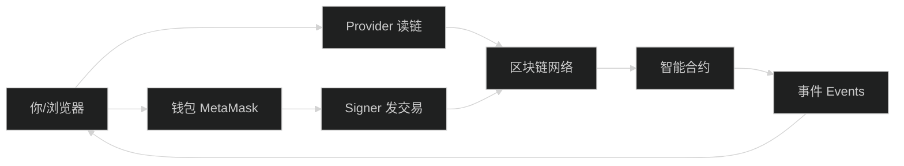

# 智能合约入门 - 零基础必读

> 🎯 目标：让完全没有区块链背景的人理解智能合约的基本概念

## 0. 先看图：你在和谁打交道？（最重要）



你只要记住：
- **读链**（Provider）= 查询状态，不花 gas
- **写链**（Signer）= 发交易改状态，要等确认

## 1. 什么是区块链？

### 1.1 通俗理解
想象一个公共账本，所有人都可以看，但没有人可以单独修改历史记录。

**举例**：
- 传统银行：你的账户余额存在银行的数据库里，只有银行知道
- 区块链：所有人的账户余额都公开透明，任何人都可以查看验证

### 1.2 核心特点
1. **去中心化**：没有一个中心服务器，数据分布在全球成千上万台电脑上
2. **不可篡改**：一旦记录上链，几乎无法修改
3. **透明公开**：所有交易记录都可以查询
4. **无需信任中介**：不需要银行等中介机构，代码自动执行

## 2. 什么是智能合约？

### 2.1 简单定义
智能合约 = 部署在区块链上的一段**自动执行的代码**

### 2.2 类比理解
```
传统合同：                智能合约：
纸质文档                  代码
需要人工执行              自动执行
可能有纠纷                代码即法律，无争议
需要律师仲裁              代码自动判断
```

### 2.3 实际例子

**场景 1：自动售货机**
```
传统方式：
1. 你投币
2. 工作人员确认收款
3. 工作人员给你商品

智能合约方式：
1. 你发送加密货币
2. 合约自动检查金额是否正确
3. 合约自动转移商品所有权
```

**场景 2：众筹（类似 Kickstarter）**
```solidity
// 伪代码示例
如果（筹集金额 >= 目标金额）并且（截止日期已到）{
    将资金转给项目方
} 否则 {
    将资金退还给所有支持者
}
```

## 3. 以太坊是什么？

### 3.1 定义
以太坊 = 可以运行智能合约的区块链平台

- **比特币**：只能转账（像计算器）
- **以太坊**：可以运行复杂程序（像电脑）

### 3.2 核心概念

#### 3.2.1 账户地址
```
示例: 0x742d35Cc6634C0532925a3b844Bc9e7595f0bEb
- 类似于银行账号
- 42个字符（0x开头）
- 公开可见
```

#### 3.2.2 Gas（燃料费）
- 执行智能合约需要支付的费用
- 类比：给计算机支付"电费"
- 用以太币（ETH）支付

#### 3.2.3 钱包
- 管理你的账户和私钥的工具
- 最常用：MetaMask（浏览器插件）
- 类比：你的"网银客户端"

## 4. 本项目涉及的关键概念

### 4.1 ERC20 代币
```
什么是代币？
就像游戏币、Q币一样，是在以太坊上发行的"虚拟货币"

ERC20 是什么？
是一个标准，规定了代币合约必须有哪些功能：
- balanceOf: 查询余额
- transfer: 转账
- approve: 授权别人使用你的代币
- transferFrom: 授权转账
```

**本项目的代币**：
- `USD8`：用于借贷的稳定币（模拟 USDT、USDC）
- `WETH`：包装的以太币（仅用于展示）

### 4.2 DeFi（去中心化金融）
```
传统金融：银行、证券公司
DeFi：用智能合约代替银行

本项目是一个 DeFi 借贷协议
类似于：区块链版的"支付宝借呗"
```

### 4.3 借贷协议基本流程
```
1. Supply（存款）
   你存入 100 USD8 到协议
   
2. Borrow（借款）
   你最多可以借出 75 USD8（75% LTV）
   
3. Repay（还款）
   你还回借的钱
   
4. Withdraw（取款）
   你取回存的钱
```

## 5. 关键术语速查表

| 术语 | 英文 | 解释 | 例子 |
|------|------|------|------|
| 钱包 | Wallet | 管理账户的工具 | MetaMask |
| 地址 | Address | 账户标识符 | 0x742d... |
| 私钥 | Private Key | 账户密码（千万别泄露） | 如同银行卡密码 |
| Gas | Gas | 交易手续费 | 0.001 ETH |
| 代币 | Token | 区块链上的货币 | USD8, WETH |
| 授权 | Approve | 允许合约使用你的代币 | 授权借贷合约使用你的 USD8 |
| 质押 | Supply/Deposit | 存入资金 | 存入 100 USD8 |
| 抵押率 | LTV (Loan-to-Value) | 最多能借多少 | 75% = 存100借75 |
| 健康因子 | Health Factor | 账户健康度 | >100% 安全 |
| 合约 | Contract | 区块链上的程序 | SimpleLending.sol |
| ABI | Application Binary Interface | 合约的"说明书" | 前端调用合约需要 |

## 6. 智能合约的生命周期

### 6.1 开发阶段
```solidity
// 用 Solidity 语言编写
contract SimpleLending {
    function supply(uint256 amount) external {
        // 存款逻辑
    }
}
```

### 6.2 编译阶段
```bash
# 将 Solidity 编译成字节码
npx hardhat compile
```

### 6.3 部署阶段
```bash
# 将合约上传到区块链
npx hardhat run scripts/deploy.ts
```
部署后会得到一个**合约地址**，例如：
```
SimpleLending deployed to: 0x5FbDB2315678afecb367f032d93F642f64180aa3
```

### 6.4 交互阶段
```javascript
// 前端通过合约地址和 ABI 与合约交互
const contract = new ethers.Contract(address, abi, signer);
await contract.supply(amount);
```

## 7. 为什么要学智能合约？

### 7.1 职业机会
- Web3 开发工程师平均薪资高
- 全球远程工作机会多
- 行业处于早期，机会大

### 7.2 技术前沿
- 区块链是下一代互联网基础设施
- 学习智能合约就像 2010 年学习移动开发

### 7.3 本项目的价值
```
这个项目展示了：
✅ 如何编写一个真实的借贷协议
✅ 如何用前端与智能合约交互
✅ 如何处理交易状态和错误
✅ 如何进行测试和部署

掌握这个项目 = 具备初级 Web3 工程师能力
```

## 8. 学习建议

### 8.1 学习路径
```
第 1 步：理解概念（本文档）✓
第 2 步：学习 Solidity 基础 → 下一篇
第 3 步：理解 DeFi 借贷原理 → 第 3 篇
第 4 步：阅读项目代码 → 第 4 篇
第 5 步：动手运行项目 → 第 9 篇
```

### 8.2 实践建议
1. **不要急**：每个概念都需要时间消化
2. **多实验**：在本地测试网络上多试几次
3. **多问为什么**：理解每行代码的作用
4. **做笔记**：记录不懂的地方，逐个攻克

### 8.3 常见误区
```
❌ 误区1：觉得很难，不敢开始
✅ 正解：和学任何编程一样，一步步来

❌ 误区2：想一次学完所有东西
✅ 正解：先跑通这个项目，再深入其他

❌ 误区3：只看理论不动手
✅ 正解：必须动手运行代码才能真正理解
```

## 9. 下一步

现在你已经理解了基本概念，接下来：

1. 阅读 [01-Solidity基础.md](01-Solidity基础.md) - 学习智能合约编程语言
2. 阅读 [02-DeFi借贷协议原理.md](02-DeFi借贷协议原理.md) - 理解借贷协议运作机制

## 10. 快速问答

**Q: 我需要买以太币吗？**
A: 不需要。本项目运行在本地测试网络，使用的是测试币，完全免费。

**Q: 学习智能合约需要什么基础？**
A: 建议有基本的编程基础（JavaScript/Python），但不是必须。

**Q: 多久可以掌握这个项目？**
A: 零基础：5-7天；有编程基础：3-4天；有Web3基础：2天。

**Q: 这个项目可以直接用在生产环境吗？**
A: 不可以。这是教学项目，缺少预言机、清算机制等生产级功能。

**Q: 面试会问什么？**
A: 主要问项目实现细节、技术选型理由、遇到的问题和解决方案，详见 [06-面试常见问题.md](06-面试常见问题.md)。

---

**📌 记住**：智能合约并不神秘，它就是运行在区块链上的代码。理解了基本概念后，剩下的就是学习编程语法和最佳实践。加油！
