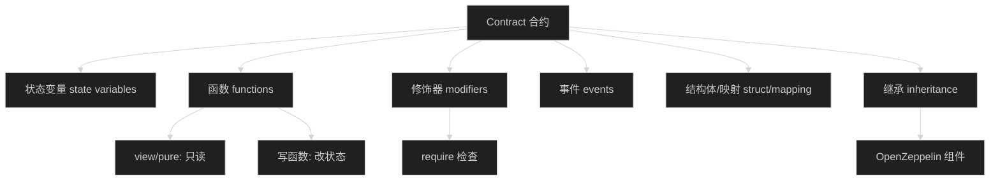
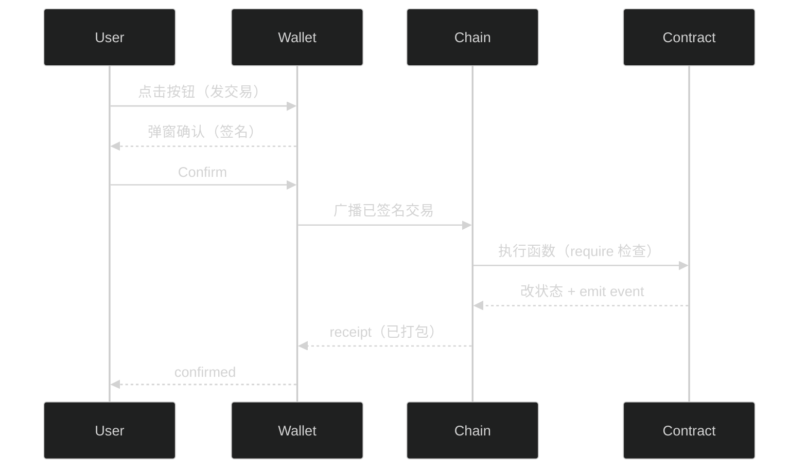

# Solidity 基础 - 智能合约编程语言

> 🎯 目标：理解 Solidity 语言的核心语法，能够读懂本项目的智能合约代码

## 0. 先看图：Solidity 合约由哪些“积木”组成？



## 0.1 先看图：一次“写函数”是怎么执行的？



## 1. Solidity 是什么？

### 1.1 定义
Solidity 是专门用于编写以太坊智能合约的编程语言。

**类比**：
- JavaScript → 写网页
- Python → 数据分析、后端
- **Solidity → 写智能合约**

### 1.2 特点
```
1. 静态类型：变量类型必须明确声明
2. 面向对象：支持继承、接口等
3. 类似 JavaScript：语法接近 JS，学习曲线平缓
4. 专为区块链设计：内置地址、转账等区块链特性
```

## 2. 基本语法

### 2.1 合约结构
```solidity
// SPDX-License-Identifier: MIT
pragma solidity ^0.8.19;  // 指定编译器版本

contract MyFirstContract {
    // 状态变量（存储在区块链上）
    uint256 public count;
    
    // 构造函数（部署时执行一次）
    constructor() {
        count = 0;
    }
    
    // 函数
    function increment() public {
        count += 1;
    }
}
```

### 2.2 数据类型

#### 2.2.1 值类型
```solidity
// 整数
uint256 public amount = 100;        // 无符号整数（0 到 2^256-1）
int256 public temperature = -10;    // 有符号整数

// 布尔
bool public isActive = true;

// 地址
address public owner = 0x742d35Cc6634C0532925a3b844Bc9e7595f0bEb;

// 字节
bytes32 public data;
```

**重要提示**：
- `uint256` 是最常用的，通常简写为 `uint`
- 金额必须用 `uint256`，防止溢出

#### 2.2.2 引用类型
```solidity
// 数组
uint256[] public numbers;           // 动态数组
address[10] public addresses;       // 固定长度数组

// 映射（类似字典/哈希表）
mapping(address => uint256) public balances;  // 地址 → 余额

// 结构体
struct User {
    string name;
    uint256 age;
    address wallet;
}
```

### 2.3 函数

#### 2.3.1 可见性修饰符
```solidity
contract Example {
    // public: 任何人都可以调用
    function publicFunc() public { }
    
    // external: 只能从外部调用（节省 gas）
    function externalFunc() external { }
    
    // internal: 只能在合约内部或继承的合约中调用
    function internalFunc() internal { }
    
    // private: 只能在当前合约中调用
    function privateFunc() private { }
}
```

#### 2.3.2 状态可变性修饰符
```solidity
contract Example {
    uint256 public value;
    
    // view: 只读，不修改状态
    function getValue() public view returns (uint256) {
        return value;
    }
    
    // pure: 不读也不写状态
    function add(uint256 a, uint256 b) public pure returns (uint256) {
        return a + b;
    }
    
    // 修改状态（不加 view/pure）
    function setValue(uint256 _value) public {
        value = _value;  // 修改状态变量
    }
}
```

#### 2.3.3 payable 函数
```solidity
contract Example {
    // 可以接收 ETH
    function deposit() public payable {
        // msg.value 是发送的 ETH 数量
    }
    
    // 不能接收 ETH（默认）
    function normalFunc() public {
        // 如果有人发 ETH 来会失败
    }
}
```

### 2.4 修饰器（Modifier）
```solidity
contract Example {
    address public owner;
    
    constructor() {
        owner = msg.sender;  // 部署者成为 owner
    }
    
    // 定义修饰器
    modifier onlyOwner() {
        require(msg.sender == owner, "Not owner");
        _;  // 继续执行函数体
    }
    
    // 使用修饰器
    function sensitiveOperation() public onlyOwner {
        // 只有 owner 可以调用
    }
}
```

### 2.5 事件（Events）
```solidity
contract Example {
    // 定义事件
    event Transfer(address indexed from, address indexed to, uint256 amount);
    
    function transfer(address to, uint256 amount) public {
        // ... 转账逻辑 ...
        
        // 触发事件（前端可以监听）
        emit Transfer(msg.sender, to, amount);
    }
}
```

**事件的作用**：
1. 记录历史（比存储便宜）
2. 前端监听状态变化
3. 作为合约的"日志"

## 3. 本项目中的 Solidity 代码解析

### 3.1 TestToken.sol - ERC20 代币

```solidity
// 简化版本
contract TestToken {
    // 状态变量
    string public name;                                    // 代币名称
    string public symbol;                                  // 代币符号
    uint8 public decimals = 18;                           // 小数位数
    mapping(address => uint256) public balanceOf;         // 余额映射
    mapping(address => mapping(address => uint256)) public allowance;  // 授权映射
    
    // 构造函数
    constructor(string memory _name, string memory _symbol) {
        name = _name;
        symbol = _symbol;
        balanceOf[msg.sender] = 1000000 * 10**18;  // 给部署者铸造 100 万个币
    }
    
    // 转账
    function transfer(address to, uint256 amount) external returns (bool) {
        require(balanceOf[msg.sender] >= amount, "Insufficient balance");
        balanceOf[msg.sender] -= amount;
        balanceOf[to] += amount;
        emit Transfer(msg.sender, to, amount);
        return true;
    }
    
    // 授权（允许别人使用你的代币）
    function approve(address spender, uint256 amount) external returns (bool) {
        allowance[msg.sender][spender] = amount;
        emit Approval(msg.sender, spender, amount);
        return true;
    }
    
    // 授权转账（别人使用你授权的代币）
    function transferFrom(address from, address to, uint256 amount) external returns (bool) {
        require(allowance[from][msg.sender] >= amount, "Insufficient allowance");
        require(balanceOf[from] >= amount, "Insufficient balance");
        
        allowance[from][msg.sender] -= amount;
        balanceOf[from] -= amount;
        balanceOf[to] += amount;
        
        emit Transfer(from, to, amount);
        return true;
    }
}
```

**关键概念**：
- `msg.sender`：调用函数的人的地址
- `10**18`：因为 decimals=18，所以 1 个代币 = 10^18 个最小单位
- `require(条件, "错误信息")`：条件不满足就回滚交易

### 3.2 SimpleLending.sol - 借贷合约核心

```solidity
contract SimpleLending {
    using SafeERC20 for IERC20;  // 使用安全的 ERC20 操作
    
    // 状态变量
    IERC20 public token;                                   // 借贷的代币
    uint256 public totalSupply;                           // 总存款
    uint256 public totalBorrow;                           // 总借款
    
    mapping(address => uint256) public userSupply;        // 用户存款
    mapping(address => uint256) public userBorrow;        // 用户借款
    
    // 常量
    uint256 public constant LTV_RATIO = 75;               // 抵押率 75%
    
    // 事件
    event Supplied(address indexed user, uint256 amount, uint256 timestamp);
    event Borrowed(address indexed user, uint256 amount, uint256 timestamp);
    
    // 构造函数
    constructor(address _token) {
        require(_token != address(0), "Token address is zero");
        token = IERC20(_token);
    }
    
    // 存款
    function supply(uint256 amount) external {
        require(amount > 0, "Amount must be greater than 0");
        
        // 从用户转入代币到合约
        token.safeTransferFrom(msg.sender, address(this), amount);
        
        // 更新状态
        userSupply[msg.sender] += amount;
        totalSupply += amount;
        
        emit Supplied(msg.sender, amount, block.timestamp);
    }
    
    // 借款
    function borrow(uint256 amount) external {
        require(amount > 0, "Amount must be greater than 0");
        
        // 计算最大可借额度
        uint256 maxBorrow = (userSupply[msg.sender] * LTV_RATIO) / 100;
        require(userBorrow[msg.sender] + amount <= maxBorrow, "Exceeds borrowing limit");
        
        // 更新状态
        userBorrow[msg.sender] += amount;
        totalBorrow += amount;
        
        // 转账给用户
        token.safeTransfer(msg.sender, amount);
        
        emit Borrowed(msg.sender, amount, block.timestamp);
    }
}
```

**关键逻辑**：

1. **存款（Supply）**：
   ```
   用户有 100 USD8
   → approve 合约使用 100 USD8
   → 调用 supply(100)
   → 合约把 100 USD8 从用户转到合约地址
   → userSupply[用户] += 100
   ```

2. **借款（Borrow）**：
   ```
   用户已存 100 USD8
   → LTV = 75%，所以最多借 75 USD8
   → 调用 borrow(50)
   → 检查 50 <= 75 ✓
   → 合约转 50 USD8 给用户
   → userBorrow[用户] += 50
   ```

## 4. 重要安全机制

### 4.1 SafeERC20
```solidity
using SafeERC20 for IERC20;

// 不安全的方式
token.transfer(to, amount);  // 有些代币不返回 bool，会导致错误

// 安全的方式
token.safeTransfer(to, amount);  // 自动处理各种代币的兼容性
```

### 4.2 ReentrancyGuard（防重入攻击）
```solidity
contract SimpleLending is ReentrancyGuard {
    function withdraw(uint256 amount) external nonReentrant {
        // nonReentrant 确保这个函数不能被递归调用
        // 防止"重入攻击"（著名的 DAO 攻击就是重入）
    }
}
```

### 4.3 Pausable（紧急暂停）
```solidity
contract SimpleLending is Pausable, Ownable {
    function supply(uint256 amount) external whenNotPaused {
        // 只有在未暂停状态下才能调用
    }
    
    function pause() external onlyOwner {
        _pause();  // 管理员可以紧急暂停合约
    }
}
```

### 4.4 Ownable（权限控制）
```solidity
contract SimpleLending is Ownable {
    function pause() external onlyOwner {
        // 只有合约所有者可以调用
        _pause();
    }
}
```

## 5. 常见模式和最佳实践

### 5.1 Checks-Effects-Interactions 模式
```solidity
function withdraw(uint256 amount) external {
    // 1. Checks（检查）
    require(userSupply[msg.sender] >= amount, "Insufficient balance");
    
    // 2. Effects（状态变更）
    userSupply[msg.sender] -= amount;
    totalSupply -= amount;
    
    // 3. Interactions（外部调用）
    token.safeTransfer(msg.sender, amount);
}
```

**为什么这样？**
防止重入攻击，先改状态，再转账。

### 5.2 使用 require 进行输入验证
```solidity
function supply(uint256 amount) external {
    require(amount > 0, "Amount must be greater than 0");
    require(token != IERC20(address(0)), "Token not set");
    // ... 继续执行
}
```

### 5.3 使用事件记录重要操作
```solidity
event Supplied(address indexed user, uint256 amount, uint256 timestamp);

function supply(uint256 amount) external {
    // ... 逻辑 ...
    emit Supplied(msg.sender, amount, block.timestamp);
}
```

## 6. 本项目合约继承关系

```
SimpleLending
  ├─ Ownable          (OpenZeppelin) - 所有权管理
  ├─ Pausable         (OpenZeppelin) - 暂停机制
  └─ ReentrancyGuard  (OpenZeppelin) - 防重入
```

**OpenZeppelin** 是行业标准的智能合约库，提供经过审计的安全组件。

## 7. 代币精度问题

### 7.1 为什么要 10^18？
```solidity
uint8 public decimals = 18;

// 用户看到的：100.5 USD8
// 合约存储的：100500000000000000000 (100.5 * 10^18)
```

**原因**：Solidity 不支持小数，所以用整数表示。

### 7.2 实际计算例子
```solidity
// 存入 100 USD8
uint256 amount = 100 * 10**18;  // 100000000000000000000

// 借款计算（75% LTV）
uint256 maxBorrow = (amount * 75) / 100;  // 75000000000000000000 = 75 USD8
```

## 8. Solidity 与 JavaScript 对比

| 特性 | Solidity | JavaScript |
|------|----------|------------|
| 类型 | 静态类型 | 动态类型 |
| 小数 | 不支持（用整数模拟） | 支持 |
| 数组 | 固定/动态 | 动态 |
| 字典 | mapping | object/Map |
| 异步 | 不支持 | 支持 async/await |
| 继承 | 支持多继承 | 原型链/class |
| 执行环境 | 区块链 | 浏览器/Node.js |
| 错误处理 | require/revert | try/catch |

## 9. 常见错误和调试

### 9.1 常见编译错误
```solidity
// ❌ 错误：没有指定可见性
function getValue() returns (uint256) { }

// ✅ 正确
function getValue() public view returns (uint256) { }
```

### 9.2 常见运行时错误
```solidity
// ❌ 错误：整数下溢
uint256 a = 5;
uint256 b = 10;
uint256 c = a - b;  // 会回滚（Solidity 0.8+ 自动检查）

// ✅ 正确：先检查
require(a >= b, "Underflow");
uint256 c = a - b;
```

### 9.3 Gas 优化技巧
```solidity
// ❌ Gas 高：多次读取存储
function bad() public {
    uint256 a = myStorageVar + myStorageVar;
}

// ✅ Gas 低：先读到内存
function good() public {
    uint256 temp = myStorageVar;
    uint256 a = temp + temp;
}
```

## 10. 实战练习

### 练习 1：读懂本项目合约
打开 `contracts/SimpleLending.sol`，尝试回答：
1. `LTV_RATIO` 是什么意思？
2. `supply` 函数做了什么？
3. 为什么 `borrow` 要检查 `maxBorrow`？

### 练习 2：修改合约（可选）
尝试在本地：
1. 修改 `LTV_RATIO` 为 80
2. 添加一个事件 `Withdrawn`
3. 重新编译和测试

## 11. 下一步

掌握了 Solidity 基础后，接下来：

1. 阅读 [02-DeFi借贷协议原理.md](02-DeFi借贷协议原理.md) - 理解借贷业务逻辑
2. 阅读 [03-项目代码详解.md](03-项目代码详解.md) - 逐行解析本项目代码

## 12. 快速问答

**Q: Solidity 难学吗？**
A: 如果你会 JavaScript，会发现语法很相似。主要是要理解区块链特有的概念（如 gas、地址、授权等）。

**Q: 一定要用 OpenZeppelin 吗？**
A: 强烈建议用。自己实现容易有安全漏洞，用经过审计的库更安全。

**Q: 为什么不能用小数？**
A: 区块链上计算必须确定性，浮点数在不同机器上可能有精度差异，所以用整数+精度位数来表示。

**Q: mapping 和数组的区别？**
A: mapping 是哈希表，通过 key 查询，不能遍历；数组可以遍历，但 gas 消耗高。

**Q: 什么时候用 view/pure？**
A: 只读状态用 `view`，纯计算用 `pure`。这样前端可以免费调用（不需要发交易）。

---

**📌 记住**：Solidity 是为区块链特化的语言，重点不是语法本身，而是理解"状态存储在链上"、"交易不可回滚"等区块链特性。多看代码，多实践！
