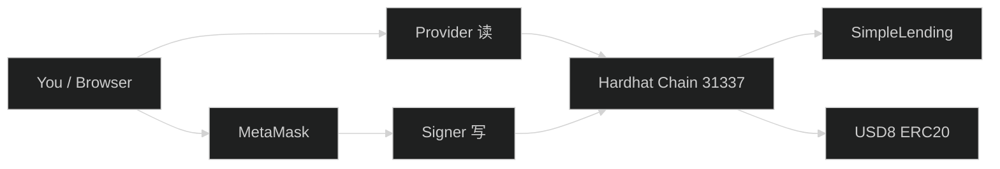
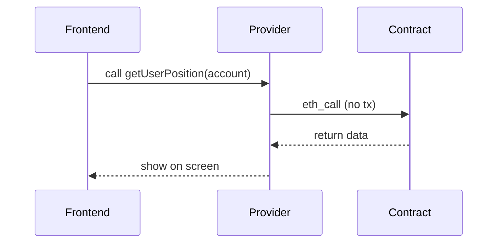
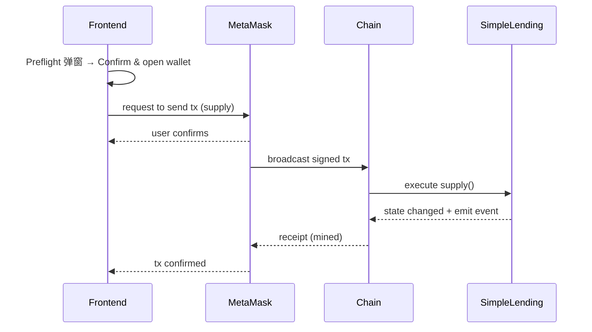
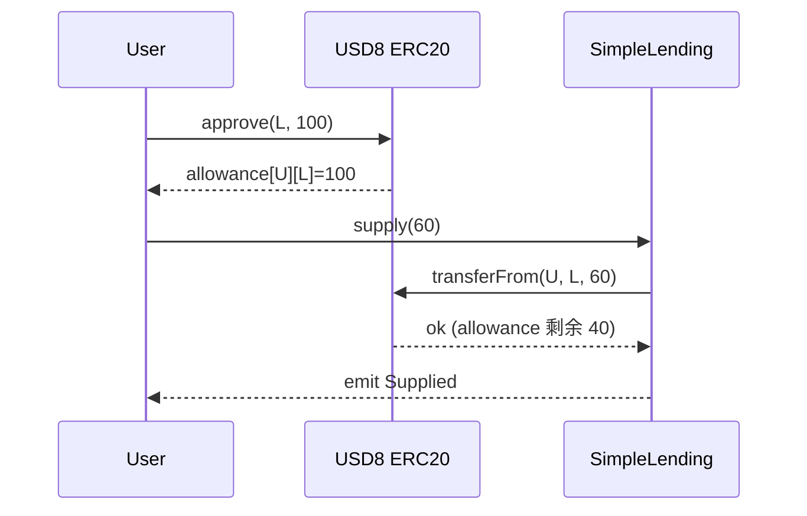
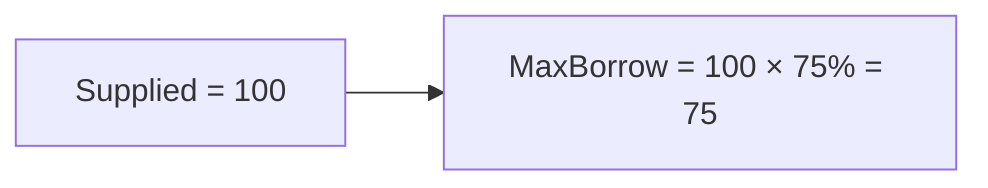

# 图解：核心概念（交易 + approve + LTV/健康因子）

> 三合一超小白版：从浏览器到链上交易、ERC20 授权、LTV 与健康因子。  
> 本项目实现与验收见 [项目总览架构](项目总览架构.md)。

---

## Part I：从浏览器到链上，一次交易发生了什么？

### 1) 角色是谁？

- 你（用户）：点按钮的人
- MetaMask：帮你“签名”的钱包
- Provider：读取链上数据的通道（像 HTTP 客户端）
- Signer：能签名并发交易的身份（来自 MetaMask）
- 智能合约：链上的程序（SimpleLending、USD8 Token）
- 区块链：执行交易并保存状态的系统

**记住**：**前端只是发起请求，真正“改状态”的是链上交易。**

配图（角色关系）：

### 2) 读链 vs 写链

- **读链**：问链“现在是什么状态”（balanceOf、getUserPosition），不改变数据，不需要 gas。
- **写链**：让链“改状态”（supply、borrow），必须成为交易被打包，所以要 gas。

读链流程：

写链流程（会经历签名→广播→pending→confirmed，所以 UI 必须显示交易状态机）：

证据点：[frontend/src/state/tx.ts](../frontend/src/state/tx.ts)

### 3) 常见误区

- **误区 A**：以为前端点了就改了状态 → 事实：必须等链上 tx confirmed。
- **误区 B**：用 JS number 处理金额 → 事实：要用 bigint，否则精度丢失。
- **误区 C**：不理解 approve → 事实：ERC20 要先授权，合约才能 transferFrom。

---

## Part II：ERC20 授权 approve 到底在干嘛？

### 1) 生活例子

- 你是房主（owner），代币是你的钱（USD8），借贷合约是“代办人”（spender）。
- 你先签授权书："我允许借贷合约最多扣 100 USD8"，合约才可以在需要时扣款。

**记住**：**approve 不是转账，只是“给合约一把钥匙”。**

### 2) allowance 表

- `allowance[owner][spender] = amount`
- supply 时合约要调用 `transferFrom(owner, to, amount)`，transferFrom 会检查 allowance >= amount。

### 3) approve + supply 时序

### 4) 精确授权 vs 无限授权

- **精确（Exact）**：更安全，每次可能需再 approve。
- **无限（Infinite）**：只 approve 一次，合约出问题则风险更大。本项目两种都支持。

证据点：[frontend/src/hooks/useActions.ts](../frontend/src/hooks/useActions.ts)（approveIfNeeded）

---

## Part III：LTV 与健康因子——为什么不能随便 Withdraw？

### 1) LTV 是什么？

LTV（Loan-to-Value）= 最多能借“抵押品价值”的多少比例。本项目 LTV=75%：存 100 最多借 75。

**为什么不是 100%？** 若 LTV=100%，存 100 借 100，合约无安全缓冲，波动/手续费可能导致资不抵债，故留安全边际。

### 2) 健康因子（Health Factor）

- borrowed=0 → 前端显示 "No debt"
- 否则：安全系数 = maxBorrowable/borrowed，前端显示为比例（如 1.50）

### 3) Borrow 与 Withdraw 的检查

- **Borrow**：借款后不能超过 maxBorrow，否则 revert "Exceeds borrowing limit"。
- **Withdraw**：提现后剩余抵押仍要覆盖当前借款，否则 revert "position unhealthy"。例如存 100 借 75 满额时，取 1 会失败（99*75% < 75）。

证据点：[contracts/core/LendingPoolImpl.sol](../contracts/core/LendingPoolImpl.sol)、[test/integration/SimpleLending.integration.ts](../test/integration/SimpleLending.integration.ts)。

下一步：动手 [04-动手实验](04-动手实验.md)；代码与合约结构见 [02-代码合约与前端](02-代码合约与前端.md)。
