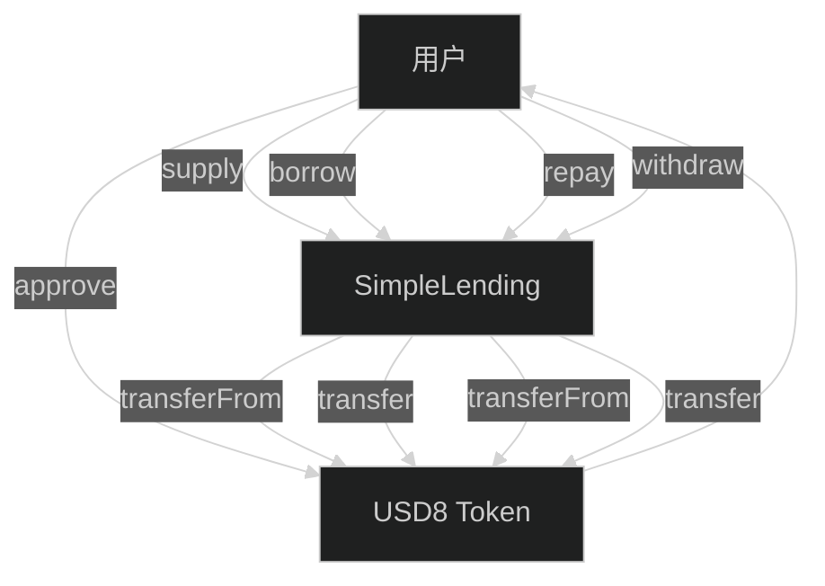
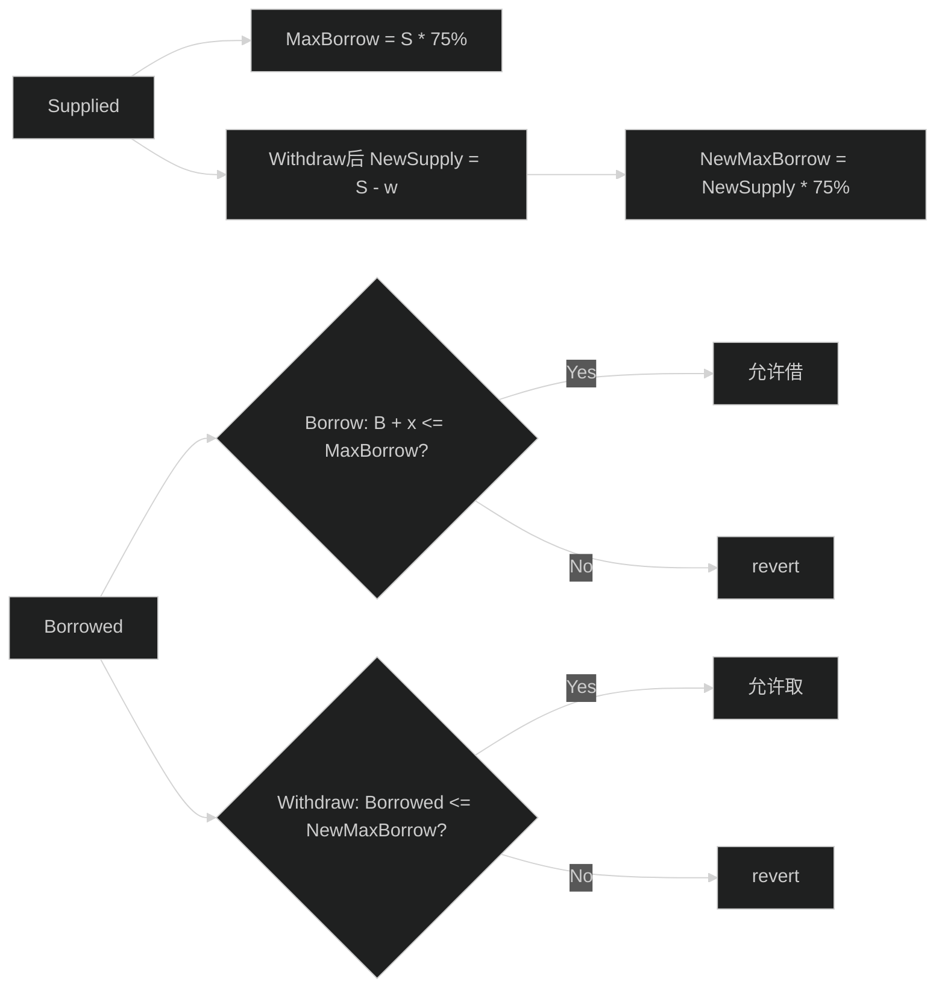

# DeFi 借贷协议原理

> 🎯 目标：理解去中心化借贷协议的运作机制和本项目的业务逻辑

## 0. 先看图：本项目“单币种借贷”一张图看懂



## 0.1 先看图：LTV=75% 的两条硬规则



## 1. 什么是 DeFi 借贷？

### 1.1 传统借贷 vs DeFi 借贷

| 对比项 | 传统借贷（如银行） | DeFi 借贷 |
|--------|-------------------|-----------|
| 中介 | 银行 | 智能合约（代码） |
| 审批 | 需要信用审查 | 无需审查，看抵押品 |
| 利率 | 银行决定 | 算法自动计算 |
| 开放性 | 需要开户、KYC | 任何人可参与 |
| 透明度 | 不透明 | 完全透明（链上可查） |
| 速度 | 几天 | 几秒钟 |
| 手续费 | 较高 | 只有 gas 费 |

### 1.2 DeFi 借贷的核心概念

```
传统借贷流程：
1. 你去银行申请贷款
2. 银行审查你的信用记录
3. 银行决定是否借给你
4. 按月还款+利息

DeFi 借贷流程：
1. 你存入抵押品（如 ETH、USDC）
2. 智能合约自动计算你能借多少
3. 你直接借出（无需等待）
4. 随时还款，利息自动计算
```

## 2. 本项目的借贷模型

### 2.1 单币种借贷
```
本项目的特点：简化版借贷协议

使用同一个代币进行存款和借款：
- 代币：USD8（模拟稳定币 USDT/USDC）
- 存：存入 USD8 作为抵押品
- 借：借出 USD8

为什么简化？
✓ 易于理解和实现
✓ 适合教学和面试展示
✓ 不需要预言机（价格喂价）
```

### 2.2 完整的用户流程

```
┌─────────────────────────────────────────┐
│  1. 用户存入（Supply）100 USD8          │
│     - 用户批准合约使用 100 USD8         │
│     - 调用 supply(100)                   │
│     - 合约记录：userSupply[用户] = 100  │
└─────────────────────────────────────────┘
                    ↓
┌─────────────────────────────────────────┐
│  2. 用户借款（Borrow）50 USD8           │
│     - 最大可借 = 100 * 75% = 75 USD8    │
│     - 用户借 50 USD8                     │
│     - 合约记录：userBorrow[用户] = 50   │
│     - 合约转 50 USD8 给用户              │
└─────────────────────────────────────────┘
                    ↓
┌─────────────────────────────────────────┐
│  3. 用户还款（Repay）30 USD8            │
│     - 用户批准合约使用 30 USD8          │
│     - 调用 repay(30)                     │
│     - 合约记录：userBorrow[用户] = 20   │
└─────────────────────────────────────────┘
                    ↓
┌─────────────────────────────────────────┐
│  4. 用户取款（Withdraw）40 USD8         │
│     - 检查健康因子：剩余 60 USD8 存款   │
│     - 还欠 20 USD8，需要至少 26.67 抵押 │
│     - 60 - 26.67 = 33.33 可取           │
│     - 用户取 33.33 USD8（或更少）       │
└─────────────────────────────────────────┘
```

## 3. 核心概念深度解析

### 3.1 LTV（Loan-to-Value Ratio）- 贷款价值比

**定义**：最多能借出的金额占抵押品价值的百分比

```solidity
uint256 public constant LTV_RATIO = 75;  // 75%

// 计算示例
存入抵押品：100 USD8
最大可借 = 100 * 75% = 75 USD8
```

**为什么不是 100%？**
```
如果 LTV = 100%:
- 存 100 USD8，借 100 USD8
- 用户可以拿走 100，合约里还有 100
- 但如果价格波动，合约可能资不抵债

如果 LTV = 75%:
- 存 100，最多借 75
- 合约里有 100 抵押品，只借出 75
- 有 25% 的安全缓冲
```

### 3.2 健康因子（Health Factor）

**定义**：衡量账户健康程度的指标

```solidity
// 伪代码
if (borrowed == 0) {
    healthFactor = ∞  // 没有借款，完全安全
} else {
    maxBorrowable = supplied * LTV_RATIO / 100
    healthFactor = (maxBorrowable * 100) / borrowed
}
```

**实际例子**：
```
场景 1：存 100，借 50
maxBorrowable = 100 * 75% = 75
healthFactor = (75 * 100) / 50 = 150%  ✅ 健康

场景 2：存 100，借 75（满额）
maxBorrowable = 75
healthFactor = (75 * 100) / 75 = 100%  ⚠️ 临界

场景 3：存 100，借 80（超额）
这种情况不允许发生，合约会拒绝
```

**健康因子的意义**：
- `> 100%`：安全，可以继续借款
- `= 100%`：临界点，不能再借
- `< 100%`：危险，应该被清算（本项目未实现清算）

### 3.3 利率计算（Utilization Rate Model）

```solidity
// 使用率 = 总借款 / 总存款
utilizationRate = (totalBorrow * 100) / totalSupply

// 存款利率
supplyRate = BASE_RATE + (utilizationRate / 10)

// 借款利率（总是高于存款利率）
borrowRate = BASE_RATE + 2 + (utilizationRate / 5)
```

**实际例子**：
```
假设：
totalSupply = 1000 USD8
totalBorrow = 500 USD8

utilizationRate = (500 * 100) / 1000 = 50%

supplyRate = 2% + (50 / 10) = 2% + 5% = 7%
borrowRate = 2% + 2% + (50 / 5) = 4% + 10% = 14%
```

**为什么利率随使用率变化？**
```
使用率低（钱多人少）：
- 降低借款利率，吸引借款人
- 降低存款利率，避免过多闲置资金

使用率高（钱少人多）：
- 提高借款利率，增加协议收入
- 提高存款利率，吸引更多存款
```

## 4. 关键函数业务逻辑

### 4.1 Supply（存款）

```solidity
function supply(uint256 amount) external {
    // 1. 检查金额
    require(amount > 0, "Amount must be greater than 0");
    
    // 2. 转账（需要事先 approve）
    token.safeTransferFrom(msg.sender, address(this), amount);
    
    // 3. 更新用户状态
    userSupply[msg.sender] += amount;
    totalSupply += amount;
    
    // 4. 更新利率
    updateRates();
    
    // 5. 更新用户仓位
    updateUserPosition(msg.sender);
    
    // 6. 发出事件
    emit Supplied(msg.sender, amount, block.timestamp);
}
```

**前端需要做什么？**
```javascript
// 步骤 1: 授权
await tokenContract.approve(lendingAddress, amount);

// 步骤 2: 等待授权交易确认

// 步骤 3: 存款
await lendingContract.supply(amount);

// 步骤 4: 等待存款交易确认

// 步骤 5: 刷新 UI 显示新余额
```

### 4.2 Withdraw（取款）

```solidity
function withdraw(uint256 amount) external {
    // 1. 检查金额
    require(amount > 0, "Amount must be greater than 0");
    require(userSupply[msg.sender] >= amount, "Insufficient supply");
    
    // 2. 检查健康因子（取款后是否安全）
    uint256 newSupply = userSupply[msg.sender] - amount;
    uint256 borrowed = userBorrow[msg.sender];
    uint256 maxBorrow = (newSupply * LTV_RATIO) / 100;
    require(borrowed <= maxBorrow, "Withdrawal would make position unhealthy");
    
    // 3. 更新状态
    userSupply[msg.sender] = newSupply;
    totalSupply -= amount;
    
    // 4. 转账
    token.safeTransfer(msg.sender, amount);
    
    // 5. 更新利率和仓位
    updateRates();
    updateUserPosition(msg.sender);
    
    emit Withdrawn(msg.sender, amount, block.timestamp);
}
```

**为什么要检查健康因子？**
```
场景：
存款：100 USD8
借款：70 USD8
尝试取款：50 USD8

检查：
剩余存款 = 100 - 50 = 50 USD8
最大可借 = 50 * 75% = 37.5 USD8
当前借款 = 70 USD8

70 > 37.5 ❌ 不允许取款！
因为取款后会导致抵押不足
```

### 4.3 Borrow（借款）

```solidity
function borrow(uint256 amount) external {
    // 1. 检查金额
    require(amount > 0, "Amount must be greater than 0");
    
    // 2. 检查合约流动性
    require(token.balanceOf(address(this)) >= amount, "Insufficient liquidity");
    
    // 3. 检查借款限额
    uint256 maxBorrow = (userSupply[msg.sender] * LTV_RATIO) / 100;
    require(userBorrow[msg.sender] + amount <= maxBorrow, "Exceeds borrowing limit");
    
    // 4. 更新状态
    userBorrow[msg.sender] += amount;
    totalBorrow += amount;
    
    // 5. 转账给用户
    token.safeTransfer(msg.sender, amount);
    
    // 6. 更新利率和仓位
    updateRates();
    updateUserPosition(msg.sender);
    
    emit Borrowed(msg.sender, amount, block.timestamp);
}
```

**什么是"流动性"？**
```
合约里的可用资金 = totalSupply - totalBorrow

示例：
总存款：1000 USD8
总借款：700 USD8
可用流动性：300 USD8

如果有人想借 400 USD8：
400 > 300 ❌ 流动性不足！
必须等有人还款或新的存款
```

### 4.4 Repay（还款）

```solidity
function repay(uint256 amount) external {
    // 1. 检查金额
    require(amount > 0, "Amount must be greater than 0");
    require(userBorrow[msg.sender] >= amount, "Amount exceeds borrow");
    
    // 2. 转账（需要事先 approve）
    token.safeTransferFrom(msg.sender, address(this), amount);
    
    // 3. 更新状态
    userBorrow[msg.sender] -= amount;
    totalBorrow -= amount;
    
    // 4. 更新利率和仓位
    updateRates();
    updateUserPosition(msg.sender);
    
    emit Repaid(msg.sender, amount, block.timestamp);
}
```

## 5. 完整用户场景示例

### 场景 1：Alice 的完整流程

```
初始状态：
- Alice 有 1000 USD8
- 合约有 0 USD8

第 1 步：Alice 存入 500 USD8
操作：supply(500)
结果：
  userSupply[Alice] = 500
  totalSupply = 500
  Alice 钱包 = 500 USD8
  合约余额 = 500 USD8

第 2 步：Alice 借出 300 USD8
操作：borrow(300)
检查：最大可借 = 500 * 75% = 375 ✓
结果：
  userBorrow[Alice] = 300
  totalBorrow = 300
  Alice 钱包 = 800 USD8 (500 + 300)
  合约余额 = 200 USD8 (500 - 300)
  healthFactor = (375 * 100) / 300 = 125%

第 3 步：Alice 还款 100 USD8
操作：repay(100)
结果：
  userBorrow[Alice] = 200
  totalBorrow = 200
  Alice 钱包 = 700 USD8
  合约余额 = 300 USD8
  healthFactor = (375 * 100) / 200 = 187.5%

第 4 步：Alice 取款 200 USD8
操作：withdraw(200)
检查：
  剩余存款 = 500 - 200 = 300
  最大可借 = 300 * 75% = 225
  当前借款 = 200
  200 <= 225 ✓ 允许取款
结果：
  userSupply[Alice] = 300
  totalSupply = 300
  Alice 钱包 = 900 USD8
  合约余额 = 100 USD8
  healthFactor = (225 * 100) / 200 = 112.5%
```

### 场景 2：Bob 触发流动性限制

```
初始状态（接上面 Alice 的状态）：
- totalSupply = 300 USD8
- totalBorrow = 200 USD8
- 可用流动性 = 100 USD8

Bob 的操作：
- Bob 存入 500 USD8
- totalSupply = 800
- totalBorrow = 200
- 可用流动性 = 600

Bob 尝试借 500 USD8:
- 最大可借 = 500 * 75% = 375 ✓
- 可用流动性 = 600 ✓
- 成功借出 500

现在流动性：
- totalSupply = 800
- totalBorrow = 700
- 可用流动性 = 100

如果 Alice 尝试再借 100:
- Alice 最大可借 = 300 * 75% = 225
- Alice 已借 = 200
- Alice 还能借 = 25
- 但合约只有 100 流动性
- 所以 Alice 只能借 25（受限于额度，不是流动性）
```

## 6. 风险和限制

### 6.1 本项目的简化
```
❌ 本项目没有实现（生产环境需要）：
1. 利息计提（时间加权）
2. 清算机制（healthFactor < 100% 时）
3. 预言机（多币种需要价格）
4. 储备金机制
5. 治理代币
```

### 6.2 真实 DeFi 协议的完整功能

**Aave / Compound 等协议还有**：
- 多币种支持（ETH、USDC、DAI...）
- 动态利率模型（更复杂）
- Flash Loan（闪电贷）
- 清算人角色
- 协议收入分配

## 7. 实战思考题

### 问题 1：
如果两个用户同时存款和借款会怎样？
```
Alice 存 100，Bob 存 100
totalSupply = 200

Alice 借 70，Bob 借 70
totalBorrow = 140

利率如何变化？
utilizationRate = 140 / 200 = 70%
supplyRate = 2% + 7% = 9%
borrowRate = 4% + 14% = 18%
```

### 问题 2：
什么情况下用户无法取款？
```
答案：
1. 取款金额 > 存款余额
2. 取款后健康因子 < 100%
3. 合约暂停（paused）
```

### 问题 3：
如果合约里没有足够的流动性怎么办？
```
答案：
借款会失败，提示"Insufficient liquidity"
解决方案：
- 等待其他用户还款
- 等待新的存款进入
```

## 8. 下一步

理解了借贷协议原理后，接下来：

1. 阅读 [03-项目代码详解.md](03-项目代码详解.md) - 深入理解代码实现
2. 阅读 [04-前端集成指南.md](04-前端集成指南.md) - 学习前端如何调用合约

## 9. 快速问答

**Q: DeFi 借贷和银行贷款最大的区别是什么？**
A: DeFi 无需信用审查，完全基于抵押品；银行需要信用记录和人工审批。

**Q: 为什么 DeFi 借贷需要超额抵押（如 75% LTV）？**
A: 因为加密货币价格波动大，需要安全缓冲。如果抵押品价格下跌，协议需要有足够的余地进行清算。

**Q: 本项目的 LTV 可以改成 100% 吗？**
A: 技术上可以，但非常危险。任何抵押品价值的微小下跌都会导致资不抵债。

**Q: 健康因子是越高越好吗？**
A: 是的。健康因子越高，说明抵押越充足，离被清算越远。

**Q: 为什么借款利率总是高于存款利率？**
A: 差额是协议收入。真实的 DeFi 协议会用这部分收入来：1) 支付运营成本 2) 储备金 3) 治理代币持有者分红。

---

**📌 记住**：DeFi 借贷的核心是"超额抵押 + 算法利率 + 自动执行"。理解了这三点，就理解了去中心化借贷的本质！
