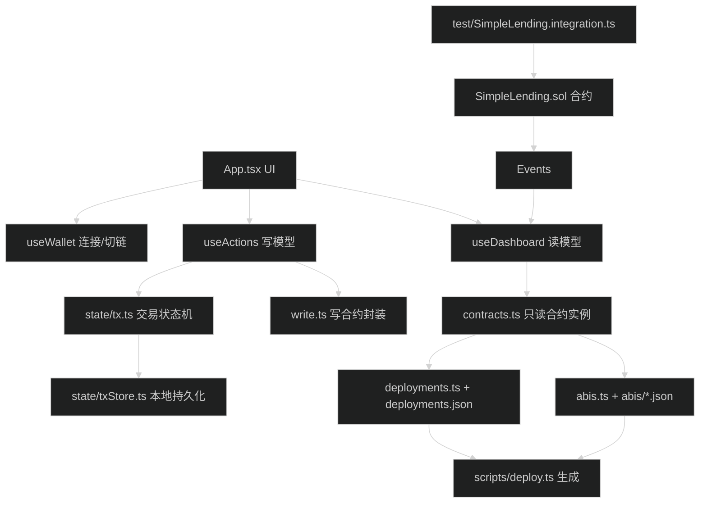

# 项目代码详解（精简版）

> 由于完整的代码详解会非常长，这里提供核心文件的解析框架

## 0) 先看图：项目“最关键文件”关系图



建议你按这个顺序看代码：
1) `frontend/src/App.tsx`
2) `frontend/src/hooks/useWallet.ts`
3) `frontend/src/hooks/useDashboard.ts`
4) `frontend/src/hooks/useActions.ts`
5) `frontend/src/state/tx.ts`
6) `contracts/SimpleLending.sol`

## 智能合约核心代码

### SimpleLending.sol 关键函数解析

请查看项目中的 [contracts/SimpleLending.sol](../contracts/SimpleLending.sol)，重点理解：

1. **supply() 函数**（第 70-82 行）
   - 检查金额有效性
   - 使用 safeTransferFrom 安全转账
   - 更新用户和全局状态
   - 触发事件

2. **borrow() 函数**（第 106-120 行）
   - 检查流动性
   - 计算并检查借款限额（LTV）
   - 更新状态
   - 转账给用户

3. **withdraw() 函数**（第 84-104 行）
   - 检查余额
   - **关键**：检查健康因子（第 90-93 行）
   - 先改状态，再转账（防重入）

4. **安全机制**：
   - `nonReentrant`：防重入攻击
   - `whenNotPaused`：支持紧急暂停
   - `SafeERC20`：兼容不同 ERC20 实现

## 前端核心代码

### useActions.ts（写模型）

查看 [frontend/src/hooks/useActions.ts](../frontend/src/hooks/useActions.ts)

关键函数：
1. **approveAndSupply()**（第 140-180 行）
   - 检查授权额度
   - 如果不足，先 approve
   - 再执行 supply
   - 完整的状态机管理

2. **交易状态机**（第 50-70 行）
   ```typescript
   idle → signing → pending → confirmed/failed
   ```

3. **Post-state 验证**（第 80-110 行）
   - 交易确认后读取链上状态
   - 对比预期变化
   - 标记 verified/unverified

### useDashboard.ts（读模型）

查看 [frontend/src/hooks/useDashboard.ts](../frontend/src/hooks/useDashboard.ts)

关键点：
1. **并发读取**（第 40-60 行）
   - Promise.all 批量查询
   - 减少等待时间

2. **事件监听**（第 100-150 行）
   ```javascript
   lending.on("Supplied", onSupplied);
   lending.on("Borrowed", onBorrowed);
   lending.on("Repaid", onRepaid);
   lending.on("Withdrawn", onWithdrawn);
   ```

3. **自动刷新策略**
   - 事件触发立即刷新（主要）
   - 交易确认后刷新（辅助）
   - 区块监听兜底（3秒节流）

## 建议学习顺序

1. **先看合约**：
   - SimpleLending.sol 的 supply/borrow/repay/withdraw
   - 理解业务逻辑

2. **再看测试**：
   - test/SimpleLending.integration.ts
   - 看测试如何调用合约

3. **最后看前端**：
   - useActions.ts 的 approveAndSupply
   - useDashboard.ts 的数据读取和事件监听

4. **对照运行**：
   - 启动项目，边操作边看代码
   - 在代码里加 console.log 观察数据流

## 深入阅读

完整的代码详解需要逐行分析，建议：
1. 打开 VS Code
2. 使用"转到定义"（F12）功能
3. 跟踪函数调用链
4. 在不理解的地方加注释

参考已有的注释，项目中的关键设计决策都有中英文说明。
