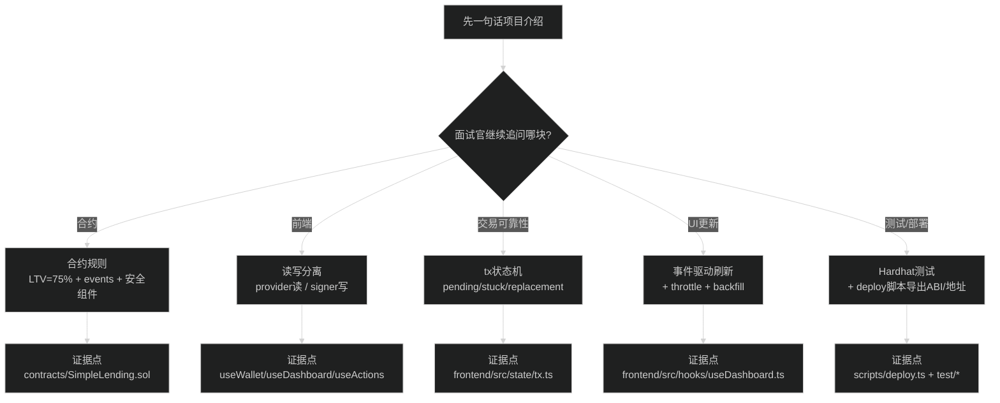

# Web3 面试常见问题及答案（中文）

> 🎯 目标：准备 Web3 开发工程师面试，掌握高频问题和最佳回答方式

## 0) 一图读懂：面试回答的“路线图”（按这张图讲就不乱）



## 📋 面试前准备清单

### ✅ 必做
- [ ] 能在 5 分钟内从零启动整个项目
- [ ] 能流畅演示完整的用户流程（连接钱包 → 存款 → 借款 → 还款 → 取款）
- [ ] 理解每个函数的业务逻辑和安全考虑
- [ ] 准备好 2-3 个遇到的技术难题和解决方案
- [ ] 熟悉项目的技术栈和设计选择

### 📌 记住
- 诚实第一：不懂就说不懂，但要说明会如何学习
- 重点突出：讲清楚你负责的部分和贡献
- 准备反问：面试最后问 2-3 个有深度的问题

---

## 第一部分：项目介绍（必问）

### Q1: 介绍一下你这个智能合约项目

**⭐ 标准回答模板**：
```
这是一个基于以太坊的去中心化借贷协议项目，包含完整的前后端实现。

技术栈：
- 智能合约：Solidity 0.8.19，使用 OpenZeppelin 安全库
- 开发框架：Hardhat，包含单元测试和部署脚本
- 前端：React + TypeScript + ethers.js v6
- 测试网络：Hardhat 本地链（chainId 31337）

核心功能：
1. 用户可以存入 USD8 代币作为抵押品
2. 基于 75% 的 LTV 比率进行借款
3. 实时显示健康因子和可用额度
4. 支持还款和取款操作
5. 完整的交易状态管理和错误处理

项目亮点：
- 事件驱动的 UI 更新（监听合约事件）
- 完善的授权流程（支持精确/无限授权）
- 交易后状态验证（post-state check）
- 防止重入攻击和溢出检查
```

**❌ 避免说**：
- "这就是个简单的借贷合约"（显得不重视）
- 直接背 README（没有自己的理解）
- 只讲功能不讲技术细节

---

## 第二部分：智能合约相关问题

### Q2: 什么是智能合约？它和普通程序有什么区别？

**回答要点**：
```
智能合约是部署在区块链上的自动执行代码。

与普通程序的区别：
1. 不可变性：部署后代码无法修改（除非用代理模式）
2. 去中心化：运行在全球的区块链节点上，没有中心服务器
3. 透明性：代码和状态公开可查
4. 执行成本：每次调用需要支付 gas 费
5. 确定性：必须保证相同输入产生相同输出

因此开发时需要特别注意：
- 安全性（一旦部署无法修复漏洞）
- Gas 优化（降低用户成本）
- 事件记录（作为低成本的历史日志）
```

### Q3: 为什么要用 OpenZeppelin 库？

**回答要点**：
```
OpenZeppelin 是行业标准的智能合约安全库，我们使用了：

1. Ownable - 所有权管理
   防止未授权的管理员操作

2. Pausable - 紧急暂停
   在发现漏洞时可以立即暂停合约

3. ReentrancyGuard - 防重入攻击
   防止恶意合约递归调用我们的函数

4. SafeERC20 - 安全的代币操作
   处理不同 ERC20 实现的兼容性问题

优势：
- 经过专业审计，安全性高
- 节省开发时间
- 行业最佳实践
- 持续维护和更新
```

### Q4: 你的合约如何防止重入攻击？

**回答要点**：
```
我们使用了 OpenZeppelin 的 ReentrancyGuard：

// 在所有状态变更函数上添加 nonReentrant 修饰器
function withdraw(uint256 amount) external nonReentrant {
    // 1. 检查（Checks）
    require(amount > 0);
    
    // 2. 状态变更（Effects）
    userSupply[msg.sender] -= amount;
    
    // 3. 外部调用（Interactions）
    token.safeTransfer(msg.sender, amount);
}

原理：
- nonReentrant 在函数开始时设置一个锁
- 如果已经在执行中，再次调用会失败
- 函数结束时释放锁

同时遵循 CEI 模式（Checks-Effects-Interactions）：
先改状态，再转账，即使被重入也不会重复提款
```

### Q5: 为什么代币精度是 10^18？如何处理小数？

**回答要点**：
```
Solidity 不支持小数，所以用整数表示。

decimals = 18 是 ERC20 标准的常用精度：
- 用户看到：100.5 USD8
- 合约存储：100500000000000000000（100.5 * 10^18）

这样设计的好处：
1. 避免浮点数精度问题
2. 保证计算确定性
3. 与以太币（ETH）精度一致

前端处理：
// 输入转合约
const amount = ethers.parseUnits("100.5", 18);

// 合约转显示
const display = ethers.formatUnits(amount, 18);
```

### Q6: 什么是 LTV 和健康因子？

**回答要点**：
```
LTV（Loan-to-Value Ratio）= 贷款价值比

我们的 LTV = 75%：
- 存入 100 USD8，最多借 75 USD8
- 留 25% 安全缓冲

健康因子（Health Factor）:
- 衡量账户安全程度
- 计算：(最大可借 * 100) / 当前借款

示例：
存 100，借 50
最大可借 = 100 * 75% = 75
健康因子 = (75 * 100) / 50 = 150%

状态：
> 100%：安全
= 100%：临界点
< 100%：应该被清算（本项目未实现）
```

---

## 第三部分：前端集成问题

### Q7: 前端如何与智能合约交互？

**回答要点**：
```
我们使用 ethers.js v6：

1. 连接钱包：
const provider = new BrowserProvider(window.ethereum);
const signer = await provider.getSigner();

2. 创建合约实例：
const contract = new Contract(address, abi, signer);

3. 读取数据（免费）：
const balance = await contract.balanceOf(userAddress);

4. 写入数据（需要发交易）：
const tx = await contract.supply(amount);
await tx.wait(confirmations);  // 等待确认

关键点：
- ABI（应用二进制接口）：合约的"说明书"
- Signer：用于签名交易
- Provider：用于读取区块链状态
```

### Q8: 为什么需要 approve？

**回答要点**：
```
ERC20 的授权机制，用于安全性：

流程：
1. 用户有 100 USD8
2. 借贷合约想转走你的钱，但没有权限
3. 用户调用 token.approve(合约地址, 100)
4. 现在合约可以通过 transferFrom 转走你授权的额度

两种授权模式：
1. 精确授权（Exact）：每次授权刚好需要的金额
   - 更安全
   - 每次操作需要先 approve
   
2. 无限授权（Infinite）：授权 MaxUint256
   - 方便，只需授权一次
   - 理论上有风险（合约被攻击时）

我们的实现：
- 默认精确授权
- 用户可选无限授权
- 支持 USDT 兼容模式（先 approve(0) 再 approve(amount)）
```

### Q9: 如何监听合约事件更新 UI？

**回答要点**：
```
我们实现了事件驱动的 UI 更新：

useEffect(() => {
  if (!lending || !account) return;
  
  // 监听 Supplied 事件
  const onSupplied = (user: string, amount: bigint) => {
    if (user.toLowerCase() === account.toLowerCase()) {
      refresh();  // 刷新 UI
    }
  };
  
  lending.on("Supplied", onSupplied);
  
  // 清理
  return () => {
    lending.off("Supplied", onSupplied);
  };
}, [lending, account]);

为什么这样做？
- 题目明确要求："Listen for contract events and update UI"
- 事件是状态变化的权威来源
- 比轮询更高效

兜底机制：
- 另外加了 3 秒节流的区块监听
- 防止事件监听丢失（网络问题等）
```

### Q10: 交易状态管理是怎么做的？

**回答要点**：
```
我们实现了完整的交易生命周期管理：

状态机：
idle → signing → pending → confirmed/failed

type TxState =
  | { stage: "idle" }
  | { stage: "signing"; label: string }
  | { stage: "pending"; label: string; hash: string }
  | { stage: "confirmed"; label: string; hash: string }
  | { stage: "failed"; label: string; error: Error }

关键功能：
1. 持久化：pending 交易存在 localStorage
   - 刷新页面不丢失
   - 可以恢复查询状态

2. 超时处理：30 秒超时提醒
   - 不强制失败（可能只是慢）
   - 允许用户手动重试或清除

3. 错误归一化：
   - 用户拒绝 → "User rejected"
   - Gas 不足 → "Insufficient gas"
   - 其他 → 解析合约 revert 消息

4. 交易后验证：
   - 等待 2 次确认
   - 读取链上状态验证变化
   - 如果不一致标记为"unverified"
```

---

## 第四部分：测试和部署

### Q11: 你是如何测试智能合约的？

**回答要点**：
```
我们使用 Hardhat + Chai 编写集成测试：

describe("SimpleLending", () => {
  it("approve → supply → borrow → repay → withdraw", async () => {
    // 1. 部署合约和代币
    const { user, usd8, lending } = await deploy();
    
    // 2. 授权
    await usd8User.approve(lendingAddr, amount);
    
    // 3. 存款
    await expect(lending.supply(amount))
      .to.emit(lending, "Supplied");
    
    // 4. 验证状态
    const pos = await lending.getUserPosition(user);
    expect(pos.supplied).to.eq(amount);
  });
});

测试覆盖：
✓ 正常流程（供应→借款→还款→取款）
✓ 边界条件（超额借款被拒绝）
✓ 安全检查（取款导致不健康被拒绝）
✓ 事件发出

运行：npm test
```

### Q12: 部署流程是怎样的？

**回答要点**：
```
我们实现了自动化部署脚本：

// scripts/deploy.ts
async function main() {
  // 1. 部署 USD8 代币
  const USD8 = await deploy("TestToken", "USD8", "USD8");
  
  // 2. 部署 WETH 代币
  const WETH = await deploy("TestToken", "WETH", "WETH");
  
  // 3. 部署借贷合约
  const Lending = await deploy("SimpleLending", USD8.address);
  
  // 4. Seed 测试账号（给 10000 USD8）
  await USD8.transfer(seedAddress, parseUnits("10000", 18));
  
  // 5. 导出 ABI 和地址到前端
  exportDeployments(chainId, addresses);
}

特点：
- 一键部署所有合约
- 自动导出前端需要的配置
- 支持指定 seed 地址（MetaMask 账号）
- 可复现（固定的合约地址在本地链）

运行：npx hardhat run scripts/deploy.ts --network localhost
```

---

## 第五部分：架构和设计

### Q13: 为什么要把读写分离？

**回答要点**：
```
我们把合约交互分成两个模型：

1. 读模型（Read-only）
   - 使用 provider（不需要签名）
   - 免费调用
   - hooks: useDashboard, useAllowance
   
2. 写模型（Write）
   - 使用 signer（需要用户签名）
   - 需要支付 gas
   - hooks: useActions

好处：
1. 职责分离：读写逻辑不混合
2. 性能优化：读操作可以并发
3. 错误隔离：写失败不影响读
4. 状态管理：交易确认后触发读刷新

实现：
// 读
const contracts = getContracts(provider);
const balance = await contracts.usd8.balanceOf(address);

// 写
const writeToken = getWriteToken(signer);
await writeToken.approve(spender, amount);
```

### Q14: 如何保证前端数据的一致性？

**回答要点**：
```
多层保障：

1. 事件监听（主要）
   - 监听 Supplied/Borrowed/Repaid/Withdrawn
   - 事件触发后刷新相关数据
   
2. 交易确认回调（辅助）
   - 交易确认后立即刷新
   - 等待 2 次确认增加可靠性
   
3. 区块监听（兜底）
   - 3 秒节流的 block 事件
   - 防止事件丢失
   - pending 时禁用（避免无效刷新）
   
4. Post-state 验证
   - 交易确认后读取链上状态
   - 验证变化是否符合预期
   - 不一致时标记"unverified"（提示用户手动刷新）

为什么不完全依赖轮询？
- 事件是题目要求
- 轮询效率低、延迟高
- 轮询只用于兜底，不是主逻辑
```

### Q15: 项目有哪些安全措施？

**回答要点**：
```
智能合约层：
✓ 使用 OpenZeppelin 审计过的库
✓ ReentrancyGuard 防重入
✓ Solidity 0.8+ 自动溢出检查
✓ require 检查所有输入
✓ Pausable 紧急暂停
✓ Ownable 权限控制

前端层：
✓ EIP-55 checksum 地址显示
✓ bigint 端到端（无精度损失）
✓ 交易前确认摘要
✓ 精确授权 vs 无限授权可选
✓ USDT 兼容模式（先 approve(0)）
✓ Max 操作留 1 wei 余地防止舍入错误
✓ Post-state 验证

开发流程：
✓ 完整的单元测试
✓ E2E 烟雾测试
✓ 依赖审计（npm audit）
✓ TypeScript 类型检查
```

---

## 第六部分：难点和亮点

### Q16: 项目遇到的最大技术挑战是什么？

**⭐ 准备 2-3 个真实案例**

**示例 1：交易状态持久化**
```
问题：
用户发起交易后刷新页面，交易状态丢失

解决：
1. pending 交易存入 localStorage
2. 页面加载时恢复 pending 状态
3. 主动查询交易 receipt
4. 30 秒超时提醒（不强制失败）

学到的：
- 不能假设用户不会刷新页面
- 区块链交易可能很慢（拥堵时）
- 用户体验 > 技术完美
```

**示例 2：Allowance 显示不一致**
```
问题：
approve 交易确认后，UI 显示的 allowance 还是旧值

解决：
1. approve 确认后触发 allowance 刷新
2. 监听 Approval 事件
3. 增加手动刷新按钮

学到的：
- 事件监听 + 回调要双管齐下
- RPC 节点可能有延迟
- 用户应该有手动控制权
```

**示例 3：Max 操作的舍入问题**
```
问题：
用户点"Max Withdraw"可能因为 1 wei 的差异失败

解决：
计算 max 时减去 1 wei 作为安全边际
const safeMax = maxWithdraw - 1n;

学到的：
- 链上计算和本地计算可能有微小差异
- 宁可保守也不要让用户交易失败
```

### Q17: 这个项目的创新点或亮点是什么？

**回答要点**：
```
1. 完整的交易生命周期管理
   - 不只是发交易，还有状态追踪、持久化、验证
   
2. 事件驱动 + 轮询兜底的混合策略
   - 符合题目要求
   - 实际可用（考虑了各种边缘情况）
   
3. Post-state 验证机制
   - 交易确认后主动验证链上状态
   - 不一致时明确提示（不假装成功）
   
4. 用户友好的细节
   - 交易前确认摘要
   - 授权模式可选
   - 地址 checksum + 复制功能
   - 错误消息归一化
   
5. 可复现性
   - 一键启动整个项目
   - 自动 seed 测试账号
   - 完整的文档和注释
```

---

## 第七部分：区块链基础知识

### Q18: Gas 是什么？为什么需要 Gas？

**回答要点**：
```
Gas 是执行智能合约操作的计算费用。

为什么需要 Gas？
1. 防止滥用：防止无限循环等攻击
2. 激励矿工：矿工打包交易的报酬
3. 资源定价：计算和存储都有成本

Gas 计算：
交易费 = Gas Used * Gas Price

示例：
- Transfer: ~21,000 gas
- Approve: ~45,000 gas
- Supply: ~60,000 gas

Gas 优化技巧：
- 使用 memory 而非 storage
- 批量操作
- 使用事件代替存储
```

### Q19: 公链、测试网、本地链有什么区别？

**回答要点**：
```
本项目使用 Hardhat 本地链（chainId 31337）

对比：
┌──────────┬─────────┬──────────┬─────────┐
│ 特性     │ 公链    │ 测试网   │ 本地链  │
├──────────┼─────────┼──────────┼─────────┤
│ 费用     │ 真钱    │ 免费     │ 免费    │
│ 速度     │ 慢      │ 较慢     │ 极快    │
│ 公开     │ 是      │ 是       │ 否      │
│ 数据持久 │ 永久    │ 永久     │ 重启丢失│
│ 用途     │ 生产    │ 测试     │ 开发    │
└──────────┴─────────┴──────────┴─────────┘

本地链优势：
- 完全控制（可以随意重置）
- 秒级确认（不需要真的挖矿）
- 免费（不需要水龙头）
- 隐私（不暴露代码）
```

### Q20: 什么是 ABI？为什么需要 ABI？

**回答要点**：
```
ABI（Application Binary Interface）
= 应用二进制接口 = 合约的"说明书"

内容：
- 函数名称和参数类型
- 事件定义
- 返回值类型

示例：
{
  "name": "supply",
  "type": "function",
  "inputs": [{ "name": "amount", "type": "uint256" }],
  "outputs": []
}

为什么需要？
1. Solidity 编译后是字节码，无法直接读
2. 前端需要知道如何调用函数
3. ethers.js 用 ABI 生成类型安全的接口

获取 ABI：
- 编译合约后自动生成
- 我们的项目自动导出到 frontend/src/abis/
```

---

## 第八部分：职业发展问题

### Q21: 为什么想做 Web3 开发？

**⭐ 个性化回答，示例方向**：
```
1. 技术前沿
   - 区块链是下一代互联网基础设施
   - 学习的是未来 5-10 年的主流技术
   
2. 开放和透明
   - 代码开源，可以学习最优秀的项目
   - 全球协作，打破地域限制
   
3. 实际影响
   - DeFi 让金融服务更普惠
   - 解决真实世界的信任问题
   
4. 职业机会
   - 行业处于早期，增长空间大
   - 远程工作机会多
```

### Q22: 你接下来打算如何深入学习 Web3？

**回答要点**：
```
短期（1-2个月）：
1. 深入学习 Solidity 进阶特性
   - 代理模式（upgradeable contracts）
   - Gas 优化技巧
   - 安全最佳实践
   
2. 学习主流 DeFi 协议
   - Uniswap (DEX)
   - Aave (借贷)
   - Compound (借贷)
   
3. 完善本项目
   - 添加清算机制
   - 集成 Chainlink 预言机
   - 多币种支持

中期（3-6个月）：
1. 参与开源项目
2. 考取认证（如 ConsenSys Developer）
3. 学习 Layer 2 解决方案（Optimism、Arbitrum）

长期：
成为能够设计和审计复杂 DeFi 协议的工程师
```

---

## 第九部分：你的提问时间

### 可以问面试官的好问题

**关于团队和项目**：
1. "团队目前在开发什么类型的项目？使用哪些技术栈？"
2. "团队的代码审查流程是怎样的？"
3. "新人如何快速融入团队？有 onboarding 流程吗？"

**关于技术**：
4. "公司在智能合约安全方面有哪些实践？"
5. "团队如何处理链上数据的索引和查询？"
6. "如何平衡开发速度和安全性？"

**关于成长**：
7. "有技术分享或培训机制吗？"
8. "团队鼓励参加黑客松或开源贡献吗？"
9. "晋升路径是怎样的？"

**❌ 避免问**：
- 薪资福利（HR 轮次再问）
- 公司基本信息（官网能查到的）
- 过于宽泛的问题（"公司文化怎么样？"）

---

## 第十部分：模拟面试流程

### 典型技术面试流程（60-90分钟）

**第 1 部分：自我介绍（5 分钟）**
```
介绍模板：
"我叫 XXX，有 X 年编程经验，主要做过 XXX。
最近在学习 Web3 开发，完成了一个完整的 DeFi 借贷项目。
这个项目包含 Solidity 智能合约、Hardhat 测试框架、
以及 React + ethers.js 的前端。
我对区块链技术很感兴趣，希望能加入你们团队..."
```

**第 2 部分：项目深入（20-30 分钟）**
- 演示项目运行
- 讲解核心代码
- 回答技术细节问题

**第 3 部分：基础知识（15-20 分钟）**
- Solidity 语法
- 区块链概念
- 安全最佳实践

**第 4 部分：算法/编码（15-20 分钟）**
- 可能是 Solidity 或 JavaScript
- 简单的逻辑题或智能合约题

**第 5 部分：你的提问（5-10 分钟）**

---

## 快速复习清单

**面试前 1 天**：
- [ ] 通读本文档 2 遍
- [ ] 运行一遍完整流程
- [ ] 准备项目演示（5分钟版）
- [ ] 准备 2 个技术难点案例
- [ ] 准备 3 个要问的问题

**面试前 1 小时**：
- [ ] 检查网络和设备
- [ ] 打开项目代码
- [ ] 启动本地链和前端
- [ ] 深呼吸，保持自信

**面试中**：
- [ ] 说话清晰，不要太快
- [ ] 不懂就说"不确定，但我的理解是..."
- [ ] 用具体代码举例
- [ ] 记录面试官的问题（复盘用）

**面试后**：
- [ ] 24 小时内发感谢邮件
- [ ] 复盘：哪些问题答得不好？
- [ ] 补充学习薄弱环节

---

## 附录：常见缩写和术语

| 缩写/术语 | 全称/含义 | 中文 |
|----------|-----------|------|
| DeFi | Decentralized Finance | 去中心化金融 |
| ERC20 | Ethereum Request for Comment 20 | 以太坊代币标准 |
| LTV | Loan-to-Value Ratio | 贷款价值比 |
| ABI | Application Binary Interface | 应用二进制接口 |
| DEX | Decentralized Exchange | 去中心化交易所 |
| TVL | Total Value Locked | 锁仓总价值 |
| APY | Annual Percentage Yield | 年化收益率 |
| DAO | Decentralized Autonomous Organization | 去中心化自治组织 |
| MEV | Maximal Extractable Value | 最大可提取价值 |
| RPC | Remote Procedure Call | 远程过程调用 |

---

**📌 最后的建议**

1. **诚实最重要**：不懂就说不懂，但要说明如何学习
2. **准备充分**：这个文档要反复读 2-3 遍
3. **实践出真知**：多运行几遍项目，确保流畅
4. **保持自信**：你已经有完整的项目，已经超过很多候选人
5. **持续学习**：面试是学习的过程，不论结果如何都是成长

**祝你面试成功！加油！🚀**
