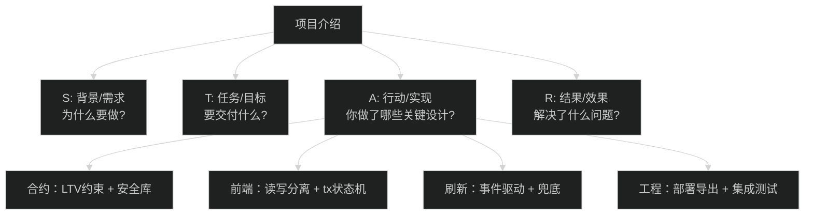

# 项目亮点梳理 - 如何介绍这个项目

> 🎯 目标：学会用专业的方式介绍项目，突出技术深度和个人贡献

## 0) 一图读懂：用 STAR + 三段结构讲项目



## 1. 项目介绍的黄金法则

### 1.1 STAR 法则
```
Situation (背景)：什么场景/需求
Task (任务)：你要解决什么问题
Action (行动)：你具体做了什么
Result (结果)：达成了什么效果
```

### 1.2 时间控制
```
电梯版本（30秒）：核心功能 + 技术栈
标准版本（2-3分钟）：完整介绍 + 技术亮点
深入版本（5-10分钟）：架构设计 + 难点解决
```

---

## 2. 30 秒电梯介绍（Elevator Pitch）

### 版本 1：技术导向
```
"这是一个基于以太坊的去中心化借贷协议，
使用 Solidity 编写智能合约，Hardhat 进行测试和部署，
前端用 React + TypeScript + ethers.js v6 实现。
实现了完整的存款、借款、还款、取款流程，
包含事件驱动的 UI 更新和完善的交易状态管理。"
```

### 版本 2：业务导向
```
"这是一个 DeFi 借贷应用，让用户可以：
1) 存入加密货币作为抵押品，获得利息
2) 基于抵押品借出稳定币
3) 实时查看健康因子和可用额度
整个流程通过智能合约自动执行，无需人工审批，
前端完整实现了钱包连接、交易管理、状态更新。"
```

**选择建议**：
- 技术岗位 → 版本 1
- 产品岗位 → 版本 2
- 不确定 → 先说版本 2，面试官追问再深入技术

---

## 3. 2-3 分钟标准介绍

### 结构模板
```
【1. 项目定位】(20秒)
这是一个教学性质的 DeFi 借贷协议全栈项目，
展示了如何从零开发一个可用的区块链应用。

【2. 技术栈】(30秒)
后端：Solidity 0.8.19 + OpenZeppelin 安全库 + Hardhat
前端：React + TypeScript + ethers.js v6 + Vite
测试：Hardhat 单元测试 + E2E 烟雾测试
部署：本地链（chainId 31337）+ 自动化部署脚本

【3. 核心功能】(40秒)
用户可以：
- 连接 MetaMask 钱包
- 存入 USD8 代币作为抵押品
- 基于 75% LTV 进行借款
- 实时查看健康因子和利率
- 随时还款和取款

技术亮点：
- 事件驱动的 UI 更新（监听合约事件）
- 完整的交易生命周期管理（签名→pending→确认→验证）
- 授权流程优化（精确/无限可选 + USDT 兼容）

【4. 个人收获】(20秒)
通过这个项目，我深入理解了：
- 智能合约的安全设计（防重入、权限控制、暂停机制）
- 区块链前端开发的特殊性（精度处理、状态一致性）
- 完整的开发流程（测试、部署、文档）
```

---

## 4. 技术亮点详解

### 亮点 1：事件驱动 + 轮询兜底的混合策略

**问题背景**：
```
题目要求："Listen for contract events and update UI"
但实际环境中事件监听可能丢失（网络问题、页面休眠等）
```

**解决方案**：
```javascript
// 主策略：事件监听
lending.on("Supplied", (user, amount) => {
  if (user === account) refresh();
});

// 兜底策略：节流的区块监听（3秒）
provider.on("block", throttledRefresh);

// 但 pending 时关闭兜底（避免无效刷新）
```

**为什么这样设计？**
1. 事件是题目明确要求
2. 事件是最准确的状态源
3. 轮询只用于极端情况（不是主逻辑）
4. 避免性能问题（节流 + pending 时禁用）

**面试时可以说**：
```
"我没有简单地用轮询，而是以事件监听为主，
轮询只作为兜底机制。这样既满足题目要求，
又考虑了实际使用中的边缘情况。"
```

### 亮点 2：完整的交易生命周期管理

**对比其他项目**：
```
普通实现：
onClick={() => contract.supply(amount)}  // 结束

我们的实现：
1. 显示"Signing..."
2. 发送交易，显示"Pending..."
3. 等待 2 次确认
4. 验证链上状态变化
5. 标记"Confirmed"或"Unverified"
6. 持久化到 localStorage（刷新页面不丢失）
7. 30秒超时提醒（但不强制失败）
```

**代码亮点**：
```typescript
type TxState =
  | { stage: "idle" }
  | { stage: "signing"; label: string }
  | { stage: "pending"; label: string; hash: string; startedAt: number }
  | { stage: "confirmed"; label: string; hash: string; postState: PostState }
  | { stage: "failed"; label: string; error: NormalizedError };

// 持久化
if (tx.stage === "pending") {
  saveTx({ hash: tx.hash, label: tx.label, chainId });
}

// 恢复
useEffect(() => {
  const saved = loadPendingTx(chainId);
  if (saved) {
    checkTxStatus(saved.hash);  // 主动查询状态
  }
}, []);
```

**面试时可以说**：
```
"我实现了完整的交易状态机，不只是发交易，
还包括状态追踪、持久化、超时处理、事后验证。
这让用户体验更好，也更符合生产环境的要求。"
```

### 亮点 3：授权流程的细节处理

**问题**：
```
不同 ERC20 代币的 approve 行为不一致
- 标准实现：可以直接 approve(new_amount)
- USDT：必须先 approve(0) 再 approve(new_amount)
```

**解决方案**：
```typescript
async function approveToken(amount: bigint, mode: "exact" | "infinite") {
  const approveAmount = mode === "infinite" ? MaxUint256 : amount;
  
  // USDT 兼容：先尝试直接 approve
  try {
    await token.approve(spender, approveAmount);
  } catch (err) {
    // 如果失败，先 approve(0) 再重试
    if (allowance > 0n) {
      await token.approve(spender, 0);
      await token.approve(spender, approveAmount);
    }
  }
}
```

**还支持**：
- 用户可选"精确授权"或"无限授权"
- 交易前显示授权摘要（"需要授权：100 USD8 (Exact)"）

**面试时可以说**：
```
"我研究了不同 ERC20 实现的兼容性问题，
特别是 USDT 的特殊要求，实现了兜底逻辑。
同时给用户选择权，平衡安全性和便利性。"
```

### 亮点 4：Post-State 验证机制

**问题背景**：
```
交易确认 ≠ 状态一定更新了
RPC 节点可能有延迟，读取的状态可能是旧的
```

**解决方案**：
```typescript
async function verifyPostState(args: {
  before: Position;
  amount: bigint;
  kind: "supply" | "withdraw" | "borrow" | "repay";
}) {
  // 等待最多 5 秒
  const timeout = 5000;
  const started = Date.now();
  
  while (Date.now() - started < timeout) {
    const after = await readPosition();
    
    // 检查是否符合预期
    if (isExpectedChange(before, after, amount, kind)) {
      return { status: "verified" };
    }
    
    await sleep(500);
  }
  
  // 超时仍不一致 → 标记为 unverified（不是失败）
  return { status: "unverified" };
}
```

**为什么不直接标记失败？**
```
因为 RPC 延迟是正常现象，不应该误导用户。
unverified 状态提示用户"交易成功了，但读取延迟，请手动刷新"。
```

**面试时可以说**：
```
"我实现了交易后状态验证，但考虑到 RPC 的最终一致性，
不会因为读取延迟就标记失败，而是给用户明确的提示。
这是对真实区块链环境特性的理解和尊重。"
```

### 亮点 5：精度处理（bigint 端到端）

**问题**：
```
JavaScript 的 Number 类型：
- 最大安全整数：2^53 - 1 (约 9 千万亿)
- 代币数量：100 * 10^18 (远超安全整数)

如果用 Number：
100000000000000000000 → 精度丢失
```

**解决方案**：
```typescript
// ❌ 错误做法
const amount = Number(ethers.parseUnits("100", 18));  // 精度丢失

// ✅ 正确做法
const amount = ethers.parseUnits("100", 18);  // 返回 bigint
// 全程使用 bigint，直到显示时才转字符串
const display = ethers.formatUnits(amount, 18);
```

**类型系统保障**：
```typescript
type Amount = {
  value: bigint;       // 合约值
  decimals: number;    // 精度
  display: string;     // 显示值
};

function requireAmountStrict(a: Amount): bigint {
  if (a.value <= 0n) throw new Error("Amount must be positive");
  return a.value;
}
```

**面试时可以说**：
```
"我全程使用 bigint 处理代币数量，避免 Number 的精度问题。
并且定义了严格的类型系统，从用户输入到合约调用都是类型安全的。"
```

---

## 5. 架构设计亮点

### 5.1 读写分离

```
传统做法：
const contract = new Contract(address, abi, signer);
await contract.balanceOf(user);  // 读
await contract.supply(amount);   // 写

我们的做法：
// 读模型（provider）
const { usd8, lending } = getContracts(provider);
await usd8.balanceOf(user);

// 写模型（signer）
const writeToken = getWriteToken(signer);
await writeToken.approve(spender, amount);
```

**好处**：
1. 职责分离：读写逻辑不混合
2. 错误隔离：写失败不影响读
3. 性能优化：读操作可以并发
4. 状态管理清晰：写完成 → 触发读刷新

### 5.2 自定义 Hooks 分层

```
useWallet
  ↓ 提供 provider, signer, account, chainId
  
useDashboard (读)
  ↓ 余额、pool、position、maxBorrow/maxWithdraw
  
useActions (写)
  ↓ supply, withdraw, borrow, repay
  
useAllowance (读)
  ↓ 授权额度
```

**每个 Hook 职责单一**：
- `useWallet`: 钱包连接和切换
- `useDashboard`: 仪表盘数据 + 事件监听
- `useActions`: 交易发送 + 状态管理
- `useAllowance`: 授权查询 + 事件监听

---

## 6. 测试和工程化亮点

### 6.1 测试覆盖

```typescript
// 正常流程
it("approve → supply → borrow → repay → withdraw", async () => {
  await approve(100);
  await supply(100);
  await borrow(50);
  await repay(50);
  await withdraw(100);
  expect(position.supplied).to.eq(0);
});

// 边界条件
it("reverts when borrowing above max", async () => {
  await supply(100);
  await expect(borrow(76)).to.be.revertedWith("Exceeds borrowing limit");
});

// 安全检查
it("reverts when withdrawing would make position unhealthy", async () => {
  await supply(100);
  await borrow(75);
  await expect(withdraw(1)).to.be.revertedWith("unhealthy");
});
```

### 6.2 一键部署 + 自动导出

```typescript
// scripts/deploy.ts
async function main() {
  // 1. 部署合约
  const usd8 = await deployToken("USD8", "USD8");
  const lending = await deployLending(usd8.address);
  
  // 2. Seed 测试账号
  await usd8.transfer(SEED_ADDRESS, parseUnits("10000", 18));
  
  // 3. 导出到前端
  exportABIs();
  exportDeployments(chainId, { usd8, lending, weth });
}

// 前端自动获取
import { deployments } from "./contracts/deployments.json";
const address = deployments["31337"].SimpleLending;
```

### 6.3 E2E 烟雾测试

```javascript
// scripts/smoke-e2e.mjs
async function smokeTest() {
  // 启动本地链（如果未运行）
  await ensureLocalChain();
  
  // 部署合约
  await deploy();
  
  // 执行完整流程
  await approve(usd8, lending, parseUnits("100", 18));
  await supply(lending, parseUnits("100", 18));
  await borrow(lending, parseUnits("50", 18));
  await repay(lending, parseUnits("50", 18));
  await withdraw(lending, parseUnits("100", 18));
  
  console.log("✅ E2E smoke test passed");
}
```

---

## 7. 如何展示项目

### 7.1 演示流程（5分钟）

**准备工作**（面试前完成）：
```bash
# Terminal 1: 启动本地链
npx hardhat node

# Terminal 2: 部署合约
npx hardhat run scripts/deploy.ts --network localhost

# Terminal 3: 启动前端
cd frontend && npm run dev
```

**演示步骤**：
```
1. 打开浏览器，展示初始状态
   "可以看到提示连接钱包"

2. 连接 MetaMask
   "这里会检查链 ID，自动提示切换到本地链"

3. 展示仪表盘
   "余额、pool 信息、用户仓位实时显示"

4. 执行 Supply
   "首先需要 approve，这里可以选精确或无限授权"
   "交易前有摘要确认"
   "可以看到状态变化：Signing → Pending → Confirmed"

5. 展示事件监听
   "交易确认后，UI 自动更新，无需手动刷新"

6. 执行 Borrow
   "基于 75% LTV，我可以借 XX USD8"
   "健康因子实时变化"

7. （可选）展示错误处理
   "尝试借超过限额，会被合约拒绝"
   "UI 显示友好的错误提示"
```

### 7.2 代码走读（10分钟）

**推荐顺序**：
```
1. 合约（5分钟）
   contracts/SimpleLending.sol
   - 关键常量（LTV_RATIO）
   - supply() 函数逻辑
   - borrow() 的安全检查
   - 防重入机制

2. 前端（5分钟）
   frontend/src/hooks/useActions.ts
   - 交易状态机
   - approve + supply 流程
   - Post-state 验证
   
   frontend/src/hooks/useDashboard.ts
   - 事件监听
   - 数据刷新策略
```

---

## 8. 常见追问及应对

### 追问 1："为什么不用 Wagmi / RainbowKit？"

**回答**：
```
"我考虑过，但最终选择直接用 ethers.js，原因是：

1. 学习目的：
   想深入理解底层机制，而不是依赖高级封装

2. 灵活性：
   我需要自定义交易状态管理，Wagmi 的抽象可能限制

3. 项目规模：
   这是一个小型教学项目，ethers.js 已经足够

4. 未来可扩展：
   理解了底层原理后，迁移到 Wagmi 会很容易

如果是生产项目，我会考虑用 Wagmi 节省开发时间。"
```

### 追问 2："为什么不部署到测试网？"

**回答**：
```
"我使用本地链是经过权衡的：

优势：
1. 完全可复现：评审者可以一键启动
2. 快速迭代：秒级确认，方便调试
3. 无需水龙头：不依赖外部资源
4. 隐私：代码不公开在测试网

劣势：
1. 数据不持久（重启丢失）
2. 无法展示给不懂技术的人

对于教学和面试展示，本地链是最优选择。
如果需要，我可以在 30 分钟内部署到 Sepolia 测试网。"
```

### 追问 3："如果让你重新做，会改什么？"

**回答（展示思考深度）**：
```
"有几个方向可以改进：

1. 添加清算机制
   - 当健康因子 < 100% 时允许清算
   - 给清算人奖励（如 5%）
   
2. 时间加权的利息计算
   - 当前利率是固定的，不随时间计提
   - 应该记录每次操作的时间戳
   
3. 多币种支持
   - 当前只有单币种
   - 需要预言机获取价格
   
4. 更多的前端优化
   - 添加图表展示利率变化
   - 历史交易记录
   - 移动端适配

但对于一个教学项目，当前的范围是合适的。
重要的是把核心功能做扎实，而不是贪多。"
```

---

## 9. 面试现场技巧

### 9.1 时间分配建议

**总时间：10 分钟**
```
项目背景 (1分钟)
技术栈 (1分钟)
演示核心功能 (3分钟)
讲解技术亮点 (3分钟)
总结和反思 (1分钟)
回答问题 (1分钟)
```

### 9.2 肢体语言

```
✅ 做：
- 眼神交流（看摄像头）
- 手势辅助讲解
- 微笑和热情
- 适当停顿让面试官提问

❌ 不做：
- 一直低头看屏幕
- 语速过快
- 说太多专业术语不解释
- 完全不互动
```

### 9.3 应对卡壳

**如果忘记要说什么**：
```
"让我在代码里确认一下..."（打开相关文件）
"这里我实现了 XXX..."（边看边说）
```

**如果被问到不会的**：
```
"这个我目前还不太了解，但我的思路是..."
"我会通过 XXX 资源学习这个知识点"
```

---

## 10. 总结：你的核心竞争力

通过这个项目，你展示了：

### ✅ 技术能力
- 完整的全栈开发能力（合约 + 前端）
- 扎实的基础（精度、状态管理、错误处理）
- 工程化思维（测试、部署、文档）

### ✅ 学习能力
- 快速上手新技术（Web3、Solidity）
- 深入理解原理（不只是调 API）
- 主动学习安全最佳实践

### ✅ 问题解决能力
- 发现问题（交易状态、精度、授权兼容性）
- 分析问题（找到根本原因）
- 解决问题（实现可行方案）

### ✅ 产品思维
- 用户体验（交易状态、错误提示）
- 边缘情况考虑（刷新页面、超时）
- 文档完善（README、注释）

---

**记住**：面试不是展示你知道的所有东西，而是展示你**如何思考**和**如何学习**。这个项目是你的证明，要充满自信地讲出来！

加油！🚀
