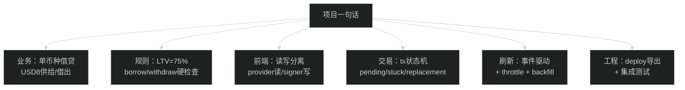

# 一页速记卡：项目闭环与面试答案卡（面试前 5–10 分钟）

> 用法：面试前 5–10 分钟只看这一份；由原「11-一页速记卡」与「26-一页速记卡-项目闭环与面试答案卡」合并。  
> 验收与路径以 [项目总览架构](项目总览架构.md) 为准。

---

## 0) 最小知识图谱与必背（10 分钟过一遍）

### 0.1 一图读懂

### 0.2 一句话项目介绍

"Hardhat 本地链(31337)上的 DeFi 借贷 Demo：Solidity + OpenZeppelin 合约，React+TS+ethers v6 前端，支持 approve→supply/borrow/repay/withdraw，事件驱动刷新+交易状态机。"

### 0.3 技术栈

- 合约：Solidity 0.8.19 + OpenZeppelin（Ownable/Pausable/ReentrancyGuard/SafeERC20）
- 框架：Hardhat（compile/test/deploy）
- 前端：React + TypeScript + ethers v6 + Vite
- 网络：Hardhat local node（RPC: 127.0.0.1:8545, chainId 31337）

### 0.4 业务规则（必须背）

- 单币种：USD8 同时用于 supply 和 borrow
- LTV：75%（maxBorrow = supplied * 75%）
- withdraw 限制：withdraw 后仍要满足 borrowed <= newSupply * 75%

### 0.5 核心合约函数（说清楚输入/检查/状态变化/事件）

- `supply(amount)`：transferFrom 用户→合约；更新 userSupply/totalSupply；emit Supplied
- `borrow(amount)`：检查流动性和 LTV；更新 userBorrow/totalBorrow；transfer 合约→用户；emit Borrowed
- `repay(amount)`：transferFrom 用户→合约；更新 userBorrow/totalBorrow；emit Repaid
- `withdraw(amount)`：检查余额 + 提现后健康；先改状态再 transfer；emit Withdrawn

### 0.6 前端交互（背这五个关键词）

- 读写分离：getContracts 仅池子+代币；治理用 getDeployments + GovernorP9/GovToken（需先 `npm run deploy:p9`）
- Provider（读）/ Signer（写）分离
- 预确认（PreflightModal）：点交易后先弹窗展示 Action/Amount/ChainId/地址，确认再打开钱包
- Allowance 检查 + approve（exact/infinite 可选）
- Tx 状态机：idle → signing → pending → confirmed/failed/stuck
- 事件监听刷新为主，区块监听节流兜底

### 0.7 最容易被追问的点（准备答案）

- 为什么要 approve？（ERC20 授权机制，合约用 transferFrom）
- 为什么用 SafeERC20？（兼容不同 ERC20 实现，避免返回值差异）
- 怎么防重入？（ReentrancyGuard + CEI）
- 事件监听怎么写？怎么清理？（on/off 或 useEffect cleanup）
- 为什么要多次确认？（减少重组风险/提升可靠性）
- 为什么 post-state 不一致不算失败？（RPC 最终一致性/读延迟）

### 0.8 面试演示顺序（按这个来）

Connect → Supply（预确认→必要时 Approve→Supply）→ Borrow（预确认）→ Repay（预确认→必要时 Approve→Repay）→ Withdraw（预确认）

### 0.9 3 个“项目亮点”短句

- "事件驱动刷新为主，轮询兜底，避免 UI 不更新。"
- "交易状态机 + pending 持久化，刷新页面也能恢复追踪。"
- "bigint 端到端金额处理 + safe max（-1 wei）避免舍入失败。"

### 0.10 你可以反问面试官的 3 个问题

- "团队对合约安全审计/上线前检查的流程是什么？"
- "前端对链上数据同步（indexer/事件/轮询）通常怎么做？"
- "新人加入后前三个月最希望我交付什么？"

---

## 1) 60 秒自我介绍模板（直接照读）

1) 我先把链路闭环跑通：Hardhat 本地链部署合约 → 导出 ABI/地址 → 前端读写四个动作（Supply/Borrow/Repay/Withdraw）。
2) 然后做工程可靠性：tx 状态机（signing/pending/stuck/替换追踪/恢复）+ 三层刷新（confirmed + events + backfill）保证 UI 最终一致。
3) 再做 UX 安全：严格金额解析（bigint）+ preflight（钱包前确认）+ approve 模式（Exact/Infinite）+ mutex/按钮禁用防 double submit。
4) 最后用证据证明可复现：assessment mapping + demo checklist + `smoke:e2e` 一键自检。

---

## 2) 20 个“口语答案卡”（每题 1 句）

1. 我把闭环跑通：部署→导出→前端读写→事件/confirmed refresh 保证 UI 同步。
2. 用 `frontend/src/contracts/deployments.json` 避免手抄地址导致错链/错合约，smoke 与前端同源配置。
3. hook 分层：wallet 负责连接切链；dashboard 负责读链与刷新；actions 负责写链与状态机。
4. confirmed 后强制 refresh，因为事件可能漏、RPC 读可能延迟。
5. events 是主路径；block/backfill 是兜底，保证最终一致且节流。
6. tx 用状态机而非 isLoading，因为真实钱包有 signing/pending/stuck/替换交易。
7. stuck 是“超时需要复查”不是失败，避免 UI 假阴性。
8. 替换交易会更新 hash 并继续追踪 replacement receipt，用户只看最终结果。
9. pending tx 持久化到 localStorage，刷新页面后继续追踪避免重复提交。
10. preflight 把 action/amount/spender/chain/account 在钱包前讲清楚，减少误操作。
11. 金额严格解析 + bigint end-to-end，避免 18 位小数精度事故与格式歧义。
12. Approval mode：Exact 更安全、Infinite 更省事，把选择权交给用户并明示 spender。
13. Supply/Repay allowance 不够就先 approve 再 action，两步封装成一次操作体验更稳。
14. allowance 单独 hook + 监听 Approval 事件，避免授权漂移导致 UI 不准。
15. 按钮禁用 + action mutex 防 double submit，避免竞态与状态机乱。
16. maxBorrow/maxWithdraw 做减 1 wei 保守策略，避开边界 rounding 触发 revert。
17. post-state verification：confirmed 后二次读验证，给 verified/unverified 不撒谎。
18. 合约核心安全约束是健康因子/LTV：borrow/withdraw 在链上硬检查。
19. `smoke:e2e` 用导出 ABI/地址跑全链路，快速证明“合约+部署”没问题。
20. 用 mapping + checklist 把题面逐条对齐到实现文件，保证可验收可复现。

---

## 3) 追问直接甩“函数名 + 文件”（最省心）

- 导出地址/ABI：`exportArtifacts(...)` in `scripts/_lib/export.ts`（入口：`scripts/deploy/deploy.ts`）
- 切链/加链：`ensureCorrectNetwork()` / `switchToLocalhost()` in `frontend/src/hooks/useWallet.ts`
- 预确认弹窗：`usePreflight` + `PreflightModal.tsx` in `frontend/src/hooks/usePreflight.ts`、`frontend/src/components/ui/PreflightModal.tsx`
- 事件监听/节流/回填：`scheduleRefresh()` / `backfillEvents()` in `frontend/src/hooks/useDashboard.ts`
- tx 状态机/超时 stuck：`runTxDetailed(...)` + `waitWithTimeout()` in `frontend/src/state/tx.ts`
- 替换交易追踪：`code === "TRANSACTION_REPLACED"` 分支 in `frontend/src/state/tx.ts`
- pending 持久化：`savePendingTx()` / `loadPendingTx()` / `clearTx()` in `frontend/src/state/txStore.ts`
- mutex：`withLock(key, fn)` in `frontend/src/hooks/useActions.ts`
- post-state verify：`verifyPostState(...)` in `frontend/src/hooks/useActions.ts`（参数：`frontend/src/config/runtime.ts`）
- 严格金额解析：`parseAmountStrict()` / `requireAmountStrict()` in `frontend/src/utils/amount.ts`

---

## 4) 最快自检命令（面试前确保“能跑”）

- 本地链：`npx hardhat node`（或 `npm run node`）
- 部署导出：`npm run deploy:localhost`（治理可选：`npm run deploy:p9`）
- 前端：`cd frontend && npm run dev`
- 一键链路自检：`npm run smoke:e2e`
- **完整验收**：`npm run p10:gate` exit 0 + evidence-pack 四锚点（见总览 §6、§7）

---

想看更详细的版本：
- 总入口（架构/题面对齐/验收）：[05-架构与技术图](05-架构与技术图.md)
- 题面对齐/演示清单：见 `docs/` 或 [09-证据与验收](09-证据与验收-录屏与岗位清单.md)
