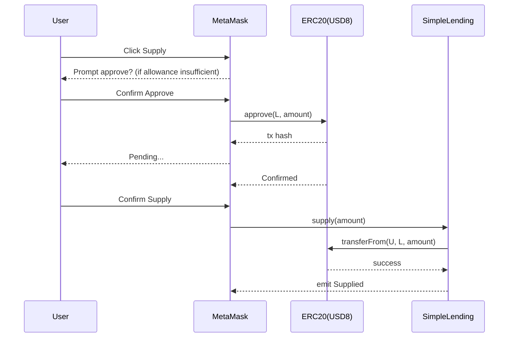
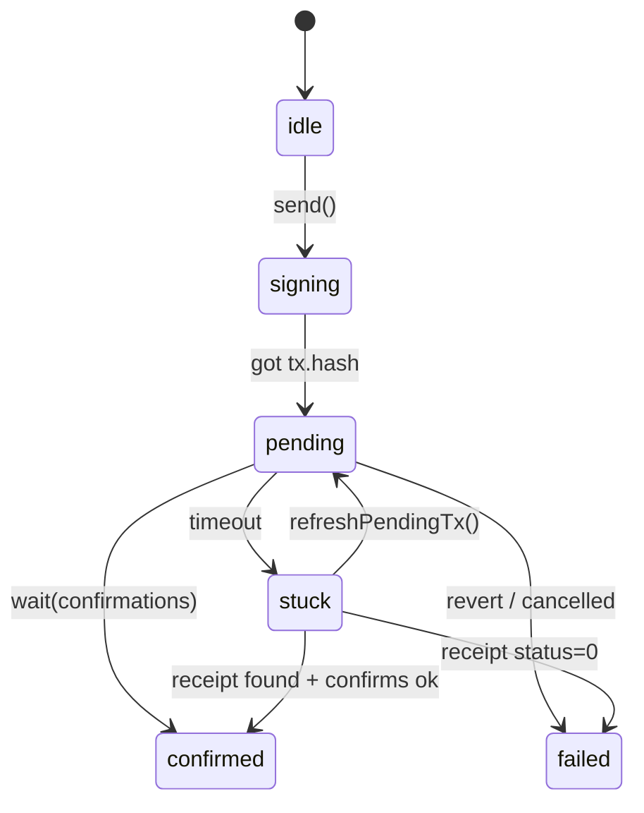
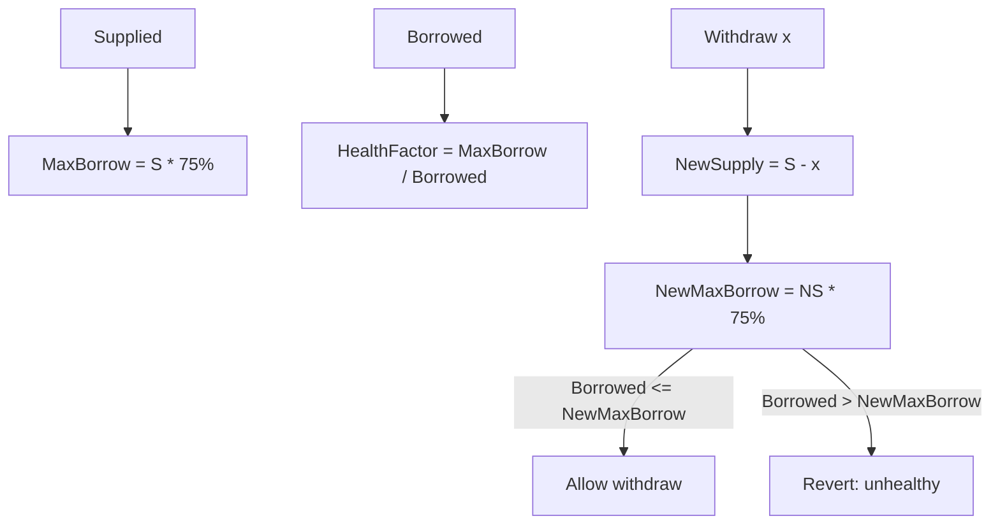

# 面试答案卡：每题 30 秒版 + 2 分钟版（小白可背）

> 用法：
> - 先背“30 秒版”（能保证不尬住）
> - 面试官追问再切“2 分钟版”（体现深度）
> - 每题后面都有“证据点”（告诉面试官你不是背概念，是基于代码）

## 0) 一图读懂：怎么用这份答案卡

```mermaid
%%{init: {'theme': 'dark'}}%%
flowchart TB
  S[先背30秒版\n保证不断片] --> T{面试官追问?}
  T -->|没有| DONE[收口+反问]
  T -->|有| DEEP[切到2分钟版\n讲设计取舍]
  DEEP --> EV[落到证据点\n(文件路径)]
  EV --> PLUS[可选加分\n(安全/边界/替代方案)]
```

---

## 1) 你这个项目做了什么？

### 30 秒版

"我做的是一个可复现的 DeFi 借贷 Demo：在 Hardhat 本地链 31337 上部署 USD8/WETH 和借贷合约 SimpleLending，前端用 React + TypeScript + ethers v6。用户可以在 UI 里完成 approve→supply/borrow/repay/withdraw 的真实链上交易，并且 UI 通过监听合约事件自动刷新。"

### 2 分钟版

"项目目标是展示完整的 Web3 交易链路，而不是只写一个合约：
1) 合约层：SimpleLending 是单币种借贷，USD8 既用来存也用来借；核心约束是 LTV=75%，borrow 和 withdraw 都会在合约侧做硬检查。
2) 前端层：我把交互拆成读模型和写模型。读模型用 provider 并发读余额/仓位/pool；写模型用 signer 发交易，并管理交易状态机（signing/pending/confirmed/failed/stuck）。
3) 刷新策略：事件监听为主（题目要求），同时做了事件 burst 节流、以及 best-effort backfill（queryFilter 小范围）来兜底。
4) 工程化：有 Hardhat 集成测试覆盖 happy path 和关键 revert，部署脚本一键部署并导出 ABI + address 给前端。"

证据点：
- 合约： [contracts/SimpleLending.sol](../contracts/SimpleLending.sol)
- 读模型： [frontend/src/hooks/useDashboard.ts](../frontend/src/hooks/useDashboard.ts)
- 写模型： [frontend/src/hooks/useActions.ts](../frontend/src/hooks/useActions.ts)
- tx 状态机： [frontend/src/state/tx.ts](../frontend/src/state/tx.ts)
- 测试： [test/SimpleLending.integration.ts](../test/SimpleLending.integration.ts)

---

## 2) 为什么 ERC20 操作要先 approve？

### 30 秒版

"因为 ERC20 代币不能让合约随便转走你的钱。你要先对 token 合约调用 approve(spender, amount)，授权借贷合约作为 spender 才能 transferFrom 你的余额。我们前端会先检查 allowance，不够才走 approve，然后再 supply/repay。"

### 2 分钟版

"ERC20 的安全模型是：余额在 token 合约里，转走别人余额必须满足两种之一：
- owner 自己调用 transfer
- spender 在 owner 授权后调用 transferFrom

我们的 supply/repay 本质上是：借贷合约从用户把 USD8 拉到合约里，所以必须走 transferFrom → 这就要求 allowance 足够。
前端实现上，我封装了 approveIfNeeded(requiredAmount)：
1) 先读 allowance(owner, spender)
2) 如果 >= requiredAmount：直接执行 supply/repay
3) 不够：先 approve（支持 exact/infinite），再执行动作

这样做能避免重复授权，也让用户体验更顺。"

配图（授权→存款）：


证据点：
- allowance/approve 编排： [frontend/src/hooks/useActions.ts](../frontend/src/hooks/useActions.ts)
- 合约 supply 内部 transferFrom： [contracts/SimpleLending.sol](../contracts/SimpleLending.sol)

---

## 3) 你怎么保证 UI 自动更新？

### 30 秒版

"我用合约事件监听作为主刷新策略：监听 Supplied/Withdrawn/Borrowed/Repaid，收到与当前用户相关的事件就刷新仪表盘数据。同时为了避免事件 burst 刷新过多，我做了 250ms 节流。"

### 2 分钟版

"题目要求必须 listen events，所以我把事件作为主驱动。实际环境里事件订阅可能因为 provider 重连、页面休眠等丢失，我加了 best-effort backfill：用 queryFilter 在最近 N 个 block 里查有没有用户事件，有就触发 refresh。

刷新本身是并发读：余额、pool、position、maxBorrow、maxWithdraw 一次 Promise.all 拉齐，减少等待和状态不同步。"

配图（事件触发刷新）：
```mermaid
flowchart LR
  TX[Tx Confirmed] --> EVT[Contract emits event]
  EVT --> SUB[Frontend subscription]
  SUB --> THR[Throttle 250ms]
  THR --> REF[refresh(): Promise.all reads]
  REF --> UI[Update dashboard]
  SUB --> BF[Backfill (queryFilter) (best-effort)]
  BF --> THR
```

证据点：
- 事件监听/节流/backfill： [frontend/src/hooks/useDashboard.ts](../frontend/src/hooks/useDashboard.ts)

---

## 4) 交易 pending 很久/刷新页面怎么办？

### 30 秒版

"我做了交易状态机：signing/pending/confirmed/failed/stuck。pending 会把 hash 持久化到 localStorage，页面刷新后自动恢复并继续 waitForTransaction；超时不会直接判失败，而是标 stuck 让用户手动 refresh。"

### 2 分钟版

"真实链上 pending 可能很久，直接显示失败会误导用户。我在 runTxDetailed 里做了：
1) signing：弹钱包前就更新状态
2) pending：拿到 tx.hash 就进入 pending，并持久化 `{chainId, account, label, hash}`
3) wait(confirmations) 带超时：超时→stuck（不清除本地记录）
4) replacement 处理：如果 TRANSACTION_REPLACED，跟踪 replacement.hash

useActions 在页面加载时会 loadPendingTx 并调用 provider.waitForTransaction 继续追踪。"

配图（交易状态机）：


证据点：
- 状态机与超时/替换： [frontend/src/state/tx.ts](../frontend/src/state/tx.ts)
- pending 持久化： [frontend/src/state/txStore.ts](../frontend/src/state/txStore.ts)
- 页面刷新恢复： [frontend/src/hooks/useActions.ts](../frontend/src/hooks/useActions.ts)

---

## 5) LTV/健康因子是什么？你项目怎么做？

### 30 秒版

"LTV 就是最大可借额度占抵押品比例。我们 LTV=75%，所以存 100 最多借 75。borrow 会检查不超过限额，withdraw 会检查提现后仍满足 LTV，否则 revert。healthFactor 是一个展示用的安全指标。"

### 2 分钟版

"在 SimpleLending 里，核心约束是：
- borrow：`userBorrow + amount <= userSupply * 75%`
- withdraw：`borrowed <= (newSupply * 75%)`

healthFactor 的计算：当 borrowed=0 时设为 uint256 max（无限安全）；否则用 maxBorrowable/borrowed 的比例（乘 100）做展示。
前端会同时读 `getUserPosition` + `calculateMaxBorrow` + `calculateMaxWithdraw` 来给用户提供可操作的上限。"

配图（LTV 约束）：


证据点：
- borrow/withdraw 检查与 healthFactor： [contracts/SimpleLending.sol](../contracts/SimpleLending.sol)
- maxBorrow/maxWithdraw view： [contracts/SimpleLending.sol](../contracts/SimpleLending.sol)
- 前端展示： [frontend/src/hooks/useDashboard.ts](../frontend/src/hooks/useDashboard.ts)

---

## 6) 合约安全你做了哪些？

### 30 秒版

"关键写函数都加了 nonReentrant 防重入；ERC20 交互用 SafeERC20；还支持 pause/unpause 紧急暂停和 onlyOwner 权限控制。"

### 2 分钟版

"我优先用 OpenZeppelin 审计过的组件：
- ReentrancyGuard：防止重入
- SafeERC20：兼容返回值异常的 ERC20
- Pausable：紧急暂停，防止事故扩大
- Ownable：限制只有 owner 能 pause/unpause

并且函数内部遵循 CEI（先检查、再改状态、再外部调用），进一步降低风险。"

证据点：
- 合约继承/修饰器： [contracts/SimpleLending.sol](../contracts/SimpleLending.sol)

---

## 7) 你怎么测试？

### 30 秒版

"用 Hardhat + Chai 写集成测试：覆盖完整 happy path 和关键 revert（超额借款、提现导致不健康）。每个动作都断言事件发出。"

### 2 分钟版

"测试里我部署 TestToken + SimpleLending，给 user 转 1000 USD8，然后按真实流程：approve→supply→borrow→approve→repay→withdraw，并用 `.to.emit(lending, 'Supplied')` 等断言事件。边界用例覆盖：
- borrow 超过 75% 会 revertedWith('Exceeds borrowing limit')
- borrow 满额后 withdraw 1 wei 也会 revertedWith('Withdrawal would make position unhealthy')

这种测试方式能验证业务规则确实由合约 enforce，不是前端挡一挡。"

证据点：
- 测试文件： [test/SimpleLending.integration.ts](../test/SimpleLending.integration.ts)
