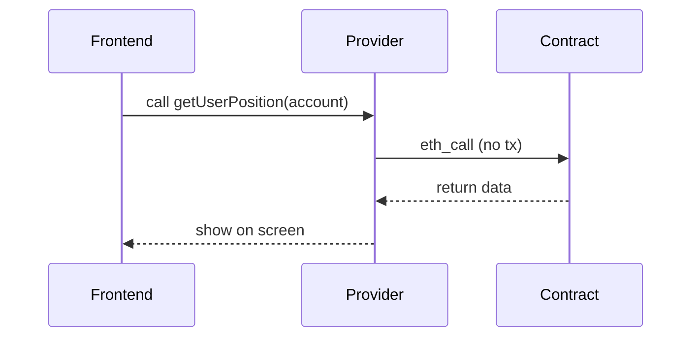
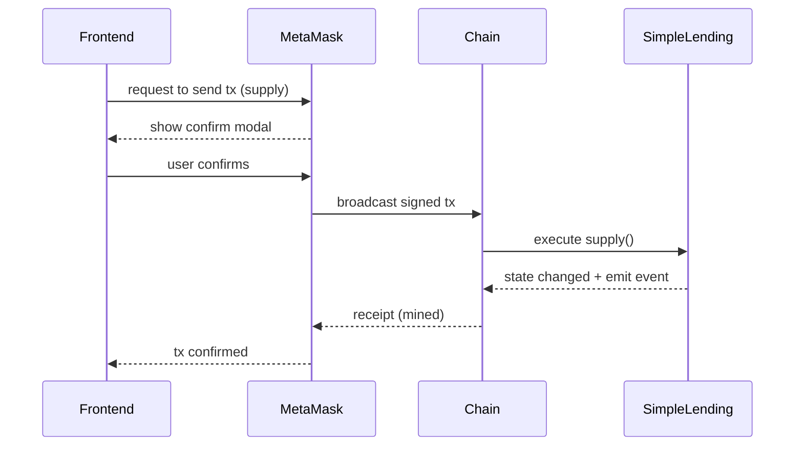

# 图解：从浏览器到链上，一次交易发生了什么？（超小白版）

> 你要记住一句话：
> **前端只是发起请求，真正“改状态”的是链上交易。**

---

## 1) 角色是谁？

- 你（用户）：点按钮的人
- MetaMask：帮你“签名”的钱包
- Provider：读取链上数据的通道（像 HTTP 客户端）
- Signer：能签名并发交易的身份（来自 MetaMask）
- 智能合约：链上的程序（SimpleLending、USD8 Token）
- 区块链：执行交易并保存状态的系统

配图（角色关系）：
```mermaid
%%{init: {'theme': 'dark'}}%%
flowchart LR
  U[You / Browser] --> MM[MetaMask]
  U --> P[Provider (read)]
  MM --> S[Signer (write)]
  P --> CHAIN[Hardhat Chain 31337]
  S --> CHAIN
  CHAIN --> C1[SimpleLending]
  CHAIN --> C2[USD8 ERC20]
```

---

## 2) 读链（Read）是什么？为什么免费？

读链就是：你问链“现在是什么状态”，例如：
- 余额是多少？`balanceOf`
- 我存了多少？`getUserPosition`

读链不改变链上数据，所以不需要打包到区块里，也不需要 gas。

配图（读链流程）：


---

## 3) 写链（Write）是什么？为什么要 gas？

写链就是：你让链“改状态”，例如：
- 存款（supply）会改变 userSupply、totalSupply
- 借款（borrow）会改变 userBorrow、totalBorrow

写链必须成为“交易”，被矿工/验证者打包执行，所以要 gas。

配图（写链流程）：


---

## 4) 为什么“我点了按钮”不等于“马上成功”？

因为链上交易会经历：
1) 签名（你在钱包里点确认）
2) 广播（发送到网络）
3) pending（等待被打包）
4) confirmed（被打包进区块）

所以 UI 必须显示交易状态机，不然用户会迷惑。

证据点：
- tx 状态机： [frontend/src/state/tx.ts](../frontend/src/state/tx.ts)

---

## 5) 最常见的新手误区

- 误区 A：以为前端点了就改了状态
  - 事实：必须等链上 tx confirmed
- 误区 B：用 JS number 处理金额
  - 事实：要用 bigint，否则精度丢失
- 误区 C：不理解 approve
  - 事实：ERC20 要先授权，合约才能 transferFrom

下一篇建议看：
- [learning/16-图解-ERC20授权approve到底在干嘛.md](16-图解-ERC20授权approve到底在干嘛.md)
