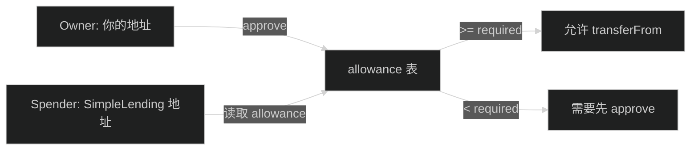
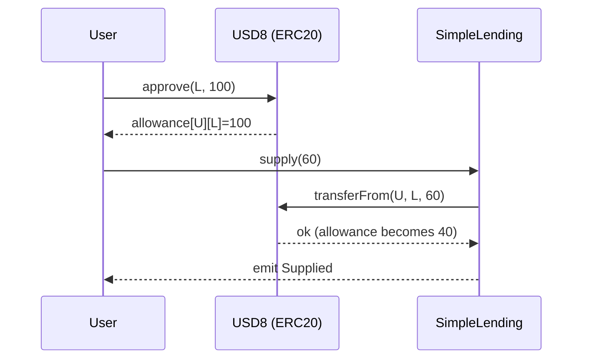

# 图解：ERC20 授权 approve 到底在干嘛？（超小白版）

> 记住：
> **approve 不是转账，它只是“给合约一把钥匙”，允许它在额度内帮你转账。**

---

## 1) 先用生活例子理解

- 你是房主（owner）
- 代币是你的钱（USD8）
- 借贷合约是“代办人”（spender）

你不希望任何人都能从你账户扣钱，所以：
- 你先签一份授权书："我允许借贷合约最多扣 100 USD8"
- 然后借贷合约才可以在需要的时候扣款

---

## 2) approve 改变了哪一张表？

ERC20 里有一张关键映射：

- `allowance[owner][spender] = amount`

这句话的意思是：
- owner 给 spender 的“可用额度”是多少

配图（allowance 关系）：

---

## 3) supply 为什么必须 approve？

因为 supply 的核心是：把你的 USD8 从你钱包转到合约里。

合约不能“直接拿走”你的钱，它必须调用 token 合约的：
- `transferFrom(owner, to, amount)`

而 transferFrom 会检查 allowance：
- allowance >= amount 才会成功

配图（approve + supply）：

---

## 4) 精确授权 vs 无限授权

- 精确授权（Exact）
  - 优点：更安全，只给需要的额度
  - 缺点：每次都可能要再 approve

- 无限授权（Infinite = MaxUint256）
  - 优点：只 approve 一次，之后操作更顺
  - 缺点：如果合约出问题，你授权的风险更大

本项目里提供了两种模式。

证据点：
- approveMode（exact/infinite）与 `approveIfNeeded()`： [frontend/src/hooks/useActions.ts](../frontend/src/hooks/useActions.ts)

---

## 5) 新手常见问题

### Q: 我 approve 了，为什么余额没变？
A: approve 不转账，只是改 allowance。

### Q: 我 supply 失败，提示 allowance 不够？
A: 可能你 approve 的额度 < supply 的额度，需要重新 approve。

### Q: 我可以 revoke 授权吗？
A: 可以，把 allowance 改成 0（approve(spender, 0)）。
