# 技术图：题目要求 → 我们实现了什么 → 证据点在哪里

> 目的：面试时你可以直接打开这份文档，把“要求”一条条对照“实现”。

---

## 0) 一张总览图（从要求到模块）

```mermaid
%%{init: {'theme': 'dark'}}%%
flowchart TB
  A[题目要求] --> B1[合约与部署]
  A --> B2[前端钱包/网络]
  A --> B3[Dashboard 读链]
  A --> B4[交易写链 + 状态]
  A --> B5[事件驱动实时更新]
  A --> B6[安全与质量]

  B1 --> C11[Hardhat + deploy脚本]
  B1 --> C12[导出ABI/地址]

  B2 --> C21[MetaMask连接]
  B2 --> C22[自动切链/加链 31337]
  B2 --> C23[连接状态持久化]

  B3 --> C31[余额/池子/仓位并发读取]
  B3 --> C32[health factor 颜色编码]
  B3 --> C33[maxBorrow/maxWithdraw]

  B4 --> C41[Supply/Withdraw/Borrow/Repay]
  B4 --> C42[Approve-if-needed]
  B4 --> C43[Tx状态机 pending/confirmed/failed/stuck]

  B5 --> C51[监听Supplied/Withdrawn/Borrowed/Repaid]
  B5 --> C52[节流 250ms]
  B5 --> C53[回填 backfill queryFilter]

  B6 --> C61[合约：nonReentrant/SafeERC20/Pausable]
  B6 --> C62[前端：bigint金额链路]
  B6 --> C63[测试：集成测试+revert用例]
```

---

## 1) 题目要求清单（你面试时可以逐条点名）

来源：`docs/CODING_TEST_ASSIGNMENT.txt` + `docs/ASSESSMENT_MAPPING.md`

### Part 1 合约与部署（Mandatory）

| 题目要求 | 我们怎么做的 | 证据点 |
|---|---|---|
| 部署 USD8 & WETH | deploy 脚本部署两个 TestToken | [scripts/deploy.ts](../scripts/deploy.ts), [contracts/TestToken.sol](../contracts/TestToken.sol) |
| 部署 SimpleLending | deploy 脚本部署 SimpleLending | [scripts/deploy.ts](../scripts/deploy.ts), [contracts/SimpleLending.sol](../contracts/SimpleLending.sol) |
| seed 测试账户 token | 部署后给测试账户转 token | [scripts/deploy.ts](../scripts/deploy.ts) |
| 导出 ABI 和地址给前端 | export 脚本 + deployments.json | [scripts/_lib/export.ts](../scripts/_lib/export.ts), [deployments/31337.json](../deployments/31337.json), [frontend/src/contracts/deployments.json](../frontend/src/contracts/deployments.json) |

### Part 2 前端（Mandatory）

| 题目要求 | 我们怎么做的 | 证据点 |
|---|---|---|
| MetaMask 连接（ethers v6） | BrowserProvider + signer | [frontend/src/hooks/useWallet.ts](../frontend/src/hooks/useWallet.ts) |
| 自动切到 31337 / 添加网络 | wallet_switchEthereumChain / wallet_addEthereumChain | [frontend/src/hooks/useWallet.ts](../frontend/src/hooks/useWallet.ts) |
| 连接状态持久化 | localStorage 记住已连接 | [frontend/src/hooks/useWallet.ts](../frontend/src/hooks/useWallet.ts) |
| 展示 USD8/WETH 余额 | dashboard 读余额 | [frontend/src/hooks/useDashboard.ts](../frontend/src/hooks/useDashboard.ts) |
| Supply 前必须 approve | approveIfNeeded 编排 | [frontend/src/hooks/useActions.ts](../frontend/src/hooks/useActions.ts) |
| 展示 allowance/授权状态 | allowance hook | [frontend/src/hooks/useAllowance.ts](../frontend/src/hooks/useAllowance.ts) |
| 展示 pool info、rates、仓位 | Promise.all 并发读 + format | [frontend/src/hooks/useDashboard.ts](../frontend/src/hooks/useDashboard.ts) |
| health factor 颜色编码 | UI + format util | [frontend/src/utils/format.ts](../frontend/src/utils/format.ts), [frontend/src/App.tsx](../frontend/src/App.tsx) |
| maxWithdraw/maxBorrow | 读合约 view | [contracts/SimpleLending.sol](../contracts/SimpleLending.sol), [frontend/src/hooks/useDashboard.ts](../frontend/src/hooks/useDashboard.ts) |
| Supply/Withdraw/Borrow/Repay | 写链入口集中在 actions | [frontend/src/hooks/useActions.ts](../frontend/src/hooks/useActions.ts), [frontend/src/contracts/write.ts](../frontend/src/contracts/write.ts) |
| 交易状态 pending/confirmed/failed | tx 状态机 | [frontend/src/state/tx.ts](../frontend/src/state/tx.ts) |
| 事件监听实时更新 | 监听 4 个事件 + 节流 | [frontend/src/hooks/useDashboard.ts](../frontend/src/hooks/useDashboard.ts) |

### Part 3 测试与质量（Bonus）

| 题目要求 | 我们怎么做的 | 证据点 |
|---|---|---|
| 至少 2 个集成测试 | 覆盖 happy path + revert | [test/SimpleLending.integration.ts](../test/SimpleLending.integration.ts) |
| 错误处理 | action/tx 统一处理 | [frontend/src/state/errors.ts](../frontend/src/state/errors.ts), [frontend/src/hooks/useActions.ts](../frontend/src/hooks/useActions.ts) |
| loading 状态 | tx stage 驱动按钮禁用 | [frontend/src/App.tsx](../frontend/src/App.tsx) |

---

## 2) 面试官最爱问的“你怎么证明你做到了？”

你就按下面这个模板说：

- "题目要求 X，我在 `文件A` 里实现，核心点是 Y；你看这里（打开链接）…"

建议你背 3 条：
- 自动切链（钱包）
- approveIfNeeded（ERC20 安全交互）
- event-driven refresh + backfill（实时更新可靠性）

下一篇（安全图）：
- [learning/19-技术图-安全加固与风险对照.md](19-技术图-安全加固与风险对照.md)
