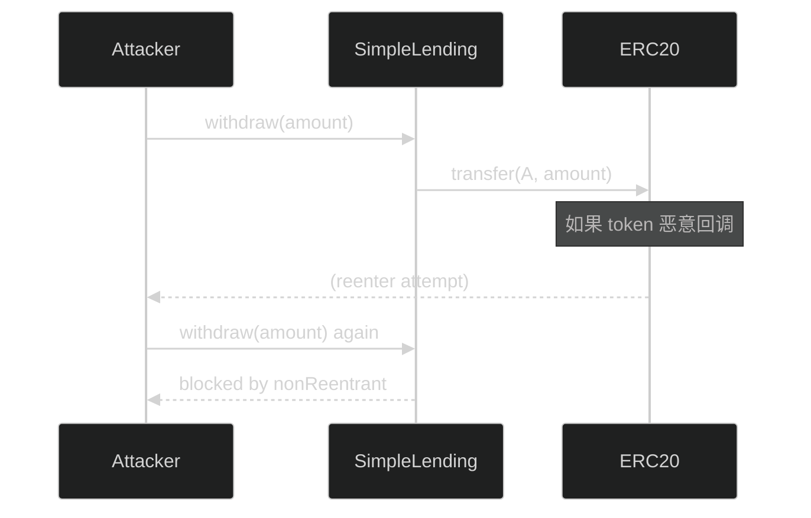
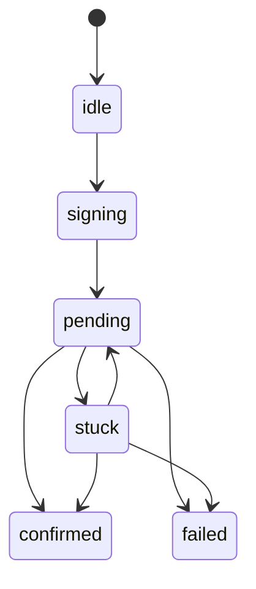

# 技术图：为了安全/可靠性，我们增加了什么？它们分别解决什么风险？

> 面试关键词：**威胁模型（Threat）→ 控制手段（Control）→ 证据点（Evidence）**

---

## 0) 一张总览图（风险→措施）

```mermaid
%%{init: {'theme': 'dark'}}%%
flowchart TB
  R[风险/问题] --> C[我们的控制措施]

  R --> R1[合约被重入攻击]
  R --> R2[ERC20 非标准返回值导致转账异常]
  R --> R3[出现紧急事故无法止损]
  R --> R4[用户操作超额导致不安全仓位]
  R --> R5[前端金额精度错误]
  R --> R6[交易pending很久/刷新页面丢状态]
  R --> R7[事件订阅丢失导致UI不更新]

  R1 --> C1[ReentrancyGuard + nonReentrant]
  R2 --> C2[SafeERC20]
  R3 --> C3[Pausable + onlyOwner]
  R4 --> C4[合约侧 require：LTV 约束]
  R5 --> C5[bigint + formatUnits]
  R6 --> C6[tx状态机 + localStorage 持久化 + stuck]
  R7 --> C7[事件驱动 + throttle + backfill(queryFilter)]
```

---

## 1) 合约层安全（Smart Contract Security）

### 1.1 重入（Reentrancy）

- 威胁：攻击者在外部调用（token.transfer/transferFrom）时重入，再次调用 withdraw/borrow 造成重复提现吗
- 措施：`nonReentrant` 保护所有关键写函数
- 证据点： [contracts/SimpleLending.sol](../contracts/SimpleLending.sol)

配图：


### 1.2 不安全 ERC20（返回值异常/不遵循标准）

- 威胁：有些 token 不返回 bool，或者返回值异常导致你以为成功其实失败
- 措施：OpenZeppelin `SafeERC20` 包装调用
- 证据点： [contracts/SimpleLending.sol](../contracts/SimpleLending.sol)

### 1.3 紧急暂停（Emergency Stop）

- 威胁：发现 bug 时无法快速止损
- 措施：`Pausable` + owner 才能 pause/unpause；关键写函数加 `whenNotPaused`
- 证据点： [contracts/SimpleLending.sol](../contracts/SimpleLending.sol)

### 1.4 协议约束必须由合约 enforce

- 威胁：只靠前端挡不住脚本/别人直接调用合约
- 措施：borrow/withdraw 内部 require：LTV=75% 约束、liquidity check
- 证据点： [contracts/SimpleLending.sol](../contracts/SimpleLending.sol), [test/SimpleLending.integration.ts](../test/SimpleLending.integration.ts)

---

## 2) 前端层安全与可靠性（Frontend Safety & Reliability）

### 2.1 金额精度（Number vs bigint）

- 威胁：JS number 会丢精度，导致金额显示/计算错
- 措施：内部用 `bigint` 表示 base units（18 decimals），展示才 format
- 证据点： [frontend/src/utils/amount.ts](../frontend/src/utils/amount.ts), [frontend/src/App.tsx](../frontend/src/App.tsx)

### 2.2 交易状态机（用户体验 + 正确性）

- 威胁：pending 很久 / 用户刷新页面 / tx 被替换（speed up）导致 UI 不一致
- 措施：TxStage 状态机 + pending 持久化 + stuck 超时 + replacement 处理
- 证据点： [frontend/src/state/tx.ts](../frontend/src/state/tx.ts), [frontend/src/state/txStore.ts](../frontend/src/state/txStore.ts)

配图：


### 2.3 事件驱动刷新 + backfill 兜底

- 威胁：事件订阅可能丢（重连/休眠），导致 UI 不更新
- 措施：监听事件触发 refresh（主）；节流避免连刷；queryFilter 小范围回填（best-effort）
- 证据点： [frontend/src/hooks/useDashboard.ts](../frontend/src/hooks/useDashboard.ts)

---

## 3) 面试必背：一句话总结

你可以这样收尾：

"合约侧我用 OZ 的 ReentrancyGuard/SafeERC20/Pausable 做 baseline hardening，并把 LTV 约束写进合约 require；前端侧用 bigint 保证金额正确，用交易状态机+持久化保证 pending 可恢复，用事件驱动+backfill 保证 UI 实时更新可靠。"
