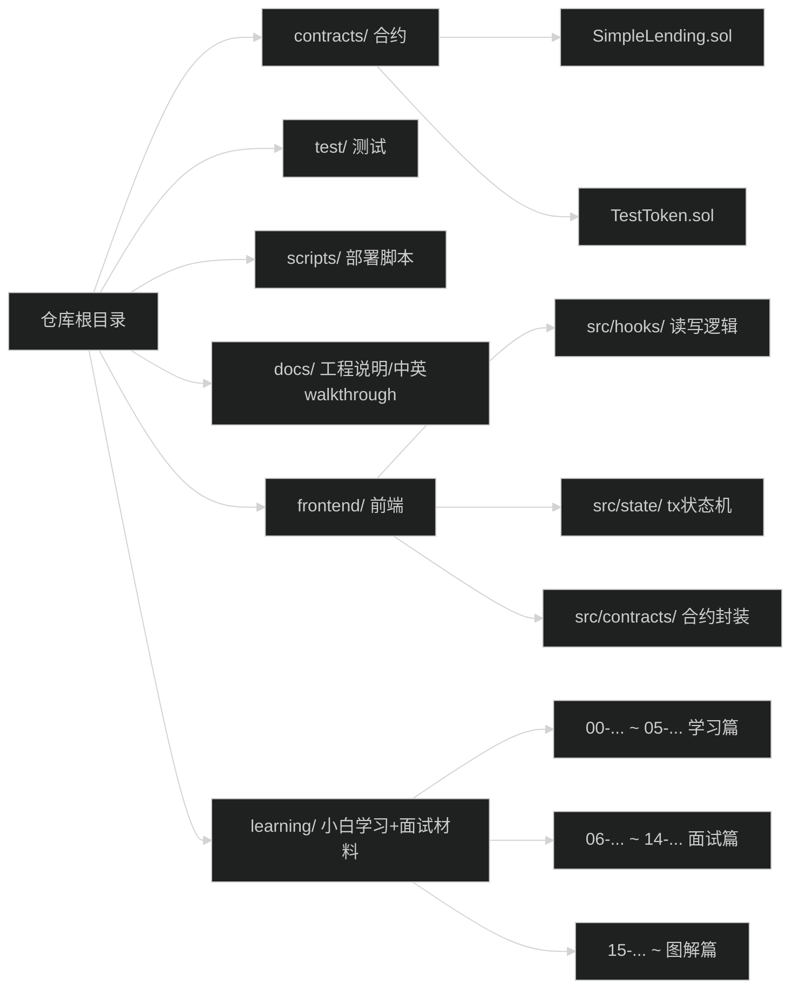

# 目录导航：学习文档在哪里？面试文档在哪里？从哪里开始？

> 你现在只需要记住：
> - **学习资料中心**在 `learning/`
> - **面试资料**也在 `learning/` 里（“面试准备篇”那一组）
> - 项目原始工程说明在 `docs/`

---

## 1) 项目目录图（你能一眼看懂版）

---

## 2) 学习目录（按小白顺序）

你按这个顺序看，最快能跑起来：

1) 入门：
- [learning/00-智能合约入门.md](00-智能合约入门.md)
- [learning/15-图解-从浏览器到链上一次交易发生了什么.md](15-图解-从浏览器到链上一次交易发生了什么.md)

2) 关键概念（必须懂 approve / LTV）：
- [learning/16-图解-ERC20授权approve到底在干嘛.md](16-图解-ERC20授权approve到底在干嘛.md)
- [learning/17-图解-LTV与健康因子-为什么不能随便取款.md](17-图解-LTV与健康因子-为什么不能随便取款.md)

3) 项目跑通（动手）：
- [learning/09-动手实验.md](09-动手实验.md)

4) 看懂项目（实战）：
- [learning/03-项目代码详解.md](03-项目代码详解.md)
- [learning/05-测试与部署.md](05-测试与部署.md)

---

## 3) 面试目录（你要背的都在这里）

面试前一天就看这 6 份：

- [learning/07-项目亮点梳理.md](07-项目亮点梳理.md)
- [learning/10-面试5分钟演示脚本.md](10-面试5分钟演示脚本.md)
- [learning/11-一页速记卡.md](11-一页速记卡.md)
- [learning/14-面试答案卡-30秒与2分钟.md](14-面试答案卡-30秒与2分钟.md)
- [learning/12-追问与证据点清单.md](12-追问与证据点清单.md)
- [learning/13-useActions交易状态机讲稿.md](13-useActions交易状态机讲稿.md)

如果面试官更“工程化”，再补：
- [learning/18-技术图-题目要求到实现映射.md](18-技术图-题目要求到实现映射.md)
- [learning/19-技术图-安全加固与风险对照.md](19-技术图-安全加固与风险对照.md)

---

## 4) 原始工程文档（更像项目说明书）

如果你想回答“为什么这么设计”，看：
- [docs/ENGINEERING_RATIONALE.zh-cn.md](../docs/ENGINEERING_RATIONALE.zh-cn.md)
- [docs/WALKTHROUGH.zh-en.md](../docs/WALKTHROUGH.zh-en.md)
- [docs/ASSESSMENT_MAPPING.md](../docs/ASSESSMENT_MAPPING.md)

---

## 5) 你现在该做什么（最短路径）

- 先跑项目：看 [learning/09-动手实验.md](09-动手实验.md)
- 跑通后背面试：看 [learning/14-面试答案卡-30秒与2分钟.md](14-面试答案卡-30秒与2分钟.md)
- 然后补技术图：看 [learning/18-技术图-题目要求到实现映射.md](18-技术图-题目要求到实现映射.md) 和 [learning/19-技术图-安全加固与风险对照.md](19-技术图-安全加固与风险对照.md)
