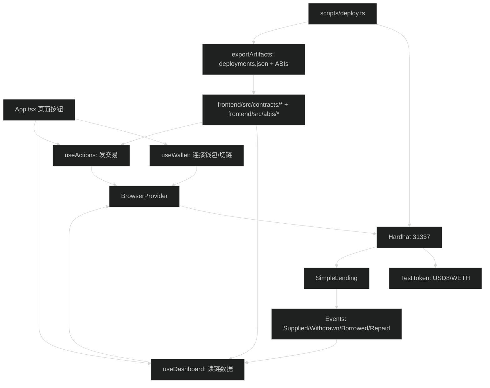

# 代码功能地图：全项目你需要知道什么（超小白版）

> 目标：你打开任何一个文件，都知道：
> 1) 这个文件负责什么？
> 2) 它和其它文件怎么配合？
> 3) 你面试时该怎么讲？

---

## 0) 一句话总览（背下来）

- 合约：`SimpleLending` 负责借贷规则（LTV=75%）和状态更新，发出事件。
- 脚本：`scripts/deploy.ts` 负责本地部署并把 ABI/地址导出到前端。
- 前端：
  - `useWallet` 负责 MetaMask 连接与自动切链
  - `useDashboard` 负责读链与事件驱动刷新
  - `useActions` 负责写链（交易）与交易状态机
  - `App.tsx` 负责把这些拼成 UI

---

## 1) 项目大模块地图（从按钮到链上）

你只要理解这张图，就能理解项目 80%。

---

## 2) 目录与文件：每个文件到底干嘛？

### 2.1 合约（contracts/）

- `contracts/TestToken.sol`
  - 功能：最简 ERC20（USD8/WETH），用于本地测试与演示。
  - 关键点：只有 `transfer/approve/transferFrom/balanceOf/allowance`。

- `contracts/SimpleLending.sol`
  - 功能：单币种借贷（USD8 同时作为 supply 与 borrow 的 token）。
  - 关键点：
    - LTV=75% 的 borrow/withdraw 约束
    - 事件：Supplied/Withdrawn/Borrowed/Repaid
    - 安全：`Pausable`、`ReentrancyGuard`、`SafeERC20`

### 2.2 部署与导出（scripts/、deployments/）

- `scripts/deploy.ts`
  - 功能：一键部署 USD8、WETH、SimpleLending；给账户发测试 token；导出 ABI/地址。

- `scripts/_lib/export.ts`
  - 功能：把合约 ABI 写入 `frontend/src/abis/*.json`；把地址写入 `frontend/src/contracts/deployments.json` 和 `deployments/31337.json`。

- `deployments/31337.json`
  - 功能：链上地址快照（给脚本/复现用）。

### 2.3 前端合约封装（frontend/src/contracts/）

- `frontend/src/contracts/deployments.ts`
  - 功能：读取 `deployments.json`，得到 `usd8Address/wethAddress/simpleLendingAddress/chainId`。

- `frontend/src/contracts/abis.ts`
  - 功能：加载 ABI JSON，变成 ethers 可用的 InterfaceAbi。

- `frontend/src/contracts/contracts.ts`
  - 功能：读合约（provider-only），返回 `{ usd8, weth, lending }`。

- `frontend/src/contracts/write.ts`
  - 功能：写合约（signer），返回 `getWriteToken/getWriteLending`，并用 `getFunction("...")` 调用（兼容 ethers v6 类型推断问题）。

### 2.4 前端 hooks（frontend/src/hooks/）

- `useWallet.ts`
  - 功能：连接 MetaMask、自动切到 31337、监听账号/链变化、持久化连接状态。

- `useDashboard.ts`
  - 功能：读链数据（余额、pool、position、maxBorrow/maxWithdraw）；事件驱动刷新 + 节流 + backfill。

- `useAllowance.ts`
  - 功能：读 allowance；监听 `Approval` 事件自动刷新；提供手动 refresh。

- `useTokenMetadata.ts`
  - 功能：读 token `symbol/decimals`。

- `useActions.ts`
  - 功能：写链（approve→supply/repay、withdraw、borrow），并管理 tx 状态机，支持 pending 恢复、stuck、replacement。

### 2.5 前端状态/工具（frontend/src/state、utils、config）

- `state/tx.ts`
  - 功能：交易状态机 + wait 超时 + replacement 处理 + pending 持久化。

- `state/txStore.ts`
  - 功能：localStorage 存 pending tx（按 chainId + account）。

- `state/errors.ts`
  - 功能：把各种错误归一化（UserRejected / Revert / Rpc / Validation...）。

- `utils/amount.ts`
  - 功能：严格金额解析（禁止科学计数法等），用 bigint 避免精度问题。

- `utils/format.ts`
  - 功能：短地址显示、healthFactor 颜色。

- `config/runtime.ts`
  - 功能：根据 chainId 配置 confirmations、pending 超时、post-state 验证时间、事件回填窗口。

### 2.6 UI（frontend/src/App.tsx）

- 功能：把所有 hook 串起来：
  - 连接钱包
  - 展示地址/余额/pool/position
  - 展示 allowance 状态
  - 交易按钮（带 preflight 确认弹窗）
  - 展示 Tx 状态与 stuck 处理
  - Fail-safe：监听新区块定期 refresh（当没有 pending tx）

### 2.7 测试（test/）

- `test/SimpleLending.integration.ts`
  - 功能：用 Hardhat 做端到端集成测试，覆盖 happy path + 关键 revert + pause。

---

## 3) 你应该怎么读代码（最短路径）

1) 先看 UI 怎么把系统拼起来：`frontend/src/App.tsx`
2) 再看 3 个 hook：`useWallet`（连）→ `useDashboard`（读）→ `useActions`（写）
3) 最后回到合约：`contracts/SimpleLending.sol`

---

## 4) 面试时怎么讲（模板）

- "我把前端分成读模型和写模型：读模型 `useDashboard` 并发读数据，并用事件驱动刷新；写模型 `useActions` 管交易流和交易状态机，pending 会持久化，超时标 stuck，不会误判失败。合约侧用 OZ 组件做 baseline hardening，并把 LTV 规则写进 require。"

接下来建议读：
- `learning/22-合约SimpleLending逐函数讲解.md`
- `learning/23-前端读写模型与交易状态机.md`
- `learning/24-部署导出与测试讲解.md`
