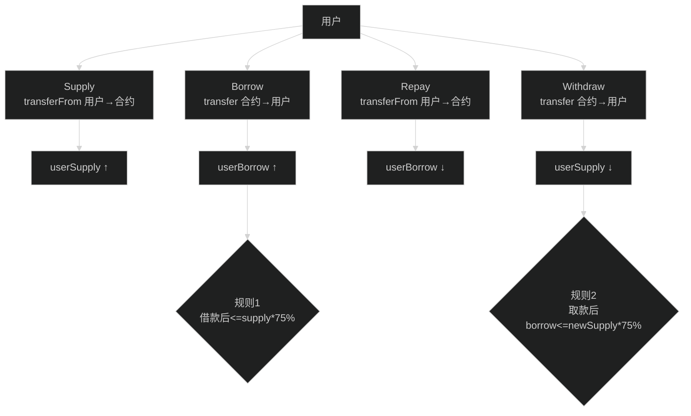

# 合约讲解：SimpleLending.sol（逐函数、逐功能）

> 你不需要先懂 DeFi。你只要把它当成一个“记账系统”：
> - 你存进去（Supply）→ 你的 `userSupply` 变大
> - 你借出来（Borrow）→ 你的 `userBorrow` 变大
> - 你还回去（Repay）→ 你的 `userBorrow` 变小
> - 你取出来（Withdraw）→ 你的 `userSupply` 变小
>
> 关键规则：**借的钱不能超过存款的 75%**。

## 0) 一图读懂：四个动作 + 两条硬规则



对应源码：`contracts/SimpleLending.sol`

---

## 0) 合约用了哪些安全组件？为什么？

- `Ownable`：只有 owner 能 pause/unpause（紧急止损）
- `Pausable`：暂停后所有关键操作会被拒绝
- `ReentrancyGuard`：防重入
- `SafeERC20`：更安全地调用 ERC20（兼容一些非标准 token）

一句话：**这是“作业范围内”的 baseline hardening。**

---

## 1) 状态变量（合约保存了什么数据？）

### 1.1 全局市场状态

- `totalSupply`：所有用户 supply 的总和
- `totalBorrow`：所有用户 borrow 的总和
- `utilizationRate`：利用率（borrow/supply）
- `supplyRate`：供给利率（演示用，非真实计息）
- `borrowRate`：借款利率（演示用，非真实计息）

### 1.2 用户状态

- `userSupply[address]`：某用户存了多少
- `userBorrow[address]`：某用户借了多少

还有一个 `positions[address]`，保存一份“汇总结构体”：
- `supplied/borrowed/collateralValue/healthFactor`

注意：这里的 `positions` 是冗余缓存（从 userSupply/userBorrow 计算出来），主要为了 Dashboard 展示。

---

## 2) 常量（规则写死在哪里？）

- `LTV_RATIO = 75`：借款上限比例
- 其它：BASE_RATE / UTILIZATION_MULTIPLIER 用于演示利率曲线

---

## 3) 事件（前端为什么能“实时更新”？）

- `Supplied(user, amount, timestamp)`
- `Withdrawn(user, amount, timestamp)`
- `Borrowed(user, amount, timestamp)`
- `Repaid(user, amount, timestamp)`

前端会监听这些事件，只要事件里的 `user` 是当前钱包地址，就刷新 UI。

---

## 4) 构造函数 constructor(address _token)

做两件事：
1) 检查 `_token != address(0)` 防止错误部署
2) 把 `token` 设为 IERC20(_token)，并设置初始利率

这就决定了：**本合约是单币种借贷：token=USD8**。

---

## 5) pause / unpause（紧急开关）

- `pause()`：onlyOwner
- `unpause()`：onlyOwner

所有核心写函数（supply/withdraw/borrow/repay）都带 `whenNotPaused`。

面试表达："发现异常时可以一键暂停，避免资金继续流动扩大损失。"

---

## 6) supply(uint256 amount)

### 做什么？
把用户的 token 从用户地址转到合约地址，并把用户存款记账。

### 关键检查
- `require(amount > 0)`：不能存 0

### 核心外部调用
- `token.safeTransferFrom(msg.sender, address(this), amount)`

为什么要 approve？
- 因为 transferFrom 需要 allowance，用户要先在 token 合约上 approve 本合约。

### 状态更新
- `userSupply[msg.sender] += amount`
- `totalSupply += amount`

### 后续更新
- `updateRates()`：更新利用率/利率
- `updateUserPosition(msg.sender)`：更新 positions 缓存

### 事件
- emit `Supplied`

配图：
```mermaid
sequenceDiagram
  participant U as User
  participant T as USD8 (ERC20)
  participant L as SimpleLending

  U->>T: approve(L, amount)
  U->>L: supply(amount)
  L->>T: transferFrom(U, L, amount)
  T-->>L: ok
  L->>L: userSupply += amount; totalSupply += amount
  L-->>U: emit Supplied
```

---

## 7) withdraw(uint256 amount)

### 做什么？
把合约里的 token 转回用户，并减少用户存款记账。

### 关键检查
- `require(amount > 0)`
- `require(userSupply[msg.sender] >= amount)`：不能取超过你存的

### 最关键：健康检查（防止抵押不足）

提现会让你的抵押减少，所以要检查提现后仍满足：

$$borrowed \le (newSupply * 75\%)$$

源码里：
- `newSupply = userSupply - amount`
- `maxBorrow = (newSupply * LTV_RATIO)/100`
- `require(borrowed <= maxBorrow, "Withdrawal would make position unhealthy")`

### 状态更新 + 转账 + 事件
- 更新 userSupply/totalSupply
- `token.safeTransfer(msg.sender, amount)`
- emit Withdrawn

---

## 8) borrow(uint256 amount)

### 做什么？
把合约里的 token 转给用户，并增加用户借款记账。

### 关键检查（两类）
1) 基础：amount > 0
2) 合约里要有钱（流动性）：
- `require(token.balanceOf(address(this)) >= amount, "Insufficient liquidity")`
3) LTV 上限：
- `maxBorrow = userSupply * 75%`
- `require(userBorrow + amount <= maxBorrow, "Exceeds borrowing limit")`

### 状态更新 + 转账 + 事件
- userBorrow += amount
- totalBorrow += amount
- token.safeTransfer(user, amount)
- emit Borrowed

---

## 9) repay(uint256 amount)

### 做什么？
用户把 token 还回合约，并减少借款记账。

### 关键检查
- amount > 0
- `userBorrow >= amount`（不能还超过欠的）

### 核心外部调用
- `token.safeTransferFrom(user, address(this), amount)`

所以 repay 也需要 approve（让合约 transferFrom 用户）。

### 状态更新 + 事件
- userBorrow -= amount
- totalBorrow -= amount
- emit Repaid

---

## 10) updateRates()（演示用利率）

它不是“真实计息”，只是把利率作为一个随 utilization 变化的展示数字。

- totalSupply==0：utilization=0
- 否则：utilization = totalBorrow * 100 / totalSupply
- supplyRate、borrowRate 也随之变化

面试边界表达："这是 demo 的展示利率，没有做利息累积/借贷指数。"

---

## 11) updateUserPosition(address user)

把 userSupply/userBorrow 汇总成 positions[user]：
- collateralValue = supplied（单币种示例）
- healthFactor：
  - borrowed==0 → max（无限安全）
  - 否则：

$$healthFactor = \frac{maxBorrowable * 100}{borrowed}$$

注意：这里的 healthFactor 是“展示指标”，不直接用于清算。

---

## 12) View 函数（前端读什么？）

- `getUserPosition(user)`：返回 supplied/borrowed/collateralValue/healthFactor
- `getPoolInfo()`：返回 totalSupply/totalBorrow/utilization/supplyRate/borrowRate
- `calculateMaxWithdraw(user)`：前端用来展示“最多能取多少”
- `calculateMaxBorrow(user)`：前端用来展示“最多还能借多少”

---

## 13) 新手最常见问题

### Q1: 为什么我 Withdraw 会失败？
A: 你借过钱（borrowed>0）时，withdraw 会做 LTV 检查，超过就 revert。

### Q2: 为什么合约里有 WETH 但不参与借贷？
A: 本作业是单币种借贷 demo，WETH 只用于前端展示余额（题面要求展示两种 token）。

---

下一篇（前端怎么调用这些函数）：
- `learning/23-前端读写模型与交易状态机.md`
