# 项目学习手册（对齐 Coding Test Assignment - Web3 Engineer）

> 这份文档是“项目总览 + 小白学习路径 + 题面验收指南”的合体版本。
>
> 你关心的点：
> - 题面给的任务到底是什么？
> - 我们应该按什么流程做？
> - 这个仓库是怎么对齐要求的？
> - 我们额外做的“安全/审计”增强是什么？

相关文档（强关联）：
- 题面原文：[docs/CODING_TEST_ASSIGNMENT.txt](../docs/CODING_TEST_ASSIGNMENT.txt)
- 需求映射表：[docs/ASSESSMENT_MAPPING.md](../docs/ASSESSMENT_MAPPING.md)
- 安全说明：[SECURITY.md](../SECURITY.md)
- 审计式自查：[docs/ENTERPRISE_AUDIT_REPORT.md](../docs/ENTERPRISE_AUDIT_REPORT.md)
- 从零跑通：[learning/09-动手实验.md](09-动手实验.md)

---

## 小白最短使用方式（先跑通再理解）

如果你是第一次学 Web3，建议按这个顺序用本手册（避免迷路）：

1) 先跑通项目闭环（照做即可）：[learning/09-动手实验.md](09-动手实验.md)
  - 成功标志：能看到 `hardhat node` 在跑、deploy 导出文件生成、前端能连上 31337
2) 回到本篇只看这三节：0（题目是什么）→ 1（对齐证据）→ 1.2（验收 checklist）
  - 成功标志：你可以按 checklist 完整演示 approve→supply→borrow→repay→withdraw
3) UI 临场不稳时，用 30 秒“自证闭环”：`npm run smoke:e2e`
  - 成功标志：输出含 `OK: approve→supply→borrow→repay→withdraw...`

---

## 0) 这次 Coding Test 的“标准答案”是什么？

题面要求你做的是：

1) **Part 1（必须）**：Hardhat 部署合约 + seed 测试账户 + 导出 ABI/地址给前端
2) **Part 2（必须）**：React + TypeScript + ethers v6 前端：
   - 连接 MetaMask、自动切到本地链 31337、持久化连接
   - 展示 USD8/WETH 余额
   - 展示 SimpleLending 仪表盘（pool info + rates + position + health factor + maxBorrow/maxWithdraw）
   - 完整交易流：Approve(if needed) → Supply / Withdraw / Borrow / Repay
   - 实时更新：tx confirmed 后更新 + 监听合约事件刷新 + 展示交易状态 pending/confirmed/failed
3) **Part 3（可选加分）**：测试、错误处理、loading 状态等质量项

你可以把它理解成一个最小闭环：

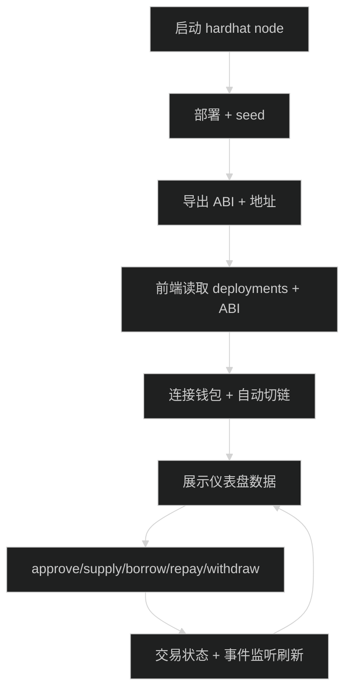

---

## 1) 我们这个仓库怎么对齐题面（你可以直接拿去给面试官讲）

一句话：
> 用脚本“一键部署并导出”，前端“读写分离 + 事件驱动刷新 + 交易状态机”，并在不超出题面范围的前提下做了安全/审计风格的工程增强。

证据（建议面试时直接指文件）：

（可点击导航）
- 对齐项清单：[docs/ASSESSMENT_MAPPING.md](../docs/ASSESSMENT_MAPPING.md)
- 一键部署与导出：[`scripts/deploy.ts`](../scripts/deploy.ts)、[`scripts/_lib/export.ts`](../scripts/_lib/export.ts)
- 前端 ethers v6 + MetaMask：[`frontend/src/hooks/useWallet.ts`](../frontend/src/hooks/useWallet.ts)
- 仪表盘读链 + 事件刷新：[`frontend/src/hooks/useDashboard.ts`](../frontend/src/hooks/useDashboard.ts)
- 写链动作 + approve 流：[`frontend/src/hooks/useActions.ts`](../frontend/src/hooks/useActions.ts)
- 交易状态机：[`frontend/src/state/tx.ts`](../frontend/src/state/tx.ts)
- 错误归一化：[`frontend/src/state/errors.ts`](../frontend/src/state/errors.ts)

### 1.1 更严格的“对齐证据索引”（脚本名/函数名/配置项）

如果你想做到“面试官一追问就能定位”，直接记这张表。

| 题面要求 | 你在本仓库里怎么证明 | 证据（可点开） |
|---|---|---|
| Part 1：部署 USD8/WETH + SimpleLending | 部署入口脚本负责 deploy 并输出地址 | [`scripts/deploy.ts`](../scripts/deploy.ts)（部署）、[`contracts/TestToken.sol`](../contracts/TestToken.sol)、[`contracts/SimpleLending.sol`](../contracts/SimpleLending.sol) |
| Part 1：seed 测试账户 | deploy 脚本内 `seedTo(...)` 给多个账户转 USD8/WETH | [`scripts/deploy.ts`](../scripts/deploy.ts)（`SEED_RECIPIENTS`/`SEED_ADDRESS`/`seedTo`） |
| Part 1：导出 ABI 与地址给前端 | `exportArtifacts(...)` 写 `frontend/src/contracts/deployments.json` 与 `frontend/src/abis/*.json` | [`scripts/_lib/export.ts`](../scripts/_lib/export.ts)、导出产物：[`frontend/src/contracts/deployments.json`](../frontend/src/contracts/deployments.json) |
| Part 2：连接 MetaMask（EIP-1193） | wallet hook 使用 EIP-1193 provider + 连接流程 | [`frontend/src/hooks/useWallet.ts`](../frontend/src/hooks/useWallet.ts) |
| Part 2：自动切链/加链到 31337 | `ensureCorrectNetwork()` → `wallet_switchEthereumChain` / `wallet_addEthereumChain` | [`frontend/src/hooks/useWallet.ts`](../frontend/src/hooks/useWallet.ts) |
| Part 2：持久化连接状态 | localStorage 保存连接状态并在加载时恢复 | [`frontend/src/hooks/useWallet.ts`](../frontend/src/hooks/useWallet.ts) |
| Part 2：读写分离（provider vs signer） | 读链使用 provider，写链使用 signer | [`frontend/src/contracts/contracts.ts`](../frontend/src/contracts/contracts.ts)、[`frontend/src/contracts/write.ts`](../frontend/src/contracts/write.ts) |
| Part 2：展示余额/池子/仓位/maxBorrow/maxWithdraw | dashboard hook 调合约 view + 聚合显示 | [`frontend/src/hooks/useDashboard.ts`](../frontend/src/hooks/useDashboard.ts)、合约 view：[`contracts/SimpleLending.sol`](../contracts/SimpleLending.sol) |
| Part 2：approve-if-needed（Supply/Repay） | actions 写模型先查 allowance，不够先 approve | [`frontend/src/hooks/useActions.ts`](../frontend/src/hooks/useActions.ts)、[`frontend/src/hooks/useAllowance.ts`](../frontend/src/hooks/useAllowance.ts) |
| Part 2：四个交易动作 | `getWriteLending()` 封装 supply/withdraw/borrow/repay | [`frontend/src/contracts/write.ts`](../frontend/src/contracts/write.ts)、UI 入口：[`frontend/src/App.tsx`](../frontend/src/App.tsx) |
| Part 2：实时更新（tx confirmed refresh） | onConfirmed 强制 refresh（自己发的交易最可靠） | [`frontend/src/hooks/useActions.ts`](../frontend/src/hooks/useActions.ts)、[`frontend/src/App.tsx`](../frontend/src/App.tsx) |
| Part 2：实时更新（事件监听 refresh） | `lending.on(...)` 监听 Supplied/Withdrawn/Borrowed/Repaid | [`frontend/src/hooks/useDashboard.ts`](../frontend/src/hooks/useDashboard.ts) |
| Part 2：显示交易状态 pending/confirmed/failed | `runTxDetailed(...)` 管理 `signing/pending/confirmed/failed/stuck` | [`frontend/src/state/tx.ts`](../frontend/src/state/tx.ts)、UI 展示：[`frontend/src/App.tsx`](../frontend/src/App.tsx) |
| Part 3（Bonus）：错误处理（revert/拒绝/RPC） | `normalizeError(...)` 归一化错误类型与信息 | [`frontend/src/state/errors.ts`](../frontend/src/state/errors.ts) |
| Part 3（Bonus）：至少 2 个集成测试 | integration tests 覆盖成功路径与 revert case | [`test/SimpleLending.integration.ts`](../test/SimpleLending.integration.ts) |
| 可复现性：一键自检闭环 | `smoke:e2e` 用导出的 ABI/地址跑完整链路 | [`scripts/smoke-e2e.mjs`](../scripts/smoke-e2e.mjs)、命令在 [`package.json`](../package.json) |

补充：本地链交易确认/超时等参数在 [`frontend/src/config/runtime.ts`](../frontend/src/config/runtime.ts)（例如 `TX_CONFIRMATIONS`、`TX_PENDING_TIMEOUT_MS`、`POST_STATE_MAX_WAIT_MS`）。

### 1.2 验收 Checklist（现场演示版：面试官按这个打勾）

你可以把下面当成“面试演示脚本 + 验收清单”。每一条都给了**成功标志**与**证据点**。

如果你要按岗位准备“最小证据包”（前端岗/合约岗/全栈岗），直接用：[learning/29-岗位定制验收与证据包.md](29-岗位定制验收与证据包.md)。

**A. 启动与部署（Part 1）**
- ✅ 启动本地链：`npm run node`（或 `npx hardhat node`）
  - 成功标志：终端显示 RPC 监听 `http://127.0.0.1:8545` 且持续运行
- ✅ 部署 + seed + 导出：`npm run deploy:localhost`
  - 成功标志：生成 `deployments/31337.json` 与 `frontend/src/contracts/deployments.json`，且前端 abis 文件存在
  - 证据点：[`scripts/deploy.ts`](../scripts/deploy.ts)、[`scripts/_lib/export.ts`](../scripts/_lib/export.ts)

**B. 一键自证（强烈推荐，30 秒证明闭环）**
- ✅ 跑 `npm run smoke:e2e`
  - 成功标志：输出包含 `OK: approve→supply→borrow→repay→withdraw...`
  - 证据点：[`scripts/smoke-e2e.mjs`](../scripts/smoke-e2e.mjs)

**C. 钱包与网络（Part 2 - Wallet）**
- ✅ 页面点击 Connect 后才弹 MetaMask（避免页面加载即弹窗）
- ✅ 自动切链到 31337（或显示一键切链按钮）
  - 成功标志：页面显示 `chainId=31337` 且 actions 不再被 wrong network 禁用
  - 证据点：[`frontend/src/hooks/useWallet.ts`](../frontend/src/hooks/useWallet.ts)

**D. 仪表盘数据（Part 2 - Dashboard）**
- ✅ 显示 USD8/WETH 余额
- ✅ 显示 Pool info（totalSupply/totalBorrow/utilization/rates）
- ✅ 显示 User position（supplied/borrowed/healthFactor/maxBorrow/maxWithdraw）
  - 成功标志：随交易变化而变化（至少在 Supply 后 supplied 变大）
  - 证据点：[`frontend/src/hooks/useDashboard.ts`](../frontend/src/hooks/useDashboard.ts)、合约 view：[`contracts/SimpleLending.sol`](../contracts/SimpleLending.sol)

**E. 交易功能（Part 2 - Actions）**
- ✅ Supply：allowance 不够会先 approve（两步交易），再 supply
- ✅ Borrow / Repay / Withdraw 都可成功
  - 成功标志：Hardhat node 终端有交易日志；页面 Tx 行出现 `signing → pending → confirmed`
  - 证据点：写模型：[`frontend/src/hooks/useActions.ts`](../frontend/src/hooks/useActions.ts)、写入封装：[`frontend/src/contracts/write.ts`](../frontend/src/contracts/write.ts)

**F. 实时更新（Part 2 - Real-time）**
- ✅ confirmed 后强制 refresh（你自己发的交易一定更新）
- ✅ 监听事件刷新（Supplied/Withdrawn/Borrowed/Repaid）
  - 成功标志：不手动刷新页面也能看到数据更新
  - 证据点：confirmed refresh：[`frontend/src/App.tsx`](../frontend/src/App.tsx)、事件监听：[`frontend/src/hooks/useDashboard.ts`](../frontend/src/hooks/useDashboard.ts)

**G. 交易状态与错误（Part 2 必需 + Part 3 加分）**
- ✅ 展示 pending/confirmed/failed（本项目还额外处理 stuck/替换交易）
- ✅ 错误能在 UI 里看见（例如 User rejected、revert 文案、RPC 错误）
  - 证据点：tx 状态机：[`frontend/src/state/tx.ts`](../frontend/src/state/tx.ts)、错误归一化：[`frontend/src/state/errors.ts`](../frontend/src/state/errors.ts)

**H. Bonus：测试**
- ✅ 至少 2 个集成测试存在并可运行：`npm test`
  - 证据点：[`test/SimpleLending.integration.ts`](../test/SimpleLending.integration.ts)

---

## 2) 项目总体架构（模块图）

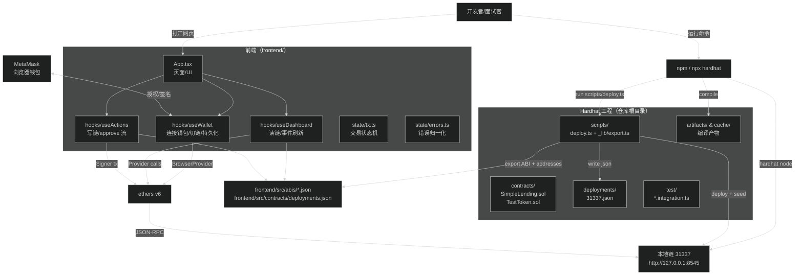

两条主线（背下来就够讲清 80%）：
- 工程线：`contracts` → `scripts/deploy.ts` → 导出 `frontend/src/abis` + `frontend/src/contracts/deployments.json`
- 运行线：`useWallet` 连钱包 → `useDashboard` 读链 → `useActions` 写链并用事件刷新

---

## 3) 按题面要求的“正确开发流程”（小白照做版）

这一节目标：你照着做，**每一步都有“成功标志”**，最后能稳定跑通并自测。

### 3.0 环境准备（先做这个，后面才不会踩坑）

必备：
- Node.js `>= 18`（仓库 `package.json` 写了 engines）
- npm（推荐用 `npm ci` 保证可复现）
- 浏览器 + MetaMask（Chrome/Edge）

本地端口：
- Hardhat RPC：`http://127.0.0.1:8545`
- 前端 dev server：Vite 默认 `http://localhost:5173`

成功标志：你能在 3 个终端分别跑 node / deploy / frontend，且没有端口冲突。

### 3.1 Part 1：本地链 + 部署 + 导出（Mandatory）

目标：让前端**不手动复制** ABI/地址也能跑起来。

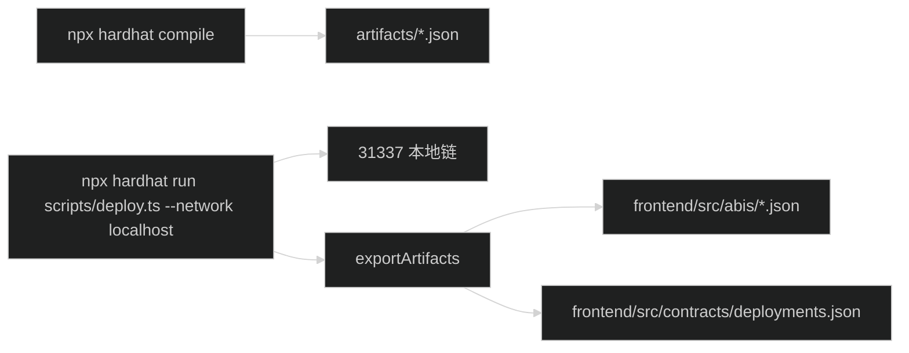

#### Step A：安装依赖（根目录）

```bash
npm ci
```

成功标志：安装结束无报错。

#### Step B：启动本地链（Terminal 1）

```bash
npx hardhat node
```

成功标志：看到 `Started HTTP and WebSocket JSON-RPC server at http://127.0.0.1:8545/`，并且终端持续运行。

#### Step C：部署 + seed + 导出（Terminal 2）

默认方案 A（最简单）：导入 Hardhat 账户私钥到 MetaMask，然后用该账号演示。

```bash
npx hardhat run scripts/deploy.ts --network localhost
```

备选方案 B（推荐给小白/避免导入私钥）：用你自己的 MetaMask 地址作为 seed 目标。

```bash
SEED_ADDRESS=0xYourMetaMaskAddress npx hardhat run scripts/deploy.ts --network localhost
```

Windows PowerShell：

```powershell
$env:SEED_ADDRESS = "0xYourMetaMaskAddress"
npx hardhat run scripts/deploy.ts --network localhost
```

Windows cmd：

```bat
set SEED_ADDRESS=0xYourMetaMaskAddress
npx hardhat run scripts/deploy.ts --network localhost
```

成功标志：这些文件存在（缺任何一个都算 Part 1 没完成）：
- `deployments/31337.json`
- `frontend/src/contracts/deployments.json`
- `frontend/src/abis/TestToken.json`
- `frontend/src/abis/SimpleLending.json`

你做完 Part 1，必须能回答：
- ABI 是什么？为什么前端需要它？
- deployments.json 是什么？为什么重启 hardhat node 后要重新部署？

#### 可选：不打开浏览器也能自检（强烈推荐）

这个仓库自带 E2E smoke，会用**导出的 ABI/地址**做一次完整链上流程：

```bash
npm run smoke:e2e
```

成功标志：最后输出 `OK: approve→supply→borrow→repay→withdraw flow succeeded...`

### 3.2 Part 2：前端（Mandatory）

目标：一个能真实发交易、真实刷新数据的 lending dashboard。

#### Step D：安装前端依赖（Terminal 3）

```bash
cd frontend
npm ci
```

成功标志：安装结束无报错。

#### Step E：启动前端开发服务器（Terminal 3）

```bash
npm run dev
```

成功标志：Vite 输出 `Local: http://localhost:5173/`（端口可能不同）。

#### Step F：配置 MetaMask（只为本地演示/开发，非题目功能）

1) 添加网络（如果 UI 没有自动帮你添加/切换）：
- Network name：Hardhat Local
- RPC URL：`http://127.0.0.1:8545`
- Chain ID：`31337`
- Currency symbol：`ETH`

2) 选择“有余额的账号”（二选一）：
- 方案 A：导入 Hardhat Account #0 私钥（在 `npx hardhat node` 输出里能看到）
- 方案 B：用你的 MetaMask 地址跑过 `SEED_ADDRESS=...` 的 deploy 脚本

成功标志：页面余额不是 0（至少 USD8/WETH 有一个 > 0）。

#### 必须点得通的用户路径（面试官验收路径）

1) Connect MetaMask → 自动切链到 31337 → 页面显示 account + chainId
2) 显示 USD8/WETH 余额
3) 显示 pool + rates + position + health factor + maxBorrow/maxWithdraw
4) 交易：Approve(if needed) → Supply → Borrow → Repay → Withdraw
5) UI 在 tx confirmed 后更新，同时监听事件实时刷新

#### 可选：一条命令做“提交前自检”

```bash
# contracts + frontend 的编译/测试/lint/build
npm run ci:local
```

---

## 4) “题面验收清单”（面试官/你自己都能用）

建议你按这个顺序自测：

### 4.1 连接与网络
- 首次打开：手动点击 Connect 才会弹 MetaMask（避免自动弹窗 UX pitfall）
- 自动切链到 31337（或给出一键切链）
- 刷新页面后能恢复连接状态（持久化）
- 切到错误网络：显示 Wrong network，按钮禁用

### 4.2 数据展示
- USD8/WETH 余额正确
- Pool info：totalSupply/totalBorrow/utilizationRate
- Rates：supplyRate/borrowRate
- 用户 position：supplied/borrowed/healthFactor（带颜色）
- maxBorrow/maxWithdraw 正确

### 4.3 交易与状态
- Supply：allowance 不够时先 approve，再 supply
- Borrow/Repay/Withdraw 都能成功
- 交易状态显示 pending/confirmed/failed，并能展示错误信息（例如 revert）

### 4.4 实时更新
- tx confirmed 后 dashboard 自动刷新
- 监听事件 `Supplied/Withdrawn/Borrowed/Repaid` 刷新 UI

### 4.5 5 分钟演示脚本（照着做就不会翻车）

强烈建议你在演示/面试前，按这份 runbook 走一遍：[docs/DEMO_CHECKLIST.zh-en.md](../docs/DEMO_CHECKLIST.zh-en.md)。

最短 5 分钟（建议准备 6 张截图作为证据）：
1) 3 个终端：node / deploy / frontend 都在跑
2) 页面：Connect 成功（account + chainId=31337）
3) Dashboard：余额 + pool + position 都有数据
4) Supply：显示 `signing → pending → confirmed`
5) Borrow：healthFactor 变化 + UI 自动刷新
6) Repay + Withdraw：回到初始状态（或可解释为什么没回到）

---

## 5) 合约层（Part 1 的核心知识点）

题面给的是一个“单币种借贷”简化合约：同一个 token 既用于 supply 也用于 borrow。

### 5.1 SimpleLending 的状态到底是什么

核心两张表：
- `userSupply[user]`：用户存入数量
- `userBorrow[user]`：用户借出数量

市场汇总：
- `totalSupply / totalBorrow`
- `utilizationRate / supplyRate / borrowRate`

用户快照：
- `positions[user] = { supplied, borrowed, collateralValue, healthFactor }`

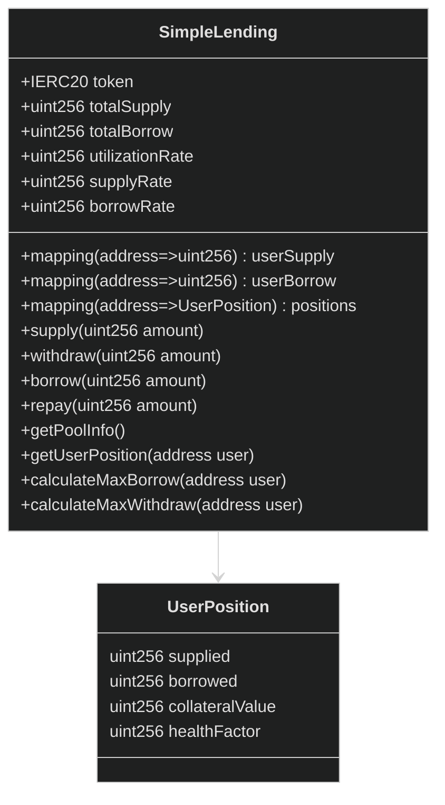

### 5.2 LTV / healthFactor 怎么算（你必须能算出来）

- LTV = 75%：最多借到 `supplied * 75%`
- `maxBorrowable = supplied * 75%`
- `healthFactor = (maxBorrowable * 100) / borrowed`
  - borrowed = 0 时：healthFactor = `uint256.max`（无穷大）
  - healthFactor ≥ 100：安全区

### 5.3 约束点在哪里（revert 的原因）

```mermaid
%%{init: {'theme': 'dark'}}%%
flowchart TB
  WDR[withdraw(amount)] --> W1{userSupply>=amount}
  W1 --> W2[newSupply=userSupply-amount]
  W2 --> W3[maxBorrow=newSupply*75%]
  W3 --> W4{borrowed<=maxBorrow}
  W4 -->|No| WERR[revert: Withdrawal would make position unhealthy]

  BOR[borrow(amount)] --> B1{合约余额>=amount}
  B1 --> B2[maxBorrow=userSupply*75%]
  B2 --> B3{userBorrow+amount<=maxBorrow}
  B3 -->|No| BERR[revert: Exceeds borrowing limit]
```

---

## 6) 前端层（Part 2 的核心知识点）

### 6.1 为什么要“读写分离”（Provider vs Signer）

- 读链：用 Provider，不会弹钱包
- 写链：用 Signer，必须弹钱包签名

这能避免：
- 每次渲染都弹钱包
- 读链逻辑被写链副作用污染

### 6.2 Supply 的完整 UX（Approve-if-needed）

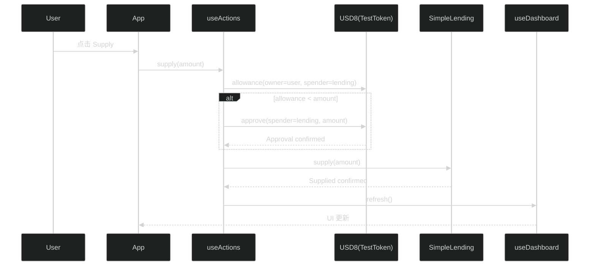

### 6.3 交易状态机（题面“tx status”要求的工程化实现）

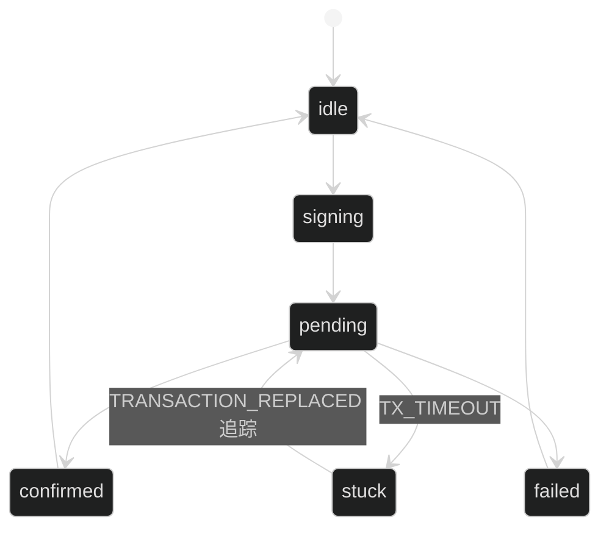

要点：`stuck` 不是失败，它避免“网络慢就判失败”的假阴性。

### 6.4 错误归一化（题面 bonus 的核心）

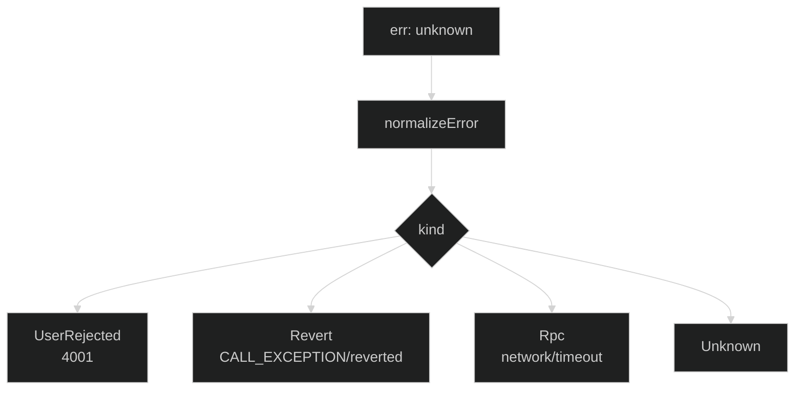

---

## 7) 我们额外做的“安全/审计增强”是什么（不超出题面范围）

题面评分里明确有 Security Awareness；我们做的是“作业范围内的工程加固”，不是做一个生产级 DeFi 协议。

### 7.1 安全沟通与范围边界

- 安全策略与范围：[SECURITY.md](../SECURITY.md)
- 明确非目标：oracle/liquidation/interest accrual/mainnet 等（题面也没要求）

### 7.2 合约层 baseline hardening（assignment-scope）

仓库里的合约实现加入了：
- `Ownable` 管理权
- `Pausable` 紧急暂停
- `ReentrancyGuard` 防重入
- `SafeERC20` 安全转账

说明：这类增强不改变题面功能，但能体现安全意识。

### 7.3 依赖审计与工程自查

- 生产依赖审计（推荐口径）：`npm run audit:prod`（仓库文档给出快照为 0）
- 全量依赖审计：`npm run audit:all`（可能出现 dev toolchain 低危，文档说明了 scope）
- 审计式自查报告：[docs/ENTERPRISE_AUDIT_REPORT.md](../docs/ENTERPRISE_AUDIT_REPORT.md)（强调不是第三方审计）

---

## 8) 小白学习路径（按“时间盒”给你安排）

### 8.1 30 分钟：先会跑 + 会讲

1) 跑通：[learning/09-动手实验.md](09-动手实验.md)
2) 会讲：本篇的第 0/1/2/4 节

### 8.2 2 小时：会定位代码

1) 读文件地图：[learning/21-代码功能地图-全项目你需要知道什么.md](21-代码功能地图-全项目你需要知道什么.md)
2) 看交易状态机：[learning/23-前端读写模型与交易状态机.md](23-前端读写模型与交易状态机.md)

### 8.3 1 天：能回答“为什么这么做”

1) 合约逐函数：[learning/22-合约SimpleLending逐函数讲解.md](22-合约SimpleLending逐函数讲解.md)
2) 部署导出与测试：[learning/24-部署导出与测试讲解.md](24-部署导出与测试讲解.md)
3) 设计取舍：[docs/ENGINEERING_RATIONALE.zh-cn.md](../docs/ENGINEERING_RATIONALE.zh-cn.md)

---

## 9) “掌握标准”Checklist（你做到这些，就算真的理解了）

你可以拿这个自测，也可以拿给面试官：

- 能用自己的话复述题面 3 个 Part 的要求
- 能画出“部署导出→前端读取→钱包连接→读写链→事件刷新”的链路
- 能解释 Provider vs Signer
- 能解释 allowance/approve 为什么存在
- 能手算：supplied=100 时 maxBorrow=75；borrowed=75 时 withdraw 1 会 revert
- 能从 UI 点一次 Supply，定位到 `useActions`、`write.ts`、`SimpleLending.supply` 的调用链
- 能解释交易状态机的 stuck 为什么不是失败
- 能指出事件监听刷新在哪个 hook 里做

---

## 10) 常见坑位（小白救命）

### 10.1 第一原则：先把问题“分层”

用这个顺序排查，最快：
1) RPC 是否在跑（`npx hardhat node` 终端是否还在）
2) 部署导出是否是最新（是否刚跑过 [scripts/deploy.ts](../scripts/deploy.ts)）
3) 钱包网络/账号是否匹配（31337 + 被 seed 的地址）
4) 前端读链是否正常（dashboard 是否能读到 pool info）
5) 写链失败的原因（revert / rejected / rpc error）

### 10.2 决策树（照着走就能定位 80% 问题）

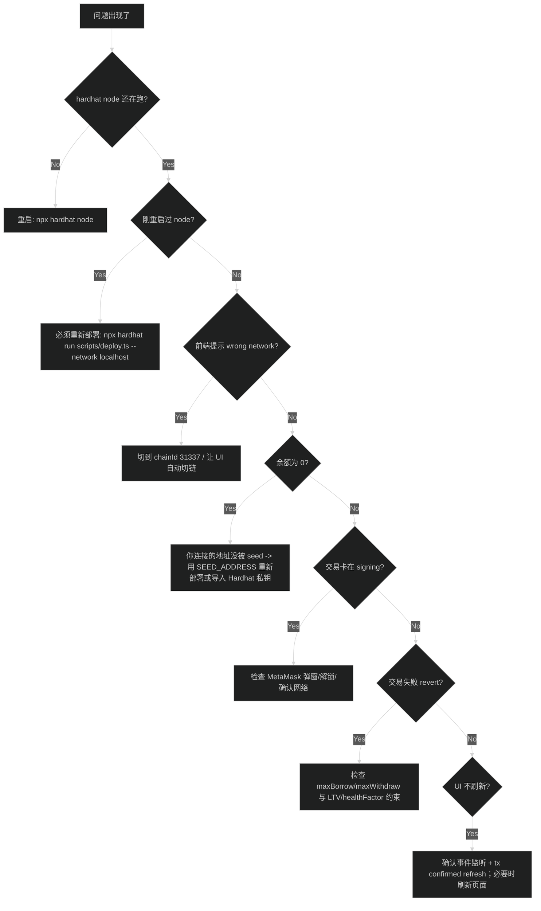

### 10.3 具体坑位与修复

1) 重启 `npx hardhat node` 后没重新部署
- 现象：页面还能打开，但交易/读链不对，或者直接报 `CALL_EXCEPTION` / 合约地址无代码
- 修复：重新运行 `npx hardhat run scripts/deploy.ts --network localhost`（会重新导出前端 deployments + ABI）

2) MetaMask 不在 31337
- 现象：页面提示 wrong network / 按钮禁用
- 修复：切到 `chainId=31337`（或删除旧的 Localhost 配置，按 3.2 Step F 重加）

3) 余额为 0
- 现象：Approve/Supply 没法演示（没钱/没 token）
- 根因：你连接的 account 没被 deploy 脚本 seed
- 修复（二选一）：
  - 重新部署时设置 `SEED_ADDRESS=0xYourMetaMaskAddress`
  - 或导入 Hardhat Account #0 私钥（来自 `npx hardhat node` 的输出）

4) allowance 不够
- 现象：Supply/Repay 直接失败或提示需要 approve
- 修复：这是预期流程：先 approve（exact 或 infinite）再 supply/repay

### 10.4 “合约没问题还是前端有问题？”——用 smoke:e2e 一刀切

当你怀疑是“前端没读到最新 deployments/ABI”或“合约/脚本有问题”时，先跑：

```bash
npm run smoke:e2e
```

解释：它会复用已有 node（或自动起 node），然后 deploy + export，再用导出的 ABI/地址做完整 approve→supply→borrow→repay→withdraw。

- smoke 通过：合约 + 部署导出大概率 OK，问题多半在 MetaMask/前端状态/网络切换
- smoke 不通过：优先看 deploy 输出、RPC 端口、或依赖安装

---

如果你要把 Mermaid 图导出成图片用于 PPT/简历：见 [learning/DIAGRAMS_EXPORT.md](DIAGRAMS_EXPORT.md)。

---

## 11) 报错 → 原因 → 修复（对照表）

这一节是“救火专用”。你看到报错时，先对照这里，再去看 10.2 的决策树。

| 你看到的现象/报错 | 80% 可能原因 | 你应该怎么做 |
|---|---|---|
| 页面提示 **Wrong network** / 按钮禁用 | MetaMask 不在 31337 | 切到/添加 `chainId=31337`，RPC `http://127.0.0.1:8545` |
| 余额是 0（USD8/WETH 都 0） | 连接的地址没被 seed | 用 `SEED_ADDRESS=0xYourMetaMaskAddress` 重新跑 deploy，或导入 Hardhat Account #0 |
| `CALL_EXCEPTION` / `reverted`（Supply/Borrow/Withdraw 失败） | 触发合约约束（LTV/healthFactor/maxBorrow/maxWithdraw） | 先看 UI 的 maxBorrow/maxWithdraw，再按 5.3 的约束图理解为何 revert（下面 11.1 有“revert 文案对照”） |
| `CALL_EXCEPTION` + “contract has no code”/调用地址像没部署 | 重启 node 后地址失效（旧 deployments） | 重新跑 `npx hardhat run scripts/deploy.ts --network localhost` 生成新地址 |
| 交易卡在 signing（一直不进 pending） | MetaMask 没弹窗/被锁/有未处理的确认 | 打开 MetaMask 解锁，检查是否有待确认交易；必要时刷新页面重试 |
| `User rejected` / error code 4001 | 用户拒绝签名/确认 | 这是正常路径：提示用户重试即可 |
| 前端读链报 `Failed to fetch` / `network error` | RPC 没启动、端口被占用、被防火墙拦截 | 确认 `npx hardhat node` 正在跑且是 `127.0.0.1:8545` |
| UI 不刷新（链上变了但页面不变） | 事件监听没收到 / 页面状态没触发 refresh | 等待 tx confirmed 后的 refresh；不行就刷新页面；用 `smoke:e2e` 判断链路是否 OK |
| Supply/Repay 提示 needs approve / allowance 不够 | allowance 机制本来就需要 approve | 先 approve（exact 或 infinite），再执行 supply/repay |

### 11.1 revert 文案对照（来自合约真实实现）

这些 revert message 都来自 [`contracts/SimpleLending.sol`](../contracts/SimpleLending.sol) 和 [`contracts/TestToken.sol`](../contracts/TestToken.sol)。

| revert message | 出现在哪个动作 | 含义（人话） | 你该看哪个指标/做什么 |
|---|---|---|---|
| `Amount must be greater than 0` | Supply / Withdraw / Borrow / Repay | 输入金额是 0 或被解析成 0 | 检查输入框；确认 decimals 和格式正确 |
| `Insufficient supply` | Withdraw | 你取的比你存的多 | 看 dashboard 的 supplied / maxWithdraw |
| `Withdrawal would make position unhealthy` | Withdraw | 取完会导致超出 LTV（健康因子不够） | 看 dashboard 的 borrowed / maxWithdraw / healthFactor |
| `Insufficient liquidity` | Borrow（合约）或 Withdraw（前端 UX 预检查） | 池子里没那么多 token 可借/可取 | 看 pool totalSupply/totalBorrow，或等别人 repay（本作业可直接调整动作金额） |
| `Exceeds borrowing limit` | Borrow | 借的超过 `supplied * 75%` | 看 dashboard 的 maxBorrow（建议用 Max safe） |
| `Amount exceeds borrow` | Repay | 还款金额 > 已借金额 | 看 dashboard 的 borrowed |
| `Insufficient balance` | ERC20 transfer/transferFrom | 你账户 token 不够（比如没 seed 或借/还搞反） | 看余额；用 SEED_ADDRESS 重新部署 seed |
| `Insufficient allowance` | Supply / Repay（transferFrom） | 没先 approve 或 allowance 不够 | 先 approve（exact/infinite），再 supply/repay |

---

## 12) 代码阅读路线（按题面验收走一遍）

目标：你可以跟着这条线读代码，做到“每个验收点都能指到文件”。

### 12.1 Part 1：部署 + 导出（为什么前端不用手填地址）

1) 部署脚本入口：[`scripts/deploy.ts`](../scripts/deploy.ts)
2) 导出 ABI/地址到前端：[`scripts/_lib/export.ts`](../scripts/_lib/export.ts)
3) 导出的结果（面试官最爱看的证据文件）：
  - [`deployments/31337.json`](../deployments/31337.json)
  - [`frontend/src/contracts/deployments.json`](../frontend/src/contracts/deployments.json)
  - [`frontend/src/abis/TestToken.json`](../frontend/src/abis/TestToken.json)
  - [`frontend/src/abis/SimpleLending.json`](../frontend/src/abis/SimpleLending.json)

### 12.2 Part 2：连接钱包与切链（为什么不会一打开就弹窗）

1) 钱包连接/切链/持久化：[`frontend/src/hooks/useWallet.ts`](../frontend/src/hooks/useWallet.ts)
2) UI 如何调用连接：[`frontend/src/App.tsx`](../frontend/src/App.tsx)

### 12.3 Part 2：读链仪表盘（pool + position + maxBorrow/maxWithdraw）

1) 读链聚合与事件刷新：[`frontend/src/hooks/useDashboard.ts`](../frontend/src/hooks/useDashboard.ts)
2) 合约只读接口（你要能解释这些 view 的意义）：[`contracts/SimpleLending.sol`](../contracts/SimpleLending.sol)

### 12.4 Part 2：写链动作（Approve-if-needed → Supply/Repay）

1) 写链动作封装：[`frontend/src/hooks/useActions.ts`](../frontend/src/hooks/useActions.ts)
2) 交易发送底座：[`frontend/src/contracts/write.ts`](../frontend/src/contracts/write.ts)
3) ERC20 allowance/approve 的交互对象：[`contracts/TestToken.sol`](../contracts/TestToken.sol)

### 12.5 交易状态与错误（为什么不会“网络慢就判失败”）

1) 交易状态机（pending/confirmed/failed/stuck）：[`frontend/src/state/tx.ts`](../frontend/src/state/tx.ts)
2) 错误归一化（revert / rpc / rejected）：[`frontend/src/state/errors.ts`](../frontend/src/state/errors.ts)

### 12.6 一键验证（你读完代码也要会跑）

- 本地 CI 自检：`npm run ci:local`
- E2E smoke：`npm run smoke:e2e`

---

## 13) 真实项目：你点一个按钮，代码到底怎么跑的？（从 UI 到链上）

这一节帮你把“点按钮”跟“代码文件/函数”一一对上。面试时你就能讲：
> UI 做了 preflight（交易意图确认）→ 走写模型 useActions → runTxDetailed 统一管理 tx 状态 → confirmed 后触发 read-model 刷新。

### 13.1 Supply（含 approve-if-needed）的真实调用链

入口在 UI：[`frontend/src/App.tsx`](../frontend/src/App.tsx)

关键路径（概念级）：
1) 点击 Supply → 打开 Preflight（让用户确认 Action/Token/Spender/Amount）
2) Confirm → 调用 `actions.supply(amountText)`
3) `useActions.supply` 做 amount 校验 → `approveIfNeeded` → `runTxDetailed` 发 `lending.supply`
4) confirmed 后：
   - `onConfirmed` 触发 `allowance.refresh()` + `dashboard.refresh()`
   - `useDashboard` 同时监听合约事件（Supplied）并 scheduleRefresh

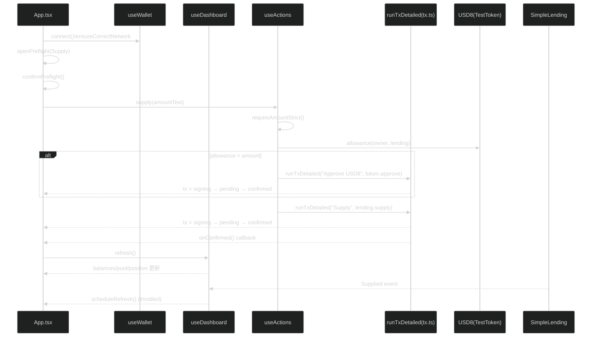

### 13.2 Borrow / Repay / Withdraw 的区别

- Borrow：不需要 approve（你是从池子里拿 token）
- Repay：需要 approve（`transferFrom` 把 token 从你账户拉回池子）
- Withdraw：不需要 approve，但会触发健康因子约束（见 5.3 / 11.1）

下面把 3 个动作各自的“真实调用链 + 常见失败原因”补齐。

### 13.3 Borrow 的真实调用链（不需要 approve）

关键文件：[`frontend/src/App.tsx`](../frontend/src/App.tsx) → [`frontend/src/hooks/useActions.ts`](../frontend/src/hooks/useActions.ts) → [`frontend/src/state/tx.ts`](../frontend/src/state/tx.ts) → [`contracts/SimpleLending.sol`](../contracts/SimpleLending.sol)

关键路径（概念级）：
1) 点击 Borrow → Preflight
2) Confirm → `actions.borrow(amountText)`
3) `useActions.borrow`：金额校验 → `runTxDetailed("Borrow", lending.borrow)`
4) confirmed 后：`onConfirmed` 强制 refresh + `Borrowed` 事件触发 refresh

```mermaid
%%{init: {'theme': 'dark'}}%%
flowchart TB
  UI[App.tsx\nBorrow button] --> PF[Preflight 确认]
  PF --> ACT[useActions.borrow]
  ACT --> VAL[requireAmountStrict]
  VAL --> TX[runTxDetailed]
  TX --> L[lending.borrow(amount)]
  L --> EVT[Borrowed event]
  TX --> CONF[confirmed → onConfirmed refresh]
  EVT --> READ[useDashboard scheduleRefresh]
  CONF --> READ
  READ --> UI
```

常见失败原因（对应 11.1 的 revert 文案）：
- `Insufficient liquidity`：池子余额不够（提高 supply 或降低 borrow 金额）
- `Exceeds borrowing limit`：超过 `supplied * 75%`（用 maxBorrow / Max safe）
- `Amount must be greater than 0`：金额解析为 0（输入格式/小数位）

### 13.4 Repay 的真实调用链（需要 approve-if-needed）

关键文件：[`frontend/src/App.tsx`](../frontend/src/App.tsx) → [`frontend/src/hooks/useActions.ts`](../frontend/src/hooks/useActions.ts) → [`frontend/src/state/tx.ts`](../frontend/src/state/tx.ts)

与 Supply 的差别：Repay 也走 `approveIfNeeded`，但最终发的是 `lending.repay(amount)`。

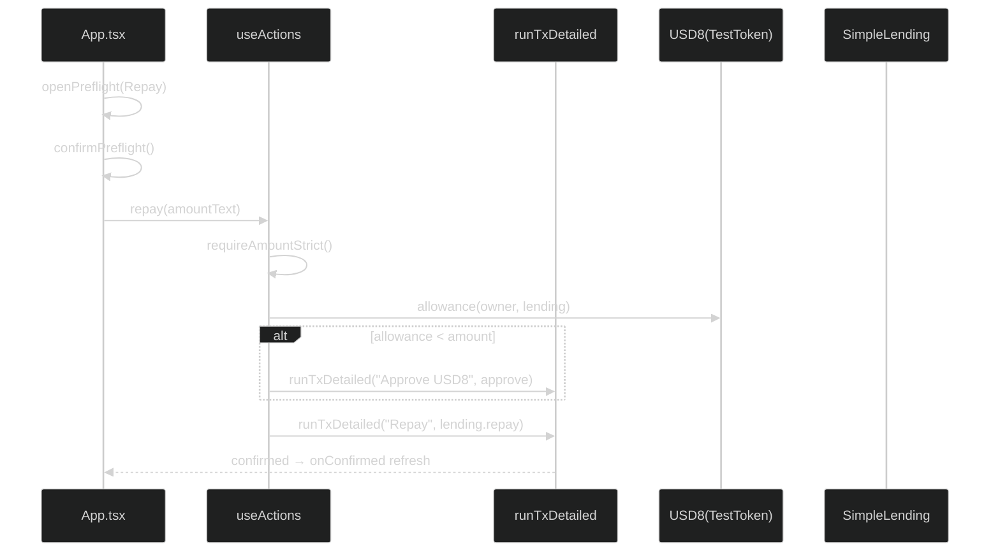

常见失败原因（对应 11.1 的 revert 文案）：
- `Amount exceeds borrow`：还款金额 > 已借金额（先看 dashboard borrowed）
- `Insufficient allowance`：没 approve 或 allowance 不够（按 UI 提示先 approve）
- `Insufficient balance`：你账户 USD8 不够（借得太少/余额被转走/没 seed）

### 13.5 Withdraw 的真实调用链（不需要 approve，但有两层保护）

关键文件：[`frontend/src/hooks/useActions.ts`](../frontend/src/hooks/useActions.ts) → [`contracts/SimpleLending.sol`](../contracts/SimpleLending.sol)

Withdraw 的两层保护：
1) 前端 UX-only 预检查：池子流动性不够就不发交易（避免必失败的签名弹窗）
2) 合约硬约束：withdraw 后必须仍满足 LTV/健康因子

```mermaid
%%{init: {'theme': 'dark'}}%%
flowchart TB
  UI[App.tsx\nWithdraw button] --> ACT[useActions.withdraw]
  ACT --> VAL[requireAmountStrict]
  VAL --> PRE[前端预检查:\nusd8.balanceOf(lending) >= amount]
  PRE -->|No| ERR[throw "Insufficient liquidity"\n(不弹钱包)]
  PRE -->|Yes| TX[runTxDetailed]
  TX --> L[lending.withdraw(amount)]
  L --> HF[合约检查:\nWithdrawal would make position unhealthy]
  L --> EVT[Withdrawn event]
  EVT --> READ[useDashboard scheduleRefresh]
  TX --> READ
  READ --> UI
```

常见失败原因（对应 11.1 的 revert 文案）：
- `Insufficient supply`：取的比存的多
- `Withdrawal would make position unhealthy`：取完会导致超出 LTV（看 maxWithdraw / healthFactor）
- `Insufficient liquidity`：池子里没那么多钱（前端可能直接拦截，不弹钱包）

---

## 14) 真实项目：为什么 UI 能“实时更新”？（三层刷新机制对齐代码）

这部分是面试加分点：你能说清“为什么不会链上变了 UI 不变”。

### 14.1 第一层：tx confirmed 后强制 refresh（最确定）

- 位置：[`frontend/src/App.tsx`](../frontend/src/App.tsx)
- 机制：`useActions({ onConfirmed: () => { allowance.refresh(); dashboard.refresh(); } })`

这保证“你自己发的交易”，只要 confirmed，就一定触发读链刷新。

### 14.2 第二层（Mandatory）：合约事件监听 refresh（题面必需）

- 位置：[`frontend/src/hooks/useDashboard.ts`](../frontend/src/hooks/useDashboard.ts)
- 监听事件：`Supplied/Withdrawn/Borrowed/Repaid`
- 细节：`scheduleRefresh()` 做 250ms 节流，避免事件爆发刷爆 UI

### 14.3 第三层（可选兜底）：block listener + backfill（防漏事件）

- block listener 位置：[`frontend/src/App.tsx`](../frontend/src/App.tsx)
- backfill（queryFilter）位置：[`frontend/src/hooks/useDashboard.ts`](../frontend/src/hooks/useDashboard.ts)

兜底逻辑只在“已连接 + 正确网络 + 没有 pending/signing/stuck tx”时启用，并且 3 秒节流一次。

---

## 15) 真实项目：怎么调试（你要像工程师一样定位问题）

### 15.1 先用证据文件确认“你到底连的是哪个合约”

- 看导出的地址：[`frontend/src/contracts/deployments.json`](../frontend/src/contracts/deployments.json)
- 看是否是本地链：`chainId` 必须是 31337

如果你重启过 `npx hardhat node`，但没重新跑 deploy，**地址必然失效**（见 10.3）。

### 15.2 用 Hardhat node 输出验证交易是否真的上链

`npx hardhat node` 的终端会打印每笔交易、每次调用、gas 使用情况。

经验规则：
- node 终端有交易日志，但 UI 不变：优先怀疑“前端 refresh 没触发/没收到事件”（看 14）
- node 终端没有交易日志：根本没发出去（多半卡在 MetaMask signing 或 wrong network）

### 15.3 前端定位：先看 tx 状态机，再看错误归一化

- tx 状态：[`frontend/src/state/tx.ts`](../frontend/src/state/tx.ts)
  - `stuck` 不是失败：代表超时，可能是 RPC 慢/替换交易
- 错误分类：[`frontend/src/state/errors.ts`](../frontend/src/state/errors.ts)
  - `UserRejected` / `Revert` / `Rpc` / `NetworkMismatch` 的分流，能让你快速判断问题在哪一层

### 15.4 最快的“一刀切”：跑 smoke:e2e

如果你不确定是“合约/脚本坏了”还是“前端/钱包状态问题”，优先跑：

```bash
npm run smoke:e2e
```

它是用导出的 ABI/地址做链上交互的，所以特别适合验证 Part 1 链路是否健康。

---

## 16) 真实项目：UI 地图（App.tsx 从上到下长什么样）

你读 UI 最容易迷路，所以这一节把 [`frontend/src/App.tsx`](../frontend/src/App.tsx) 的结构“拆成地图”。

### 16.1 总览：页面由哪些区块组成

```mermaid
%%{init: {'theme': 'dark'}}%%
flowchart TB
  TOP[Top bar\nConnect / Refresh\nChainId / Account] --> ADDR[Contract addresses\nUSD8/WETH/Lending]
  ADDR --> ERR[Errors\nWallet error / Dashboard error]
  ERR --> NET[Wrong network banner\nSwitch to 31337]
  NET --> TX[Tx status line\n+ stuck helper panel]
  TX --> PF[Preflight modal\n(pre-wallet confirmation)]
  PF --> ACT[Actions\nApprove mode + 4 cards]
  ACT --> DATA[Balances / Pool / User Position\n+ Max(safe) helpers]
```

### 16.2 每个区块对应的“数据来源”（真实项目对齐）

1) Top bar（Connect/Refresh/ChainId/Account）
- 数据来源：[`frontend/src/hooks/useWallet.ts`](../frontend/src/hooks/useWallet.ts)、[`frontend/src/hooks/useDashboard.ts`](../frontend/src/hooks/useDashboard.ts)
- 为什么不会一打开就弹 MetaMask：只有点 `Connect MetaMask` 才会触发 `eth_requestAccounts`

2) Contract addresses（USD8/WETH/SimpleLending 地址展示）
- 数据来源：部署导出的 [`frontend/src/contracts/deployments.json`](../frontend/src/contracts/deployments.json)
- 重要点：这就是“真实项目里避免手抄地址”的关键证据

3) Errors（Wallet error / Dashboard error）
- 来源：`useWallet.error` / `useDashboard.error`（内部用 [`frontend/src/state/errors.ts`](../frontend/src/state/errors.ts) 归一化 message）

4) Wrong network banner（Switch to 31337）
- 判定：`wallet.chainId !== deployments.chainId`
- 行为：点击按钮会调用 `wallet.ensureCorrectNetwork()`（内部 switch/add chain）

5) Tx status line + stuck panel（交易状态展示/兜底）
- 数据来源：[`frontend/src/hooks/useActions.ts`](../frontend/src/hooks/useActions.ts) 里的 `actions.tx`
- 核心机制：[`frontend/src/state/tx.ts`](../frontend/src/state/tx.ts)（signing→pending→confirmed/failed/stuck）
- stuck 面板提供两件事：`refreshPendingTx()` 重新查 receipt、`clearPendingTx()` 清本地 pending

6) Preflight modal（pre-wallet 确认弹窗）
- 目的：钱包弹窗前，先让用户看清楚 **Action/Amount/Token/Spender/Account/ChainId**
- 关键点：Supply/Repay 会额外展示 Approval mode（Exact/Infinite）

7) Actions（Approve mode + 四个卡片）
- Approve mode：只影响 Supply/Repay 的 approve 额度（Exact 更安全，Infinite 更省事）
- 四个按钮不会直接发交易：它们会先 `openPreflight(...)`，confirm 后才调用 `actions.supply/withdraw/borrow/repay`

8) Balances / Pool / User Position（只读展示区）
- 数据来源：[`frontend/src/hooks/useDashboard.ts`](../frontend/src/hooks/useDashboard.ts)
- Max(safe)：`maxBorrow/maxWithdraw - 1 wei` 的保守策略（避免边界 rounding 触发 revert）

### 16.3 读 UI 的推荐顺序（小白版）

如果你只想快速看懂页面：
1) 先看 Top bar（你连的是谁/哪条链）
2) 再看 Wrong network（是不是 31337）
3) 再看 Tx status（交易到底有没有发出去）
4) 最后看 Balances/Pool/Position（读链数据是不是刷新了）

---

## 17) 真实项目：按钮为什么会被禁用？（工程级 UX 安全性）

很多小白会误解：
> “按钮灰了是不是项目坏了？”

真实工程里，按钮禁用通常是**防错、防重复提交、防错链、防脏输入**。

这一节对齐 [`frontend/src/App.tsx`](../frontend/src/App.tsx) 的真实逻辑：每个 Action button 都有类似的禁用条件。

### 17.1 四个 Action 按钮的统一禁用规则（读懂一次，后面都懂）

在 `App.tsx` 里（Supply/Withdraw/Borrow/Repay）都包含这些条件：

- `!actions.ready`
  - 含义：provider/account/contracts 还没准备好
  - 典型原因：没连接钱包、或者 dashboard 还没拿到合约实例
  - 相关代码：[`frontend/src/hooks/useActions.ts`](../frontend/src/hooks/useActions.ts)

- `!isCorrectNetwork`
  - 含义：不是 chainId 31337（Hardhat Local）
  - 相关代码：[`frontend/src/hooks/useWallet.ts`](../frontend/src/hooks/useWallet.ts)（switch/add chain）

- `!canSupply / !canWithdraw / !canBorrow / !canRepay`
  - 含义：输入金额不合法（还没达到“能发交易”的标准）
  - 相关代码：严格金额解析 [`frontend/src/utils/amount.ts`](../frontend/src/utils/amount.ts)

- `tx.stage === "pending" || "signing" || "stuck"`
  - 含义：正在交易中（或 pending 超时）
  - 目的：防止 double submit（重复点两次就发两笔交易）
  - 相关代码：交易状态机 [`frontend/src/state/tx.ts`](../frontend/src/state/tx.ts)

### 17.2 为什么金额校验要“严格”？（enterprise-safe amount schema）

严格解析不是炫技，是为了避免真实项目里常见事故：
- 科学计数法（`1e18`）在某些 UI/输入法里会造成误读
- 千分位/空格（`1,000` / `1 000`）容易被 parse 错
- JS number 会丢精度（尤其是 18 decimals）

本项目使用的是 **bigint end-to-end**，并禁止危险格式：
- 位置：[`frontend/src/utils/amount.ts`](../frontend/src/utils/amount.ts)
- 规则：只允许十进制；禁止 `e/E`；禁止分隔符；限制小数位 ≤ decimals；必须 > 0

你会在 UI 上看到这些校验直接变成用户可读的错误提示（比如 `Too many decimal places`）。

### 17.3 为什么要 Preflight（确认弹窗）？

Preflight 的作用：**钱包弹窗之前**，把交易意图讲清楚（降低误点与钓鱼式 UI 风险）。

对齐真实 UI：
- 位置：[`frontend/src/App.tsx`](../frontend/src/App.tsx)
- 展示字段：Action / Amount / ChainId / Account / Token / Spender
- Supply/Repay 会额外展示 Approval mode（Exact/Infinite），并提示可能出现 Approve → Action 的两步钱包流程

工程价值：
- 防止“签名疲劳”（用户连着点确认但不知道自己在授权什么）
- 把 spender 地址显式化（尤其是 infinite approval 时）

### 17.4 为什么要锁（mutex）和 pending 恢复？

真实项目里最常见 bug 之一：用户连续点两次按钮，状态机/余额刷新会乱。

本项目用两层手段解决：
1) UI 禁用（见 17.1）
2) 写模型 action mutex（每个 action 一把锁）
   - 位置：[`frontend/src/hooks/useActions.ts`](../frontend/src/hooks/useActions.ts)

另外还有一个真实项目体验点：刷新页面后 pending tx 不应该“消失”。
- 位置：`useActions` 内的 pending tx restore + `stuck` 面板
- 交易超时阈值：[`frontend/src/config/runtime.ts`](../frontend/src/config/runtime.ts)

### 17.5 allowance 为什么单独做成一个 hook？

因为 allowance UX 在真实钱包里很容易漂移（approve 可能被替换/取消/重发）。

- allowance 读取与手动刷新：[`frontend/src/hooks/useAllowance.ts`](../frontend/src/hooks/useAllowance.ts)
- 自动同步：监听 `Approval` 事件触发 refresh

这也是为什么 Supply 卡片里能稳定显示 `Sufficient / Needs approve`。

---

## 18) 真实项目：交易状态面板怎么读？（signing/pending/stuck 的正确处理方式）

你在页面上看到的 Tx 文本和 stuck 面板，来自 [`frontend/src/App.tsx`](../frontend/src/App.tsx)。

它背后的状态机来自 [`frontend/src/state/tx.ts`](../frontend/src/state/tx.ts)，并且会把 pending tx 持久化到 localStorage（用于页面刷新后恢复）——见 [`frontend/src/state/txStore.ts`](../frontend/src/state/txStore.ts)。

### 18.1 状态机全景（真实实现）

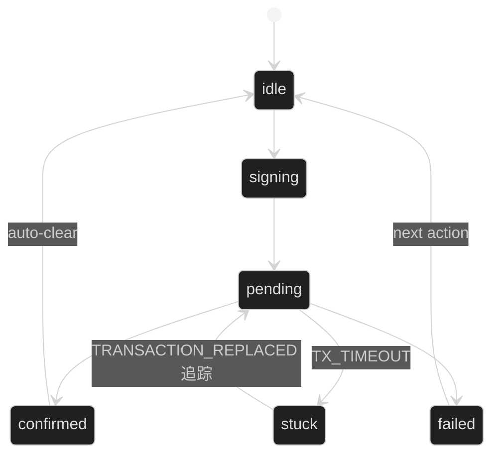

关键参数（本地链 vs 真实 RPC 会不同）：
- `TX_CONFIRMATIONS`、`TX_PENDING_TIMEOUT_MS`：[`frontend/src/config/runtime.ts`](../frontend/src/config/runtime.ts)

### 18.2 每种状态的“人话含义”与“你该做什么”

| UI 显示 stage | 人话含义 | 你应该怎么做 | 对应源码 |
|---|---|---|---|
| `idle` | 没有交易在进行 | 正常操作 | `TX_IDLE` in [`frontend/src/state/tx.ts`](../frontend/src/state/tx.ts) |
| `signing` | 交易已准备好，等待 MetaMask 弹窗签名/确认 | 打开 MetaMask，确认网络/金额/授权内容，然后确认或取消 | `runTxDetailed` 先 `setTx(signing)` |
| `pending` | 已发出交易，等待上链确认 | 等待；不要重复点按钮 | `runTxDetailed` 发出 tx 后 `setTx(pending)` |
| `confirmed` | 已确认（达到 confirmations） | 观察 UI 是否刷新；通常会自动回到 idle | `runTxDetailed` confirmed 后 `clearTx()` |
| `failed` | 失败（revert/拒绝/网络错误等） | 看错误 message；用第 11 节对照原因；调整参数再试 | `normalizeError` in [`frontend/src/state/errors.ts`](../frontend/src/state/errors.ts) |
| `stuck` | 超时了，但**不等于失败**（避免假阴性） | 用 stuck 面板的 `Refresh status` 重新查 receipt；必要时 `Clear pending` | stuck 面板在 [`frontend/src/App.tsx`](../frontend/src/App.tsx) |

### 18.3 为什么会有 stuck？（以及为什么它不算失败）

真实世界里（尤其不是本地链时）RPC 可能：
- 不稳定 / 延迟高
- 交易被替换（speed up）导致 hash 变化
- subscription 丢事件

因此 [`frontend/src/state/tx.ts`](../frontend/src/state/tx.ts) 里做了一个 guardrail：
- 超过 `TX_PENDING_TIMEOUT_MS` 就进入 `stuck`
- stuck 的目的：提醒用户“需要 re-check”，但**不把它当失败**（避免 UI 说失败但链上其实成功了）

### 18.4 pending 持久化（刷新页面后为什么还能看到 pending）

当 tx 进入 `pending` 时：
- `runTxDetailed` 会调用 `savePendingTx(chainId, account, label, hash)`
- 存储位置：localStorage key 形如 `tx:${chainId}:${account}`

页面刷新后：
- `useActions` 会调用 `loadPendingTx(chainId, account)` 恢复并继续 `waitForTransaction`

对应源码：[`frontend/src/state/txStore.ts`](../frontend/src/state/txStore.ts)

### 18.5 stuck 面板的两个按钮到底干什么

stuck 面板在 [`frontend/src/App.tsx`](../frontend/src/App.tsx) 里，调用的是写模型的方法：
- `Refresh status`：`actions.refreshPendingTx()`（读 receipt/等待一个 bounded time，然后更新 stage）
- `Clear pending`：`actions.clearPendingTx()`（清 localStorage pending，并把 tx 置回 idle）

建议：
- 你“确定自己不想再追踪这笔交易”才点 Clear
- 不确定就先 Refresh

---

## 19) 真实项目：TRANSACTION_REPLACED（加速/替换交易）我们是怎么处理的？

现实里用户经常会在 MetaMask 里点 **Speed up** / **Cancel**：
- Speed up：用**更高 gas** 发一笔相同 nonce 的新交易，把旧交易替换掉
- Cancel：用相同 nonce 发一笔 0 value 的交易（或自转）来“占掉 nonce”，让旧交易失效

对于前端来说，最棘手的点是：
> 交易 hash 可能变了，但用户并不关心“hash 变了”，用户只关心“我点的那次操作最后到底成没成”。

### 19.1 我们的处理策略（对齐真实代码）

核心逻辑在 [`frontend/src/state/tx.ts`](../frontend/src/state/tx.ts)：

- 正常路径：
  - `signing` → `pending(hash)` → `confirmed(hash)`

- 替换路径（ethers v6 会抛出 `code === "TRANSACTION_REPLACED"`）：
  1) 捕获 replacement（`e.replacement`）
  2) 把 UI 里的 hash 更新为 replacement.hash
  3) 重新等待 replacement 的 receipt
  4) 如果 replacement 等待也超时：进入 `stuck`
  5) 如果 replacement 明确 cancelled：标记 failed

关键点：我们不会“把替换当失败”，而是**继续追踪 replacement**，保证用户看到的状态仍然正确。

### 19.2 为什么 pending 的 localStorage 也要跟着更新？

因为刷新页面后要恢复 pending 交易。

当发生替换时，我们会把 persisted hash 也更新到 replacement.hash：
- 保存/清理逻辑：[`frontend/src/state/txStore.ts`](../frontend/src/state/txStore.ts)
- 这样用户刷新页面后追踪的就是“最新那笔有效交易”，不会一直盯着旧 hash。

### 19.3 如何在 Hardhat 本地“稳定复现”替换交易（可选高级实验）

注意：Hardhat 默认会很快出块，很多时候来不及点 Speed up，所以要先让交易“挂住”。

步骤（演示/学习用，非题面必需）：

1) Terminal 1：启动本地链

```bash
npx hardhat node
```

2) Terminal 2：部署并导出（保证前端地址最新）

```bash
npx hardhat run scripts/deploy.ts --network localhost
```

3) Terminal 3：启动前端

```bash
cd frontend
npm run dev
```

4) Terminal 4：打开 Hardhat console，把 automine 关掉（让交易进入 pending）

```bash
npx hardhat console --network localhost
```

在 console 里执行：

```js
await network.provider.send("evm_setAutomine", [false]);
await network.provider.send("evm_setIntervalMining", [0]);
"ok";
```

5) 在网页里发一笔交易（例如 Supply），它会停在 `pending`

6) 立刻在 MetaMask 中对这笔 pending 交易点 **Speed up**（或 Cancel）

7) 回到 console 里手动挖块，让交易上链：

```js
await network.provider.send("evm_mine");
"mined";
```

8) 看 UI：hash 会更新为 replacement.hash，并最终 confirmed（或失败）

复原（可选）：

```js
await network.provider.send("evm_setAutomine", [true]);
"automine on";
```

这套实验能让你在面试时讲清楚：
> 为什么交易 hash 会变、我们怎么保证 UI 状态仍正确、为什么 stuck 不是失败。

---

## 20) 真实项目：为什么有 post-state verification（verified/unverified）？

你可能会问：
> “交易 confirmed 了，为什么还要再读链验证一次？”

原因：现实 RPC 读有“最终一致性”问题。
- 交易 confirmed 只是说明区块里有这笔交易
- 但你的读 RPC 可能短时间读不到最新状态（缓存/负载均衡/延迟）

### 20.1 我们怎么做的（对齐真实代码）

逻辑在 [`frontend/src/hooks/useActions.ts`](../frontend/src/hooks/useActions.ts)：
- confirmed 后进入 `postState: verifying`
- 在一个 bounded 时间窗里轮询读取 `getUserPosition`
- 如果观察到预期变化：标记 `verified`
- 如果超时仍没观察到：标记 `unverified`，并提示用户手动刷新

对应的时间预算在 [`frontend/src/config/runtime.ts`](../frontend/src/config/runtime.ts)：
- `POST_STATE_MAX_WAIT_MS`

### 20.2 为什么 unverified 不算失败？

因为这时候“链上很可能已经成功”，只是 RPC 读没跟上。

所以我们用 unverified 做 UX 提示：
- 不撒谎说失败
- 也不装作一定成功
- 给用户一个确定的下一步（Refresh）

你在 UI 的 Tx 行里能看到 `post-state: verifying/verified/unverified`（渲染在 [`frontend/src/App.tsx`](../frontend/src/App.tsx)）。

---

## 21) 面试官常问 20 题（每题都给“30 秒答案 + 证据文件”）

这一节的目标是：你不只是“能跑通”，还能把工程取舍讲清楚。

建议你的答题结构永远固定成一句话：
> 目标是什么 → 风险/坑是什么 → 我怎么做 → 证据在哪

### 21.1 Q&A（直接可背诵）

1) Q：这个项目的最小闭环是什么？
- 30 秒答案：Hardhat 本地链部署 `SimpleLending/TestToken` → 导出地址/ABI → 前端读链展示与写链动作（Supply/Borrow/Repay/Withdraw）→ 事件监听 + tx confirmed refresh 保证 UI 一致。
- 证据：[`scripts/deploy.ts`](../scripts/deploy.ts)、[`scripts/_lib/export.ts`](../scripts/_lib/export.ts)、[`frontend/src/contracts/deployments.json`](../frontend/src/contracts/deployments.json)、[`frontend/src/hooks/useDashboard.ts`](../frontend/src/hooks/useDashboard.ts)、[`frontend/src/hooks/useActions.ts`](../frontend/src/hooks/useActions.ts)

2) Q：为什么要导出 `deployments.json`，不手写地址？
- 30 秒答案：避免人肉抄地址导致“连错合约/错链”这类最常见事故；并让 smoke/e2e 与前端天然对齐同一份地址来源。
- 证据：[`frontend/src/contracts/deployments.json`](../frontend/src/contracts/deployments.json)、[`scripts/_lib/export.ts`](../scripts/_lib/export.ts)、[`scripts/smoke-e2e.mjs`](../scripts/smoke-e2e.mjs)

3) Q：为什么前端要做 hook 分层（useWallet/useDashboard/useActions）？
- 30 秒答案：把“连接与网络（wallet）/读链缓存与刷新（dashboard）/写链动作与状态机（actions）”拆开，避免组件里状态爆炸，并能单独测试/复用。
- 证据：[`frontend/src/hooks/useWallet.ts`](../frontend/src/hooks/useWallet.ts)、[`frontend/src/hooks/useDashboard.ts`](../frontend/src/hooks/useDashboard.ts)、[`frontend/src/hooks/useActions.ts`](../frontend/src/hooks/useActions.ts)

4) Q：为什么 confirmed 后还要 refresh？
- 30 秒答案：事件可能漏、读 RPC 可能延迟；confirmed 是最确定的“写已发生”，所以必须强制触发一次读链刷新。
- 证据：[`frontend/src/App.tsx`](../frontend/src/App.tsx)、[`frontend/src/hooks/useActions.ts`](../frontend/src/hooks/useActions.ts)

5) Q：为什么既监听事件，又做 block/backfill？不是重复吗？
- 30 秒答案：事件监听是主路径，但现实里 subscription 会丢；block/backfill 是兜底，保证 UI 最终能追上链上状态（而且有节流，避免刷爆）。
- 证据：事件监听/backfill 在 [`frontend/src/hooks/useDashboard.ts`](../frontend/src/hooks/useDashboard.ts)，block listener 在 [`frontend/src/App.tsx`](../frontend/src/App.tsx)

6) Q：为什么要 tx 状态机（signing/pending/stuck），而不是一个 boolean isLoading？
- 30 秒答案：真实钱包会出现“签名中/已发出等待确认/超时但未失败/交易被替换”等不同状态；用状态机才能给出正确 UX 指引，并避免误判失败。
- 证据：[`frontend/src/state/tx.ts`](../frontend/src/state/tx.ts)

7) Q：为什么会有 stuck？为什么 stuck 不算失败？
- 30 秒答案：RPC 可能慢或丢回执；把超时当失败会产生假阴性（链上其实成功但 UI 说失败）。stuck 的正确语义是“需要 re-check”。
- 证据：[`frontend/src/state/tx.ts`](../frontend/src/state/tx.ts)、stuck UI 在 [`frontend/src/App.tsx`](../frontend/src/App.tsx)

8) Q：交易被 Speed up/Cancel（TRANSACTION_REPLACED）怎么处理？
- 30 秒答案：不把旧 hash 当最终结果；捕获 replacement，更新 hash 并继续等待 replacement 的 receipt，保证用户看到的结论仍正确。
- 证据：[`frontend/src/state/tx.ts`](../frontend/src/state/tx.ts)

9) Q：为什么要把 pending tx 存 localStorage？
- 30 秒答案：用户刷新页面/浏览器崩溃后，pending 交易不应该“消失”；恢复后继续追踪，避免用户重复点造成双花式操作。
- 证据：[`frontend/src/state/txStore.ts`](../frontend/src/state/txStore.ts)、恢复逻辑在 [`frontend/src/hooks/useActions.ts`](../frontend/src/hooks/useActions.ts)

10) Q：为什么有 preflight（钱包弹窗前确认）？
- 30 秒答案：减少签名疲劳与误操作，让用户在钱包前明确看到 action/amount/spender/chain/account，尤其是 infinite approve 风险。
- 证据：[`frontend/src/App.tsx`](../frontend/src/App.tsx)

11) Q：为什么金额解析要“严格”（禁止 1e18、逗号、JS number）？
- 30 秒答案：18 decimals 的金额用 JS number 会丢精度；科学计数法/分隔符在不同输入法下易产生歧义。严格 schema + bigint end-to-end 是生产级防事故手段。
- 证据：[`frontend/src/utils/amount.ts`](../frontend/src/utils/amount.ts)

12) Q：为什么有 Approval mode（Exact vs Infinite）？
- 30 秒答案：Exact 更安全（最小授权），Infinite 更省事（减少未来 approve 交易）。把选择权交给用户，并在 preflight 明确展示 spender。
- 证据：UI 与 preflight 在 [`frontend/src/App.tsx`](../frontend/src/App.tsx)，approve 逻辑在 [`frontend/src/contracts/write.ts`](../frontend/src/contracts/write.ts)

13) Q：为什么 Supply/Repay 里有“approve-if-needed”的两步交易？
- 30 秒答案：ERC20 的 transferFrom 需要 allowance；不足就先 approve，再执行 action。前端把这两步封装成一个 action，用户体验更稳定。
- 证据：[`frontend/src/contracts/write.ts`](../frontend/src/contracts/write.ts)、[`frontend/src/hooks/useActions.ts`](../frontend/src/hooks/useActions.ts)

14) Q：为什么 allowance 单独做成 hook 还要监听 Approval 事件？
- 30 秒答案：allowance 会被替换/取消/不同来源改变；单独 hook + 事件刷新能让 UI 的“是否需要 approve”更可靠。
- 证据：[`frontend/src/hooks/useAllowance.ts`](../frontend/src/hooks/useAllowance.ts)

15) Q：为什么要做 action mutex / 禁用按钮？
- 30 秒答案：防止重复点击导致并发交易、状态机错乱、余额刷新竞态；真实项目必须避免 double submit。
- 证据：禁用条件在 [`frontend/src/App.tsx`](../frontend/src/App.tsx)，mutex 在 [`frontend/src/hooks/useActions.ts`](../frontend/src/hooks/useActions.ts)

16) Q：为什么 maxBorrow/maxWithdraw 要“减 1 wei”？
- 30 秒答案：边界值可能因为 rounding/同步延迟触发 require；减 1 wei 是保守策略，提升成功率且对用户几乎无感。
- 证据：max(safe) 展示在 [`frontend/src/hooks/useDashboard.ts`](../frontend/src/hooks/useDashboard.ts)

17) Q：为什么 confirmed 后还要做 post-state verification？
- 30 秒答案：confirmed 不代表读 RPC 立刻能读到最新状态；verification 用有限时间轮询，给出 verified/unverified，让 UI 既不撒谎也不沉默。
- 证据：[`frontend/src/hooks/useActions.ts`](../frontend/src/hooks/useActions.ts)、参数在 [`frontend/src/config/runtime.ts`](../frontend/src/config/runtime.ts)

18) Q：合约层面最关键的安全约束是什么？
- 30 秒答案：借贷动作必须满足 LTV/健康因子约束（borrow/withdraw 会在合约里做硬检查）；并用事件让前端可追踪。
- 证据：[`contracts/SimpleLending.sol`](../contracts/SimpleLending.sol)

19) Q：为什么要写 `smoke:e2e`？它和前端有什么关系？
- 30 秒答案：smoke:e2e 用导出的 ABI/地址直接跑完整链路（approve→supply→borrow→repay→withdraw），快速证明“链路健康”，也能把问题定位到“前端/钱包”还是“合约/部署”。
- 证据：[`scripts/smoke-e2e.mjs`](../scripts/smoke-e2e.mjs)、命令说明见 [`README.md`](../README.md)

20) Q：怎么证明你这份实现对齐了题面？
- 30 秒答案：用映射文档把题面条目逐条对应到实现与证据文件，并用 demo checklist 和 smoke 自检确保可复现。
- 证据：[docs/CODING_TEST_ASSIGNMENT.txt](../docs/CODING_TEST_ASSIGNMENT.txt)、[docs/ASSESSMENT_MAPPING.md](../docs/ASSESSMENT_MAPPING.md)、[docs/DEMO_CHECKLIST.zh-en.md](../docs/DEMO_CHECKLIST.zh-en.md)

### 21.2 面试时的“1 分钟叙事模板”（可直接套用）

你可以用这段结构回答“你做了什么/亮点是什么”：

1) 我先把链路闭环跑通（Hardhat 部署→导出→前端读写）
2) 然后做工程可靠性：tx 状态机（stuck/替换追踪/恢复）+ 三层刷新（confirmed+events+backfill）
3) 再做 UX 安全：严格金额解析 + preflight + approve 模式 + mutex/禁用规则
4) 最后用证据文件证明可复现：assessment mapping + demo checklist + smoke:e2e

如果你想把这一节做成“面试答案卡”（更短、更口语），我可以继续把每题压缩成 1-2 句话版本。

### 21.3 面试答案卡（1-2 句话口语版）

| 题号 | 口语版（建议直接背） |
|---:|---|
| 1 | 我把链路闭环跑通：Hardhat 部署合约 → 导出 ABI/地址 → 前端读写四个动作，并用事件监听 + confirmed refresh 保证 UI 跟链上同步。 |
| 2 | 我用脚本把地址导出成 `deployments.json`，避免手抄地址导致“错链/错合约”，同时 smoke/e2e 和前端都吃同一份配置。 |
| 3 | 前端按职责拆成 wallet（连接/切链）、dashboard（读链与刷新）、actions（写链与状态机），避免组件状态爆炸，也更好讲清楚。 |
| 4 | confirmed 之后强制 refresh，因为事件可能漏、RPC 读可能延迟；confirmed 是最确定的“写已发生”，所以用它兜底 UI 一致性。 |
| 5 | 事件监听是主路径，但订阅可能丢；block/backfill 是兜底，保证最终一致，而且做了节流避免刷爆 UI。 |
| 6 | 我用 tx 状态机而不是 isLoading，因为真实钱包有 signing/pending/stuck/替换交易等状态，不分清会误判失败。 |
| 7 | stuck 是“超时需要复查”，不是失败；这样避免 RPC 慢导致 UI 假阴性（链上成功但 UI 显示失败）。 |
| 8 | 遇到 Speed up/Cancel 时会触发替换交易，我会更新 hash 并继续追踪 replacement 的 receipt，让用户只关心最终结果。 |
| 9 | pending tx 会持久化到 localStorage，用户刷新页面后还能继续追踪，避免重复点击导致两笔交易。 |
| 10 | preflight 是钱包前的确认页，让用户在签名之前看清 action/amount/spender/chain/account，减少误操作和无限授权风险。 |
| 11 | 金额解析必须严格：禁止科学计数法/分隔符，且用 bigint 全链路，避免 18 位小数精度事故。 |
| 12 | Approval mode 是给用户选择：Exact 更安全、Infinite 更省事；并在 preflight 把 spender 明示出来。 |
| 13 | Supply/Repay 需要 allowance，不够就先 approve 再执行 action；我把两步封装成一个 action，用户体验更稳定。 |
| 14 | allowance 单独 hook 并监听 Approval 事件，因为授权很容易漂移（被替换/取消/外部改变），这样 UI 才可靠。 |
| 15 | 我用按钮禁用 + action mutex 防 double submit，避免并发交易导致状态机乱和余额刷新竞态。 |
| 16 | maxBorrow/maxWithdraw 做减 1 wei 的保守策略，避免边界 rounding/同步延迟触发 revert，提高成功率。 |
| 17 | post-state verification 是 confirmed 后的二次读验证：给出 verified/unverified，既不撒谎也给用户明确下一步。 |
| 18 | 合约关键约束是健康因子/LTV：borrow/withdraw 会在链上硬检查，确保 position 不会越界。 |
| 19 | smoke:e2e 用导出的 ABI/地址跑完整链路，快速证明“合约+部署”没问题，也能把锅从前端/钱包里剥离出来。 |
| 20 | 我用 assessment mapping 把题面逐条对齐到实现文件，并提供 demo checklist + smoke 自检保证可复现。 |

### 21.4 面试追问清单（问到就甩“函数名 + 文件”）

下面这些是面试官最爱追问的“证据点”。你不需要背代码全文，记住**函数名 + 文件**就够了。

1) 追问：导出 ABIs/地址到底在哪里做的？
- 证据点：`exportArtifacts(...)` in [`scripts/_lib/export.ts`](../scripts/_lib/export.ts)，部署入口 in [`scripts/deploy.ts`](../scripts/deploy.ts)

2) 追问：切链/加链具体怎么写的？
- 证据点：`ensureCorrectNetwork()` / `switchToLocalhost()` in [`frontend/src/hooks/useWallet.ts`](../frontend/src/hooks/useWallet.ts)，内部调用 `wallet_switchEthereumChain` / `wallet_addEthereumChain`

3) 追问：事件监听是怎么节流的？backfill 怎么防止太重？
- 证据点：`scheduleRefresh()`（250ms throttle）、`backfillEvents()`（range 限制 `EVENT_BACKFILL_MAX_BLOCKS`）、`lending.queryFilter(...)` in [`frontend/src/hooks/useDashboard.ts`](../frontend/src/hooks/useDashboard.ts)

4) 追问：tx 状态机怎么实现“超时 → stuck”？
- 证据点：`runTxDetailed(...)` 内部 `waitWithTimeout()` + `TX_PENDING_TIMEOUT_MS` in [`frontend/src/state/tx.ts`](../frontend/src/state/tx.ts)

5) 追问：TRANSACTION_REPLACED 具体怎么追踪 replacement？
- 证据点：`code === "TRANSACTION_REPLACED"` 分支，更新 `finalHash` 并继续 `waitWithTimeout(replacement)` in [`frontend/src/state/tx.ts`](../frontend/src/state/tx.ts)

6) 追问：pending tx 怎么持久化/怎么恢复/怎么清理？
- 证据点：`savePendingTx(...)` / `loadPendingTx(...)` / `clearTx(...)` in [`frontend/src/state/txStore.ts`](../frontend/src/state/txStore.ts)，恢复入口在 [`frontend/src/hooks/useActions.ts`](../frontend/src/hooks/useActions.ts)

7) 追问：stuck 面板的 Refresh/Clear 分别干嘛？
- 证据点：`refreshPendingTx()` / `clearPendingTx()` in [`frontend/src/hooks/useActions.ts`](../frontend/src/hooks/useActions.ts)，UI 渲染 in [`frontend/src/App.tsx`](../frontend/src/App.tsx)

8) 追问：金额为什么能做到“严格校验 + bigint end-to-end”？
- 证据点：`parseAmountStrict(...)` / `requireAmountStrict(...)` in [`frontend/src/utils/amount.ts`](../frontend/src/utils/amount.ts)

9) 追问：approve 和 lending 写入是怎么抽象的？
- 证据点：`getWriteToken()` / `getWriteLending()` in [`frontend/src/contracts/write.ts`](../frontend/src/contracts/write.ts)

10) 追问：为什么说你做了 mutex？具体在哪里？
- 证据点：`withLock(key, fn)` in [`frontend/src/hooks/useActions.ts`](../frontend/src/hooks/useActions.ts)

11) 追问：post-state verification 的实现细节是什么？
- 证据点：`verifyPostState(...)` + `POST_STATE_MAX_WAIT_MS` in [`frontend/src/hooks/useActions.ts`](../frontend/src/hooks/useActions.ts) and [`frontend/src/config/runtime.ts`](../frontend/src/config/runtime.ts)

如果你愿意，我也可以把“21.3 答案卡”再压缩成**一页速记卡**（只保留关键词，适合打印/手机看），并放到 learning 目录里。

---

## 22) 小白必备术语表（遇到不懂的词就回来看）

- Hardhat node：本地开发链（默认 RPC `127.0.0.1:8545`，chainId 通常是 `31337`）
- chainId：链 ID，切错链会导致余额/合约地址/事件都不对
- RPC：前端连接节点的接口（本项目主要是 `http://127.0.0.1:8545`）
- Provider（读链）：读取链上数据，不弹钱包
- Signer（写链）：发交易，需要钱包签名确认
- ABI：合约“函数说明书”，前端调用合约必须依赖 ABI
- deployments.json：部署产物地址集合，重启本地链后需要重新部署并重新导出
- approve/allowance：授权机制，允许 spender 从你账户 transferFrom
- tx/receipt：交易与回执（回执包含状态、gas、事件）
- event/log：合约日志，前端用来实时刷新
- revert：合约执行失败并回滚，通常有错误 message
- LTV/healthFactor：借贷安全约束指标，borrow/withdraw 会在合约里硬检查

---

## 23) 小白学习里程碑（学完这些就算真的会）

你不需要一次吃完整篇，按里程碑推进最稳：

1) 会跑起来：三终端 node/deploy/frontend 都稳定（见第 3 节）
2) 钱包不迷路：能解释/修复 wrong network（见第 3.2/10.2）
3) 看懂导出：知道 deployments/ABI 从哪来，知道重启 node 为什么要重新 deploy（见第 3.1/12.1）
4) 读链读明白：能说清余额/pool/position 的来源（见第 12.3/14）
5) 写链走通：至少成功一次 Supply（并能解释 approve-if-needed）（见第 13.1/18）
6) 约束讲对：能解释 maxBorrow、withdraw 为什么会 revert（见第 5.2/5.3/11.1）
7) 会排错：能按“分层→决策树→对照表”定位（见第 10/11/15）
8) 能面试复述：60 秒讲闭环 + 抗 3 个追问（见第 21 节）

---

## 24) 小白动手作业（带验收标准）

### 作业 1：smoke 一键验证链路

- 目标：证明 Part 1（部署导出）+ 链上交互闭环 OK
- 操作：运行 `npm run smoke:e2e`
- 验收：输出包含 `OK: approve→supply→borrow→repay→withdraw flow succeeded...`
- 卡住：优先看第 10.4 和第 11 节

### 作业 2：用 UI 完成一次完整闭环

- 目标：在网页完成 `Supply → Borrow → Repay → Withdraw`
- 验收：
  - Tx 行至少出现一次 `signing → pending → confirmed`
  - position 的 supplied/borrowed/healthFactor 会随动作变化
  - 不需要手动刷新也能更新（confirmed refresh 或事件刷新）
- 卡住：看第 14（刷新机制）+ 第 18（tx 状态）

### 作业 3：故意触发一次 revert，并能解释原因

- 目标：证明你理解合约约束，不是只会点按钮
- 任选一种：
  - 借超过 maxBorrow：`Exceeds borrowing limit`
  - 还超过 borrowed：`Amount exceeds borrow`
  - 取款让仓位不健康：`Withdrawal would make position unhealthy`
- 验收：能对照第 11.1 说明“哪个约束 + 看哪个指标 + 怎么修”

### 作业 4（进阶）：复现 stuck / replacement

- 目标：能讲清 stuck 不等于失败、以及替换交易追踪
- 操作：按第 19.3 关闭 automine，让交易挂住，再 speed up/cancel
- 验收：
  - UI 能进入 stuck；点击 `Refresh status` 能更新状态
  - speed up 后 hash 变化，但最终状态仍正确

---

## 25) 学完本文档后通常还差什么（给你下一步）

学完本文档，你已经能“跑通 + 验收 + 排错 + 复述”。如果你是完全小白，通常还会差这三类能力：

1) Solidity 语法与调试习惯：先看 [learning/01-Solidity基础.md](01-Solidity基础.md) + [learning/22-合约SimpleLending逐函数讲解.md](22-合约SimpleLending逐函数讲解.md)
2) 前端工程化习惯（状态/并发/错误边界）：重点读 [`frontend/src/state/tx.ts`](../frontend/src/state/tx.ts) 和 [`frontend/src/hooks/useActions.ts`](../frontend/src/hooks/useActions.ts)
3) 面试表达（叙事与证据）：用 [learning/26-一页速记卡-项目闭环与面试答案卡.md](26-一页速记卡-项目闭环与面试答案卡.md) 录音练 3 次 60 秒版本

如果你希望我把“作业 1-4”做成可勾选 checklist（并按前端岗/合约岗/全栈岗分三套），我也可以继续补。
