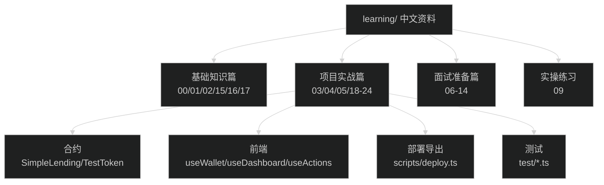

# 学习资料中心

> 本文件夹包含面向初学者和面试准备的中文学习材料

## 0) 一图读懂：学习资料全景图



想要“截图那种图/导出图片文件”：见 [DIAGRAMS_EXPORT.md](DIAGRAMS_EXPORT.md)

学习时间表（每天 8 小时，小白可执行）：见 [STUDY_PLAN_8H.md](STUDY_PLAN_8H.md)

## 📚 文档结构

### 1. 基础知识篇
- [00-智能合约入门.md](00-智能合约入门.md) - 零基础智能合约和区块链概念
- [01-Solidity基础.md](01-Solidity基础.md) - Solidity 编程语言基础
- [02-DeFi借贷协议原理.md](02-DeFi借贷协议原理.md) - DeFi 借贷协议核心概念
- [15-图解-从浏览器到链上一次交易发生了什么.md](15-图解-从浏览器到链上一次交易发生了什么.md) - 超小白图解：读链/写链/交易确认
- [16-图解-ERC20授权approve到底在干嘛.md](16-图解-ERC20授权approve到底在干嘛.md) - 超小白图解：approve 与 allowance
- [17-图解-LTV与健康因子-为什么不能随便取款.md](17-图解-LTV与健康因子-为什么不能随便取款.md) - 超小白图解：LTV/healthFactor/withdraw 检查

### 2. 项目实战篇
- [03-项目代码详解.md](03-项目代码详解.md) - 本项目完整代码逐行解析
- [04-前端集成指南.md](04-前端集成指南.md) - React + ethers.js 与智能合约交互
- [05-测试与部署.md](05-测试与部署.md) - 测试编写和本地部署实操
- [25-项目总体架构图与快速教学.md](25-项目总体架构图与快速教学.md) - 一页讲清整体架构/关键流程/快速上手（含 Mermaid 图）
- [18-技术图-题目要求到实现映射.md](18-技术图-题目要求到实现映射.md) - 题目要求→实现位置→证据点（含技术图）
- [19-技术图-安全加固与风险对照.md](19-技术图-安全加固与风险对照.md) - 风险→控制措施→证据点（含技术图）
- [20-目录导航-学习与面试从哪里开始.md](20-目录导航-学习与面试从哪里开始.md) - 学习目录/面试目录/项目目录图
- [21-代码功能地图-全项目你需要知道什么.md](21-代码功能地图-全项目你需要知道什么.md) - 全项目模块/文件/功能总览（含技术图）
- [22-合约SimpleLending逐函数讲解.md](22-合约SimpleLending逐函数讲解.md) - 合约逐函数讲解（含图）
- [23-前端读写模型与交易状态机.md](23-前端读写模型与交易状态机.md) - useWallet/useDashboard/useActions/tx 状态机全解
- [24-部署导出与测试讲解.md](24-部署导出与测试讲解.md) - deploy+导出ABI/地址+集成测试讲解

### 3. 面试准备篇
- [06-面试常见问题.md](06-面试常见问题.md) - Web3 开发面试高频问题及答案
- [07-项目亮点梳理.md](07-项目亮点梳理.md) - 如何介绍这个项目
- [08-技术面试技巧.md](08-技术面试技巧.md) - 技术面试策略和注意事项
- [10-面试5分钟演示脚本.md](10-面试5分钟演示脚本.md) - 现场可照读的 5 分钟演示话术
- [28-录屏与截图证据模板.md](28-录屏与截图证据模板.md) - 投简历/线上面试：录屏与 6 张截图证据清单
- [29-岗位定制验收与证据包.md](29-岗位定制验收与证据包.md) - 前端岗/合约岗/全栈岗：验收 Checklist + 证据包
- [11-一页速记卡.md](11-一页速记卡.md) - 面试前 10 分钟快速复习清单
- [26-一页速记卡-项目闭环与面试答案卡.md](26-一页速记卡-项目闭环与面试答案卡.md) - 面试前 5 分钟：项目闭环/亮点/证据点一页背诵版
- [12-追问与证据点清单.md](12-追问与证据点清单.md) - Top10 追问 + 项目里对应“证据点”
- [13-useActions交易状态机讲稿.md](13-useActions交易状态机讲稿.md) - 专门讲“交易可靠性”的话术
- [14-面试答案卡-30秒与2分钟.md](14-面试答案卡-30秒与2分钟.md) - 每题可背：30秒版 + 2分钟版（含配图）

### 4. 实操练习
- [09-动手实验.md](09-动手实验.md) - 从零开始运行本项目的完整步骤

## 🎯 学习路径建议

### 完全零基础（建议 5-7 天）
```
第1天: 00 → 01 (理解区块链和智能合约基本概念)
第2天: 02 → 03 (理解 DeFi 借贷 + 本项目合约代码)
第3天: 04 → 09 (理解前端代码 + 动手运行项目)
第4天: 05 (测试和部署流程)
第5天: 06 → 07 (面试准备，梳理项目亮点)
第6-7天: 08 + 反复练习讲解
```

### 有编程基础但不懂 Web3（建议 3-4 天）
```
第1天: 00 → 02 → 03
第2天: 04 → 09 (动手实践)
第3天: 06 → 07 (面试准备)
第4天: 08 + 模拟面试
```

### 有一定 Web3 基础（建议 2 天）
```
第1天: 03 → 04 → 09 (深入理解本项目)
第2天: 06 → 07 → 08 (面试准备和演练)
```

## 💡 使用建议

1. **顺序阅读**：建议按照编号顺序阅读，后面的文档会引用前面的概念
2. **边学边做**：理论结合实践，每看完一个文档就在代码里找对应的实现
3. **做笔记**：准备一个笔记本，记录不理解的地方和自己的理解
4. **反复练习**：尤其是面试准备部分，需要多次练习才能流畅表达

## 🔗 相关资源

- [项目根目录 README](../README.md) - 项目整体说明
- [技术文档目录](../docs/) - 更深入的技术设计说明
- [合约代码](../contracts/) - Solidity 智能合约源码
- [前端代码](../frontend/) - React + TypeScript 前端源码

---

**提示**：这些文档是基于真实项目代码编写的，所有示例代码都可以在项目中找到对应实现。
