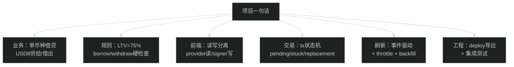

> **已归档**：已并入 [20-面试一页速记卡.md](../20-面试一页速记卡.md)，仅作保留。

# 一页速记卡（面试前 10 分钟快速过一遍）

> 验收与路径以 [项目总览架构](../项目总览架构.md) 为准。

## 0) 一图读懂：你要背的“最小知识图谱”

## 1) 一句话项目介绍

"Hardhat 本地链(31337)上的 DeFi 借贷 Demo：Solidity + OpenZeppelin 合约，React+TS+ethers v6 前端，支持 approve→supply/borrow/repay/withdraw，事件驱动刷新+交易状态机。"

## 2) 技术栈

- 合约：Solidity 0.8.19 + OpenZeppelin（Ownable/Pausable/ReentrancyGuard/SafeERC20）
- 框架：Hardhat（compile/test/deploy）
- 前端：React + TypeScript + ethers v6 + Vite
- 网络：Hardhat local node（RPC: 127.0.0.1:8545, chainId 31337）

## 3) 业务规则（必须背）

- 单币种：USD8 同时用于 supply 和 borrow
- LTV：75%（maxBorrow = supplied * 75%）
- withdraw 限制：withdraw 后仍要满足 borrowed <= newSupply * 75%

## 4) 核心合约函数（说清楚输入/检查/状态变化/事件）

- `supply(amount)`：transferFrom 用户→合约；更新 userSupply/totalSupply；emit Supplied
- `borrow(amount)`：检查流动性和 LTV；更新 userBorrow/totalBorrow；transfer 合约→用户；emit Borrowed
- `repay(amount)`：transferFrom 用户→合约；更新 userBorrow/totalBorrow；emit Repaid
- `withdraw(amount)`：检查余额 + 提现后健康；先改状态再 transfer；emit Withdrawn

## 5) 前端交互（背这五个关键词）

- Provider（读）/ Signer（写）分离
- 预确认（PreflightModal）：点交易后先弹窗展示 Action/Amount/ChainId/地址，确认再打开钱包
- Allowance 检查 + approve（exact/infinite 可选）
- Tx 状态机：idle → signing → pending → confirmed/failed/stuck
- 事件监听刷新为主，区块监听节流兜底

## 6) 你最容易被追问的点（准备答案）

- 为什么要 approve？（ERC20 授权机制，合约用 transferFrom）
- 为什么用 SafeERC20？（兼容不同 ERC20 实现，避免返回值差异）
- 怎么防重入？（ReentrancyGuard + CEI）
- 事件监听怎么写？怎么清理？（on/off 或 useEffect cleanup）
- 为什么要多次确认？（减少重组风险/提升可靠性）
- 为什么 post-state 不一致不算失败？（RPC 最终一致性/读延迟）

## 7) 面试演示顺序（按这个来）

Connect → Supply（预确认→必要时 Approve→Supply）→ Borrow（预确认）→ Repay（预确认→必要时 Approve→Repay）→ Withdraw（预确认）

## 8) 3 个“项目亮点”短句

- "事件驱动刷新为主，轮询兜底，避免 UI 不更新。"
- "交易状态机 + pending 持久化，刷新页面也能恢复追踪。"
- "bigint 端到端金额处理 + safe max（-1 wei）避免舍入失败。"

## 9) 你可以反问面试官的 3 个问题

- "团队对合约安全审计/上线前检查的流程是什么？"
- "前端对链上数据同步（indexer/事件/轮询）通常怎么做？"
- "新人加入后前三个月最希望我交付什么？"
