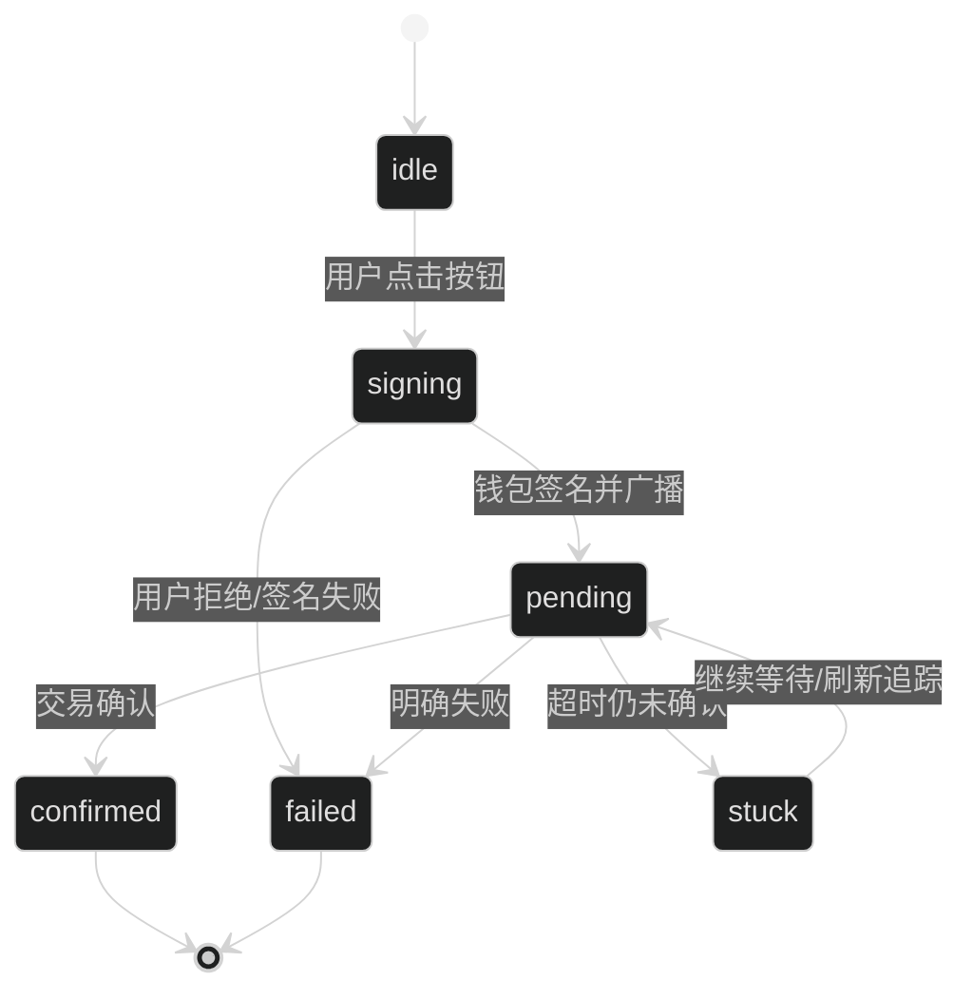

> **已归档**：已并入 [19-追问证据点与讲稿.md](../19-追问证据点与讲稿.md)，仅作保留。

# `useActions` 交易状态机讲稿（面试讲解版）

> 目标：面试官让你讲“前端怎么发交易、怎么保证可靠”，你就按这个讲。  
> TxStage/outcome/runTxDetailed 以 [项目总览架构](项目总览架构.md) §5.4 为准。

## 0) 一图读懂：TxState 状态机

## 1) 我把交易当成状态机，而不是一次函数调用

核心观点：链上交易在真实环境会遇到很多不确定性：
- 用户拒绝签名
- pending 时间很长
- 交易被替换（speed up / cancel）
- RPC 读延迟导致 UI 看起来没更新

所以我做了 `TxState` 状态机，让用户永远知道“现在发生到哪一步”。

证据点： [frontend/src/state/tx.ts](../frontend/src/state/tx.ts)

---

## 2) 状态流转（你可以背这 5 个词）

`idle → signing → pending → confirmed/failed/stuck`

- `signing`：正在弹钱包，等待用户确认
- `pending`：已广播，等待确认
- `stuck`：超时仍未确认（不误报失败）
- `confirmed`：已确认
- `failed`：明确失败或用户拒绝

证据点：
- 状态定义： [frontend/src/state/tx.ts](../frontend/src/state/tx.ts)

---

## 3) 为什么有 `stuck`（超时）？

关键理由：如果直接标记 failed，会产生很多“假失败”（RPC 超时、网络抖动、链拥堵）。
所以我在超时后标记 `stuck`，给用户一个可操作的路径：刷新状态或清除本地记录。

证据点：
- timeout 逻辑和 stuck： [frontend/src/state/tx.ts](../frontend/src/state/tx.ts)
- refresh/clear： [frontend/src/hooks/useActions.ts](../frontend/src/hooks/useActions.ts)

---

## 4) 交易被替换（speed up/cancel）怎么处理？

ethers v6 会抛 `TRANSACTION_REPLACED`，我会拿到 replacement.hash，更新 UI 并继续追踪新的 hash。

证据点：
- replacement 处理： [frontend/src/state/tx.ts](../frontend/src/state/tx.ts)

---

## 5) 页面刷新后，pending 交易怎么恢复？

我把 pending 的 `{chainId, account, label, hash}` 存在 localStorage：
- 刷新页面后读取
- 自动 `waitForTransaction` 继续追踪
- 成功/失败后清理

证据点：
- 持久化： [frontend/src/state/txStore.ts](../frontend/src/state/txStore.ts)
- 恢复 pending： [frontend/src/hooks/useActions.ts](../frontend/src/hooks/useActions.ts)

---

## 6) 用户点击后先预确认，再 approve(if needed) → action

用户点击 Supply/Withdraw/Borrow/Repay 后，先由 `usePreflight` 弹出预确认弹窗（Action、Amount、ChainId、地址），用户点「Confirm & open wallet」后才进入 useActions 发交易。这样避免误点或错链。

ERC20 操作常见两步：
1) allowance 不够 → approve
2) allowance 足够 → supply/repay

我把这件事封装成 `approveIfNeeded()`，并让用户可选：
- exact：只授权刚好需要的金额
- infinite：一次授权 MaxUint256

证据点：
- allowance 检查与 approveIfNeeded： [frontend/src/hooks/useActions.ts](../frontend/src/hooks/useActions.ts)

---

## 7) confirmed 后还要 post-state check

理由：confirmed 不等于你马上能从 RPC 读到最新状态（最终一致性）。
所以我会：
- 先标记 confirmed
- 然后短时间读链验证预期变化
- 读不到就标 `unverified` 提示用户刷新

证据点：
- post-state check： [frontend/src/hooks/useActions.ts](../frontend/src/hooks/useActions.ts)

---

## 8) 你最后一句总结（背下来）

"我把交易当成状态机来设计，并且把 pending 追踪持久化，处理替换和超时；同时 confirmed 后做轻量的 post-state 校验，避免 RPC 延迟导致的错觉。整体目标是：演示可靠、用户心智清晰、错误可解释。"
