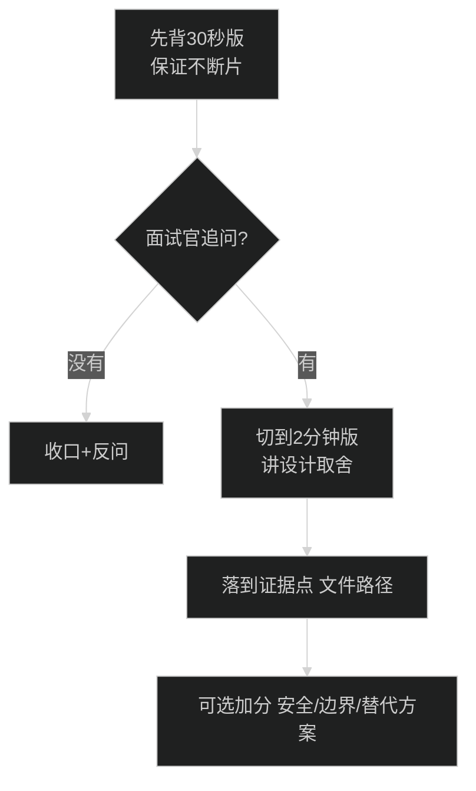

> **已归档**：已并入 [16-项目亮点梳理.md](../16-项目亮点梳理.md) 附录 A，仅作保留。

# 面试答案卡：每题 30 秒版 + 2 分钟版（小白可背）

> 用法：
> - 先背“30 秒版”（能保证不尬住）
> - 面试官追问再切“2 分钟版”（体现深度）
> - 每题后面都有“证据点”（告诉面试官你不是背概念，是基于代码）  
> 验收与路径以 [项目总览架构](../项目总览架构.md) 为准。

## 0) 一图读懂：怎么用这份答案卡

---

## 1) 你这个项目做了什么？

### 30 秒版

"我做的是一个可复现的 DeFi 借贷 Demo：在 Hardhat 本地链 31337 上部署 USD8/WETH 和借贷合约 SimpleLending，前端用 React + TypeScript + ethers v6。用户可以在 UI 里完成 approve→supply/borrow/repay/withdraw 的真实链上交易，并且 UI 通过监听合约事件自动刷新。"

### 2 分钟版

"项目目标是展示完整的 Web3 交易链路，而不是只写一个合约：
1) 合约层：SimpleLending 是单币种借贷，USD8 既用来存也用来借；核心约束是 LTV=75%，borrow 和 withdraw 都会在合约侧做硬检查。
2) 前端层：我把交互拆成读模型和写模型。读模型用 provider 并发读余额/仓位/pool；写模型用 signer 发交易，并管理交易状态机（signing/pending/confirmed/failed/stuck）。
3) 刷新策略：事件监听为主（题目要求），同时做了事件 burst 节流、以及 best-effort backfill（queryFilter 小范围）来兜底。
4) 工程化：有 8 个 Hardhat 集成测试覆盖闭环与多种 revert，部署脚本一键 deploy + seedTo + exportArtifacts 导出 ABI + address 给前端。"

证据点：
- 合约： [contracts/core/LendingPoolImpl.sol](../../contracts/core/LendingPoolImpl.sol)（前端 ABI 名 SimpleLending）
- 读模型： [frontend/src/hooks/useDashboard.ts](../../frontend/src/hooks/useDashboard.ts)
- 写模型： [frontend/src/hooks/useActions.ts](../../frontend/src/hooks/useActions.ts)
- tx 状态机： [frontend/src/state/tx.ts](../../frontend/src/state/tx.ts)
- 测试： [test/integration/SimpleLending.integration.ts](../../test/integration/SimpleLending.integration.ts)

---

（以下 2–7 题略，详见 07 附录 A。）

证据点：
- 测试文件： [test/integration/SimpleLending.integration.ts](../../test/integration/SimpleLending.integration.ts)
