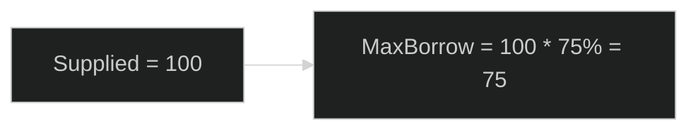
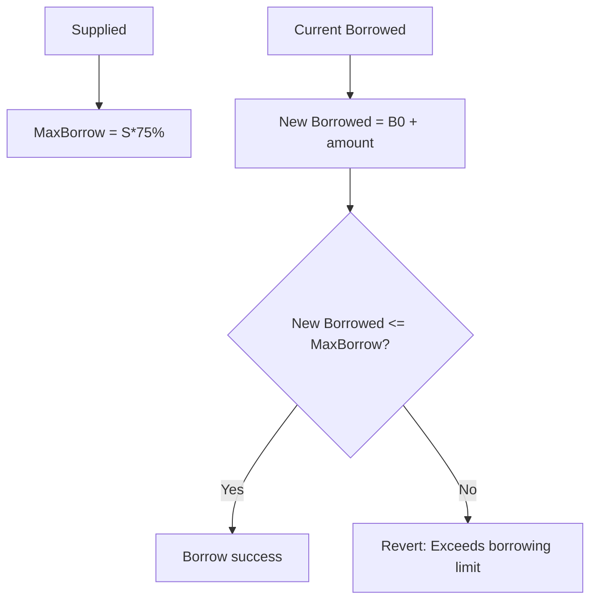
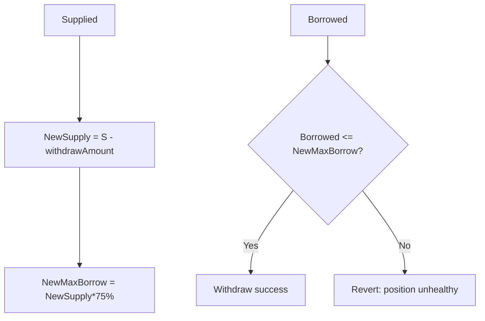

> **已归档**：已并入 [07-图解-核心概念-交易与approve与LTV.md](../07-图解-核心概念-交易与approve与LTV.md)，仅作保留。

# 图解：LTV 与健康因子——为什么你不能随便 Withdraw？（超小白版）

> 记住：
> **借贷系统要保证“你借的钱有足够的抵押”，否则就会资不抵债。**  
> 本项目实现与验收见 [项目总览架构](项目总览架构.md)。

---

## 1) LTV 是什么？

LTV（Loan-to-Value）= 你最多能借出“抵押品价值”的多少比例。

本项目：
- `LTV_RATIO = 75`

意思是：
- 你存 100 USD8
- 最多借 75 USD8

配图（LTV 计算）：

---

## 2) 为什么不是 100%？

如果 LTV=100%：
- 你存 100，借 100
- 合约手里“没有安全缓冲”
- 任何波动/手续费/误差都可能让系统撑不住

所以一般会留出安全边际。

---

## 3) 健康因子（Health Factor）是什么？

你可以把它理解成“安全系数”。

在本项目里（展示用）：
- borrowed=0 → healthFactor = ∞（非常安全，前端显示 "No debt"）
- 否则：合约存的是 `(maxBorrowable * 100) / borrowed`（百分数×100），前端除以 100 显示为比例（如 100 显示为 1.00）

举例：
- 存 100，最大可借 75
- 借了 50
- healthFactor = 75/50 = 1.5 → 合约存 150，前端显示 1.50

---

## 4) 为什么 Borrow 要检查？

因为 Borrow 会让你的债务变大。

规则：
- 借款后不能超过 maxBorrow

配图（Borrow 检查）：

---

## 5) 为什么 Withdraw 更麻烦？

因为 Withdraw 会让你的抵押变少。

如果你已经借了钱，取走抵押品可能会让你“抵押不足”。
所以 Withdraw 必须检查：
- 提现后，剩余抵押还能覆盖当前借款

配图（Withdraw 检查）：

---

## 6) 用一个最直观的例子

你现在：
- 存了 100
- 借了 75（满额）

你想取 1：
- 新存款 = 99
- 新 maxBorrow = 99*75% = 74.25
- 但你还欠 75
- 75 > 74.25 → 不允许

所以会 revert。

证据点：
- borrow/withdraw 的 require： [contracts/core/LendingPoolImpl.sol](../contracts/core/LendingPoolImpl.sol)（前端 ABI 名 SimpleLending）
- revert 测试： [test/integration/SimpleLending.integration.ts](../test/integration/SimpleLending.integration.ts)
