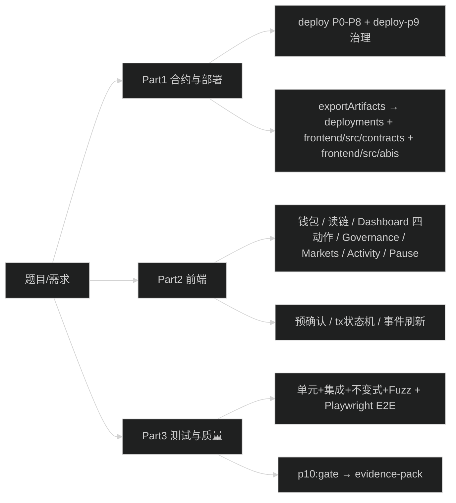

# 项目总览架构（一文档读懂全项目）— v1.0 P0–P10

> **定位**：从这一篇可以了解整体架构、设计取舍、前端风格与配置、功能清单、技术栈与目录、合约/前端/部署/测试的细节，以及「到哪里找更细的说明」。适合快速入职、验收自检、**靠此文档系统学习**。  
> **文档等级**：企业级架构总览（单一权威入口、可追溯至代码与文档、可执行验收标准、与合规/企业审计对齐）；符合现实世界中顶级架构总览文档的通用要求。

**如何使用本文档学习**：按顺序读 §0→§2 建立全局；§3–§4 理解业务与合约；§5 对照 `frontend/src` 逐目录看；§6–§7 动手部署与验收。表格和列表均可直接对应到仓库路径与导出名，便于边看边查代码。

**本项目级别**：v1.0 Local-Only，**P0–P10 已实现**。**唯一验收**：`npm run p10:gate` exit 0 + evidence-pack 四锚点（COMMIT_SHA、NODE_VERSION、NPM_VERSION、OS）。详见根目录 [RELEASE_CHECKLIST_P10.md](../RELEASE_CHECKLIST_P10.md)、[docs/03-08-deployment-runbook.md](../docs/03-08-deployment-runbook.md) §8、[docs/04-AUTHORITATIVE-RELEASE-EVIDENCE.md](../docs/04-AUTHORITATIVE-RELEASE-EVIDENCE.md)。

---

## 0) 一图总览：从需求到交付



**一句话**：Hardhat 本地链上的 **v1.0 升级版借贷协议**：代理 + 储备/利率 + 预言机 + 风险/清算 + Treasury + Governor/Timelock 治理 + 紧急暂停；合约一键部署（deploy + deploy-p9），前端主要含 Dashboard / Governance / Markets / Activity，及 Settings / Diagnostics / Admin；交易状态机与事件驱动刷新；验收为 `npm run p10:gate`（deploy → 治理 → E2E → evidence-pack）。

---

## 1) 技术栈与运行环境

### 1.1 版本与依赖

| 层级 | 技术选型 | 说明 |
|------|----------|------|
| 链与合约 | Hardhat + Solidity ^0.8.19 | 本地链默认 chainId 31337，RPC 127.0.0.1:8545 |
| 合约库 | OpenZeppelin | 代理（TransparentProxy）、Governor、Timelock、Ownable、Pausable、ReentrancyGuard、SafeERC20 |
| 合约结构 | core/ oracle/ tokens/ governance/ libs/ interfaces/ mocks/ test/ | core：LendingPoolImpl、PoolConfigurator、ReserveLogic、RiskEngine、Liquidation、Treasury、FlashLoan、LinearRateStrategy、UserConfiguration；oracle：OracleRouter、ChainlinkAdapter、PriceBoundGuard、DexTwapAdapter、SequencerUptimeGuard；tokens：AToken、VariableDebtToken、TestToken；governance：GovernorP9、GovernanceToken、EmergencyModule（Timelock 用 OpenZeppelin） |
| 前端 | React 18 + TypeScript + Vite | 多页：Dashboard、Governance、Markets、Activity、Settings、Diagnostics、Admin（提案列表/详情） |
| 链交互 | ethers v6 | BrowserProvider / Signer；读写在 contracts.ts / write.ts；Governance 用 GovernorP9、GovToken |
| 样式 | 全局 CSS + design-tokens | layout / cards / forms 分离；Light / Dark / Navy 三档主题 |
| E2E | Playwright | e2e/ 下 core / 可选 full 层级；p10:gate 内执行 |

### 1.2 前端环境变量（可选）

| 变量 | 作用 |
|------|------|
| `VITE_EXPECTED_CHAIN_NAME` | 预期链显示名（如 "Hardhat Local"） |
| `VITE_LOCAL_RPC_URL` | 本地 RPC（如 http://127.0.0.1:8545），用于 switch/add chain |
| `VITE_AUTO_ADD_CHAIN` | 是否自动向 MetaMask 添加链（true/false） |
| `VITE_IS_LOCAL_CHAIN` | 是否按「本地链」调节确认数、超时等 |
| `VITE_CHAIN_NAME_<chainId>` | 某 chainId 的显示名覆盖 |
| `VITE_ADMIN_ADDRESSES` | 逗号分隔地址，仅这些地址显示 Admin（治理/提案）入口；空则所有人可见 |
| `VITE_READ_ONLY_MAINNET` | true 时主网只读（不发起写交易） |
| `VITE_CONTRACTS_AUDITED` | true 时隐藏「Unaudited」类提示 |

RPC 覆盖（可选）：`VITE_RPC_URL_<chainId>`、`VITE_RPC_URL_<chainId>_FALLBACK`（见 network.ts）。  
未设置时由 runtime/network 根据 chainId 等推断默认值；本地 31337 通常无需全部配置。

---

## 2) 目录与文件职责（精炼版）

```
├── contracts/
│   ├── core/             # LendingPoolImpl、PoolConfigurator、ReserveLogic、RiskEngine、Liquidation、Treasury、FlashLoan、LinearRateStrategy、UserConfiguration（aToken/VariableDebtToken 在 tokens/）
│   ├── oracle/           # OracleRouter、ChainlinkAdapter、PriceBoundGuard、DexTwapAdapter、SequencerUptimeGuard
│   ├── tokens/           # AToken.sol、VariableDebtToken.sol、TestToken.sol
│   ├── governance/       # GovernorP9.sol、GovernanceToken.sol、EmergencyModule.sol（Timelock 用 OpenZeppelin）
│   ├── libs/             # Errors、Events、SafeTransfer、WadRayMath
│   ├── interfaces/       # IFlashLoanReceiver、IOracleRouter、IInterestRateStrategy
│   ├── mocks/            # MockAggregator、MockFlashLoanReceiver* 等
│   ├── test/             # TestRiskEngine、TestReserveLogic、MockGovernanceTarget（测试用）
│   ├── ImportProxy.sol   # 代理入口
│   └── SimpleLending.sol # 兼容/占位（前端 ABI 名仍为 SimpleLending，来自 LendingPoolImpl）
├── configs/              # 链下配置：profiles/mock|real/profile.json、localChain.mjs；deploy 通过 loadProfile(chainId) 读取
├── scripts/
│   ├── config/           # loadProfile.ts（链下配置入口）、reserves.31337.json（储备配置）；deploy/deploy-p9 依赖
│   ├── deploy/
│   │   ├── deploy.ts     # P0–P8：USD8/WETH、proxy+实现、oracle、configurator、treasury 等 → seedTo → exportArtifacts
│   │   └── deploy-p9.ts  # P9：GovernorP9、Timelock、GovernanceToken；配置权限与角色
│   ├── _lib/export.ts    # 写 deployments/<chainId>.json（如 31337.json）、frontend/src/contracts/deployments.json、frontend/src/abis/*.json（含 GovToken、GovernorP9）
│   ├── governance/       # grant-and-delegate、verify-p9-complete、first-proposal-setltv、second-proposal-setlt、transfer-admin-to-timelock、verify-guardian-emergency-pause、proposal-upgrade-governance-params、full-lifecycle-evidence-pack、governance-audit-log、verify-voting-snapshot-safety、verify-recovery-paths、risk-simulate-params、proxy-upgrade-drill
│   ├── ci/               # p10-local-only-gate.mjs（p10:gate 入口）、run-p10-full.mjs、run-e2e-ui.mjs、generate-evidence-pack.mjs、smoke-deployed-localhost.ts、run-governance-smoke.mjs 等
│   ├── demo/             # start-local-chain.mjs（demo:chain）、start-frontend.mjs（demo:frontend）、run-local-prereq.mjs
│   ├── ops/              # fix-supply-revert-31337.ts（ops:fix-supply-revert）
│   ├── security-gate/    # verify.ts、check-b4-evidence.ts、b4-evidence.ts、config.ts
│   ├── release/          # sign-b4-evidence.ts、generate-manifest.ts、frontend-build-manifest.mjs
│   └── smoke-e2e.mjs     # 完整闭环演示/兜底
├── .github/workflows/   # ci.yml、release-proof.yml
├── test/
│   ├── integration/     # SimpleLending.integration.ts、governance-lifecycle.integration.ts 等
│   ├── unit/             # ReserveLogic.unit.ts、RiskEngine.unit.ts、LinearRateStrategy.unit.ts、validate-evidence-summary.test.mjs 等
│   ├── invariants/       # invariants.ts
│   └── fuzz/             # fuzz.ts
├── e2e/                  # Playwright UI E2E（p10:gate 内执行）
├── evidence-pack/        # p10:gate 通过后在根目录生成：manifest.json、evidence-summary.json、deployments-31337.json、p10-gate-output.txt 等
├── frontend/src/
│   ├── App.tsx           # 路由、useWallet / useDashboard / useGovernanceOverview / usePreflight / useActions / useTxDisplay；block 监听 + backfill
│   ├── abis/             # SimpleLending.json、TestToken.json、GovToken.json、GovernorP9.json（deploy 导出）
│   ├── config/           # runtime.ts、ui.ts、network.ts、localReadProvider.ts、rpcHealth.ts
│   ├── contracts/        # contracts.ts：getContracts(provider,chainId)→{ usd8, weth, lending }（仅池子与代币）；deployments.ts：getDeployments(chainId)、Deployments 类型；write.ts：getWriteToken、getWriteLending（approve、supply/withdraw/borrow/repay）；abis.ts：ABIS.TestToken、SimpleLending、GovToken、GovernorP9。Governance 页内用 getDeployments().governorAddress/governanceTokenAddress 单独 new Contract(..., ABIS.GovernorP9/GovToken)
│   ├── styles/           # layout.css、cards-dashboard.css、forms-buttons.css、governance.css、markets-charts.css、states-toast-skeleton.css、production-polish.css、product-finish.css、tx-modal.css
│   ├── types/            # dashboard.ts、ethereum.ts
│   ├── design-tokens.ts  # 主题与设计 token（Light/Dark/Navy）
│   ├── main.tsx、index.css、App.css
│   ├── hooks/            # useWallet、useDashboard、useDashboardForm、usePreflight、useActions、useAllowance、useTheme、useTxDisplay、useGovernanceOverview、usePoolInfo、useRuntimeRisk、useReserveRiskParams、useTokenMetadata、useGenesisBlockHash、useValueUpdated、useSplitProvider、useChainAddressMatch、useDebounce
│   ├── state/            # tx.ts（TxStage、runTxDetailed）、txStore.ts（savePendingTx、clearTx）、errors.ts（AppError、normalizeError、rewriteMessage、classifyErrorKind）；txHistory.ts、sessionEvidence.ts、navBadges.tsx、toast.tsx、governanceEvidence.ts、sendPathEvidence.ts、revertDiagnostics.ts、splitProviderContext.tsx
│   ├── components/       # layout：Header、Layout、DataStatusBar、ChainAddressMismatchBanner、ChainDeploymentFixBanner；dashboard：DashboardGrid、PoolOverview、UserPosition、ActionCardsGrid、ActionCard、RiskVizCard、RiskParametersPanel、DashboardKpiBar、ChainProofAnchors；actions：ApproveToolbar；tx：TxStatus；ui：PreflightModal、AddressDisplay、Tooltip、RiskDisclaimerBanner、InlineError、Skeleton、ToastContainer、DataProvenanceBlock；governance：TimelockCountdown、ProposalVotesBar、ProposalStateTimeline；admin：AdminLayout、PauseUnpauseBar；markets：ReserveList；charts：PriceVolumeChart；ErrorBoundary
│   ├── pages/            # DashboardPage、MarketsPage、AssetDetailPage（/markets/:assetId）、GovernancePage、ActivityPage、SettingsPage、DiagnosticsPage；admin：ProposalsListPage、ProposalDetailPage（/admin/proposals、/admin/proposals/:id）
│   └── utils/            # amount（parseAmountStrict、sanitizeAmountInput）、format（shortAddress、healthFactorColor、formatAmountForDisplay 等；formatToken/formatPercent 来自 useDashboardForm）、assert、preflightImpact（computePreflightImpact，预确认前后 HF/borrow usage）、computeConfigFingerprint（diagnostics 指纹）；rpcErrorLog
└── deployments/          # 按 chainId 命名如 31337.json（脚本写入）。Deployments 类型含：chainId、usd8Address、wethAddress、simpleLendingAddress、aTokenAddress、variableDebtTokenAddress、oracleRouterAddress、proxyAdminAddress、configuratorAddress、mockAggregatorAddress、governorAddress、governanceTokenAddress、timelockAddress、emergencyModuleAddress
```

---

## 3) 业务与设计（为什么要这样设计）

### 3.1 业务范围（v1.0）

- **单资产借贷（当前配置）**：USD8 作为抵押与借出资产；WETH 前端展示余额。池子通过 PoolConfigurator 配置 LTV、清算阈值、利率等；**预言机**提供价格（OracleRouter → ChainlinkAdapter）；**清算**在 HF &lt; 100 时可用；**Treasury** 收 reserveFactor 等收入；**治理**由 Governor + Timelock 控制参数与升级，**PAUSER/Guardian** 可紧急暂停。
- **核心规则**：
  - LTV / 清算阈值 / 清算奖励等由 PoolConfigurator 设置（链上唯一来源）。
  - 健康因子：合约内计算；无债时为 type(uint256).max。
  - 最大可借 / 最大可提：由 RiskEngine/ReserveLogic 与仓位推导。
- **闭环**：approve（如需）→ supply → borrow → repay → withdraw；治理侧：创建提案 → 投票 → Timelock 执行；紧急暂停/恢复由 PAUSER 或 Governance 执行。

### 3.2 设计取舍（v1.0 已包含）

- **已做**：代理升级、预言机、清算、Treasury、Governor+Timelock、紧急暂停、多页前端（Dashboard、Governance、Markets、Activity、Settings、Diagnostics、Admin）、p10:gate 与 evidence-pack。
- **不做（本版）**：主网/测试网部署、生产级 SLA、第三方主网审计承诺；保持 Local-Only 可演示、可验收、可复现。

### 3.3 可靠性三支柱（仍适用）

- **交易状态机**：idle → signing → pending → confirmed / failed / stuck；超时、替换交易、pending 持久化与恢复。
- **刷新策略**：tx confirmed 后 onConfirmed 刷新；事件监听触发 scheduleRefresh；block 节流 + backfill 兜底。
- **预确认**：PreflightModal 展示 Action/Amount/ChainId/地址/额度模式，校验通过后再打开钱包。

---

## 4) 合约层（v1.0 要点）

### 4.1 核心模块（与 contracts/ 目录一一对应）

| 模块 | 合约文件 | 说明 |
|------|----------|------|
| **Pool** | core/LendingPoolImpl.sol | 经 TransparentProxy 暴露；supply/withdraw/borrow/repay；getUserPosition、getPoolInfo；前端 ABI 名 SimpleLending |
| **配置与风险** | core/PoolConfigurator.sol、ReserveLogic.sol、RiskEngine.sol、LinearRateStrategy.sol | LTV、LT、liquidationBonus、reserveFactor、利率曲线 |
| **清算与资金** | core/Liquidation.sol、Treasury.sol | liquidationCall；协议收入 mint 至 Treasury |
| **闪电贷** | core/FlashLoan.sol | 闪电贷入口 |
| **用户配置** | core/UserConfiguration.sol | 用户仓位位图等 |
| **预言机** | oracle/OracleRouter.sol、ChainlinkAdapter.sol、PriceBoundGuard.sol、DexTwapAdapter.sol、SequencerUptimeGuard.sol | 价格源、心跳、minAnswer/maxAnswer、熔断；L2 序贯器占位 |
| **代币** | tokens/AToken.sol、VariableDebtToken.sol、TestToken.sol | 供应/债务凭证；USD8/WETH 测试币 |
| **治理与权限** | governance/GovernorP9.sol、GovernanceToken.sol、EmergencyModule.sol | GovernorP9 继承/组合 OpenZeppelin Governor；Timelock 用 OZ；PAUSER、Configurator Admin 可移交 Timelock |
| **库与接口** | libs/Errors.sol、Events.sol、SafeTransfer.sol、WadRayMath.sol；interfaces/IFlashLoanReceiver.sol、IOracleRouter.sol、IInterestRateStrategy.sol | 错误码、事件、安全转账、Wad/Ray 数学 |

### 4.2 安全

- Ownable、Pausable、ReentrancyGuard、SafeERC20；代理升级仅追加存储、_disableInitializers()。详见 [docs/12-PROTOCOL-DESIGN.md](../docs/12-PROTOCOL-DESIGN.md)。

---

## 5) 前端层：架构、配置、状态与功能

### 5.1 读写分离与合约入口

- **读（池子与代币）**：`getContracts(provider, chainId)` **仅返回** `{ usd8, weth, lending }`，依赖 `getDeployments(chainId)` 的 usd8Address、wethAddress、simpleLendingAddress。无 signer，仅只读调用。
- **读（治理）**：Governance 页与 `useGovernanceOverview` 使用 `getDeployments(chainId).governorAddress`、`governanceTokenAddress`、`simpleLendingAddress`，在页内/ hook 内 `new Contract(addr, ABIS.GovernorP9 或 ABIS.GovToken, provider)` 读提案、投票、池子暂停、quorum、votingPeriod、proposalThreshold 等。
- **写（池子四动作）**：`write.ts` 提供 `getWriteToken(tokenContract, signer)`（approve）、`getWriteLending(lendingContract, signer)`（supply/withdraw/borrow/repay），参数为 ethers Contract 实例；由 useActions 在已有 signer 时调用，发交易走 `runTxDetailed`。
- **写（治理）**：GovernancePage 内直接用 `new Contract(governorAddress, ABIS.GovernorP9, signer)` 调用 propose、castVote、queue、execute、cancel。**PauseUnpauseBar** 调用**池子**（SimpleLending/LendingPoolImpl）的 `pause()`/`unpause()`，仅当 `pool.isPauser(account)` 为 true 时显示并可用。所有写统一经 runTxDetailed 与状态机。

### 5.2 配置体系（单源）

- **ui.ts**：appName、appLogo、chainName、connectWallet、supply/withdraw/borrow/repay、Preflight 与 TxStatus 全部文案、errorTitles（UserRejected、NetworkMismatch、Revert、Rpc、InsufficientBalance、InsufficientAllowance、Validation、Unknown）、`actionReason*` 系列（action disabled 文案，如 actionReasonConnectWallet、actionReasonWrongNetworkTemplate 等）、complianceRiskDisclaimer / complianceRiskDisclaimerShort。
- **runtime.ts**：TX_CONFIRMATIONS、TX_PENDING_TIMEOUT_MS、POST_STATE_MAX_WAIT_MS、EVENT_BACKFILL_MAX_BLOCKS=2000、BLOCK_DEBOUNCE_MS=3000、TX_IDLE_RESET_DELAY_MS=2500、HEALTH_FACTOR_BORDERLINE=100、HEALTH_FACTOR_WARN=110、HEALTH_FACTOR_SAFE=150、THEME_STORAGE_KEY="app-theme"、DEFAULT_DECIMALS=18、DISPLAY_MAX_DECIMALS=6、REFRESH_THROTTLE_MS=250、PREFLIGHT_GAS_ESTIMATE_TIMEOUT_MS=8000、PREFLIGHT_GAS_DEBOUNCE_MS=300、TX_DROPPED_POLL_ATTEMPTS、TX_DROPPED_POLL_DELAY_MS、COPY_FEEDBACK_MS=1200、BLOCK_STALE_THRESHOLD、BLOCK_STALE_HIGH、READ_ONLY_MAINNET、ADMIN_ADDRESSES、CONTRACTS_AUDITED、ORACLE_PRICE_DECIMALS=8 等。
- **network.ts**：DEFAULT_LOCAL_RPC、LOCAL_CHAIN_ID、SUPPORTED_CHAIN_IDS、DEFAULT_CHAIN_ID、getChainName(chainId)、getRpcUrl、getRpcUrls、EXPECTED_CHAIN_NAME、LOCAL_RPC_URL、AUTO_ADD_CHAIN、IS_LOCAL_CHAIN、getBlockExplorerAddressUrl、getExplorerTxUrl、MAINNET_CHAIN_IDS、isMainnet。

### 5.3 路由（App.tsx）

| 路径 | 页面 | 说明 |
|------|------|------|
| `/` | DashboardPage | 仪表盘、四动作、池子与仓位 |
| `/markets` | MarketsPage | 储备列表 |
| `/markets/:assetId` | AssetDetailPage | 单资产详情（如 /markets/USD8） |
| `/governance` | GovernancePage | 治理 KPI、提案列表、创建提案、投票、queue/execute/cancel |
| `/activity` | ActivityPage | 交易历史 |
| `/settings` | SettingsPage | 设置 |
| `/diagnostics` | DiagnosticsPage | 诊断（RPC、chainId、deployments、Copy debug bundle） |
| `/admin` | AdminLayout | 管理布局，重定向到 /admin/proposals |
| `/admin/proposals` | ProposalsListPage | 提案列表（管理视角） |
| `/admin/proposals/:id` | ProposalDetailPage | 提案详情 |

### 5.4 交易状态机、刷新、预确认、错误归一化（细节）

- **TxStage**（state/tx.ts）：`idle` | `signing` | `pending` | `stuck` | `confirmed` | `failed`。TxState 还含 label、hash、amount、error、startedAtMs、submittedAtMs、confirmedAtMs、blockNumber、gasUsed、confirmations、minedAt、**outcome**（confirmed | failed | replaced | dropped）、**replacementHash**（被替换时新 tx hash）、**droppedReason**（timeout | notFound | rpcDegraded）、postState（verifying | verified | unverified）。
- **runTxDetailed**：setTx(signing) → send() → pending 并可选 persist（savePendingTx）→ 等待 confirmations（支持超时→stuck、TRANSACTION_REPLACED→跟踪新 hash 或判定取消）。成功 setTx(confirmed) 并 clearTx；失败 setTx(failed/stuck) 并归一化 error。
- **刷新**：tx confirmed 后 onConfirmed 触发 scheduleRefresh；lending 上 Supplied/Withdrawn/Borrowed/Repaid 事件触发 scheduleRefresh；block 监听节流 BLOCK_DEBOUNCE_MS + backfillEvents（queryFilter 最近 EVENT_BACKFILL_MAX_BLOCKS）兜底。
- **预确认**：PreflightModal 展示 Action/Amount/ChainId/地址/Approval 模式；校验余额、额度、池子、maxBorrow/maxWithdraw；不通过 setPreflightError 不打开钱包。
- **错误**：AppError（kind、message、code、meta）；rewriteMessage 将合约 revert 映射到 ui 文案；classifyErrorKind 根据 code/message 判定 kind；TxStatus 显示 errorTitles[kind]。

### 5.5 功能清单（用户可见）

| 功能 | 实现要点 |
|------|----------|
| 连接钱包 | useWallet：MetaMask、ensureCorrectNetwork、持久化 |
| 仪表盘 | useDashboard：余额、pool、position、四动作 Supply/Withdraw/Borrow/Repay |
| 治理 | Governance 页：提案列表、创建提案、投票；useGovernanceOverview；GovernorP9、GovToken |
| 紧急暂停 | PauseUnpauseBar：调用池子（SimpleLending）的 pause/unpause；仅当 pool.isPauser(account) 为 true 时显示并可用 |
| Markets / Activity | Markets 储备列表；Activity 交易历史 |
| 诊断页 | DiagnosticsPage：/diagnostics；Read chainId、Wallet chainId、Deployments 三项 Yes 为 GATE；Copy debug bundle（version、fingerprint、rpcHealth、runtimeRisk、last tx） |
| Approve / 交易状态 / 实时更新 / 错误与提示 / 地址与复制 / 健康因子 | useAllowance、TxStatus（stage/hint/step、outcome、replacementHash、droppedReason）、onConfirmed、normalizeError、AddressDisplay、healthFactor 颜色（HEALTH_FACTOR_SAFE/BORDERLINE/WARN）与 tooltip |

---

## 6) 部署与导出

- **命令**：`npm run deploy:localhost`（P0–P8）→ `npm run deploy:p9`（治理）；或一键 **`npm run p10:gate`**（端口 8545 空闲下：起链 → deploy → deploy:p9 → E2E → evidence-pack）。
- **流程**：deploy 依赖 **链下配置**（`configs/profiles/<mode>/profile.json`、`scripts/config/loadProfile.ts`、`scripts/config/reserves.31337.json`），部署 USD8、WETH、proxy+池子+oracle+configurator+treasury 等 → seedTo → exportArtifacts 写 **deployments/<chainId>.json**（如 31337.json）、**frontend/src/contracts/deployments.json**、**frontend/src/abis/**（SimpleLending、TestToken、GovToken、GovernorP9）。deploy-p9 同样通过 loadProfile(chainId) 读配置，部署 Governor、Timelock、GovToken 并配置角色。
- **常用 npm 脚本**（与 package.json 一致）：`deploy:localhost`（scripts/deploy/deploy.ts）、`deploy:p9`（scripts/deploy/deploy-p9.ts）、`p10:gate`（scripts/ci/p10-local-only-gate.mjs）、`e2e:core`（`npm run e2e:core` 或 `node scripts/ci/run-e2e-ui.mjs -- --project=smoke --project=core-flow`，注意 `--` 分隔符）、`test`（hardhat test）、`governance:first-proposal`、`governance:transfer-admin`、`local:align`（deploy:localhost + deploy:p9 + verify:consistency）。
- **前端消费**：getDeployments(chainId) 返回 Deployments 对象，字段包括：chainId、usd8Address、wethAddress、simpleLendingAddress、aTokenAddress、variableDebtTokenAddress、oracleRouterAddress、proxyAdminAddress、configuratorAddress、**mockAggregatorAddress**、governorAddress、governanceTokenAddress、timelockAddress、emergencyModuleAddress 等；abis.ts 统一导出 ABIS.TestToken、ABIS.SimpleLending、ABIS.GovToken、ABIS.GovernorP9。

---

## 7) 测试与质量

### 7.1 测试层次

| 类型 | 说明 |
|------|------|
| 单元 | test/unit/：ReserveLogic.unit.ts、RiskEngine.unit.ts、LinearRateStrategy.unit.ts；validate-evidence-summary.test.mjs |
| 集成 | test/integration/：SimpleLending.integration.ts、governance-lifecycle.integration.ts（闭环、revert、pause、治理流程） |
| 不变式 / Fuzz | test/invariants/invariants.ts、test/fuzz/fuzz.ts |
| E2E | Playwright e2e/（run-e2e-ui.mjs，project=smoke/core-flow/tx-heavy 等）；p10:gate 内执行 |

### 7.2 门禁与证据

- **`npm run p10:gate`**：端口检查 → 起链 → deploy → deploy:p9 → E2E → evidence-pack；exit 0 且输出含 EVIDENCE-PACK-MANIFEST-SHA256 与四锚点（COMMIT_SHA、NODE_VERSION、NPM_VERSION、OS）= v1.0 验收通过。**输出目录**：根目录生成 **evidence-pack/**（manifest.json、evidence-summary.json、deployments-31337.json、p10-gate-output.txt）。门禁与证据包定义见 [docs/03-08-deployment-runbook.md](../docs/03-08-deployment-runbook.md) §8；v1.0 封板证据见 [docs/04-AUTHORITATIVE-RELEASE-EVIDENCE.md](../docs/04-AUTHORITATIVE-RELEASE-EVIDENCE.md)。

---

## 8) 安全与合规要点

- **合约**：重入防护、SafeERC20、whenNotPaused、权限分离（Owner、PAUSER、Configurator Admin、Timelock）；预言机心跳与边界校验；清算与 MEV 见 [docs/12-PROTOCOL-DESIGN.md](../docs/12-PROTOCOL-DESIGN.md)。
- **前端**：金额 bigint、Max 边界、预确认、错误归一化、合规免责文案（ui.ts complianceRiskDisclaimer）；见 [REPO_DESCRIPTION.md](../REPO_DESCRIPTION.md)、[docs/release/MULTIDIMENSION-CHECK.md](../docs/release/MULTIDIMENSION-CHECK.md)。
- **企业级审计**（与标注一致）：推送前/发布前须通过**多维度检查**与**企业复检**：禁文与敏感内容、无暴露密钥、免责与平台安全表述。详见 [docs/release/MULTIDIMENSION-CHECK.md](../docs/release/MULTIDIMENSION-CHECK.md)、[docs/release/ENTERPRISE-SAFETY-CHECK.md](../docs/release/ENTERPRISE-SAFETY-CHECK.md)、[docs/release/PRE-RELEASE-AUDIT-REPORT.md](../docs/release/PRE-RELEASE-AUDIT-REPORT.md)。
- **企业级审计检查清单**（与 MULTIDIMENSION-CHECK / ENTERPRISE-SAFETY-CHECK 对齐）：① 无投资/收益承诺、无违法或攻击性内容；② 无暴露私钥/助记词/API Key（.gitignore 覆盖 .env）；③ README/REPO_DESCRIPTION 含免责（educational、not financial advice、DeFi involves risk）；④ 前端 ui.ts 含 complianceRiskDisclaimer；⑤ 平台「About」描述简短、中性、技术向。

---

## 9) 延伸阅读（按需深入）

| 想了解 | 看这篇 |
|--------|--------|
| **当前栈** 技术概览、P0–P10 阶段、运行与验证 | [docs/02-PROJECT-LEAD-ENTRY.md](../docs/02-PROJECT-LEAD-ENTRY.md)、根 [README.md](../README.md)、[PROJECT_OVERVIEW.md](../PROJECT_OVERVIEW.md) |
| **协议设计**（架构、经济、风险、预言机、清算、安全、治理） | [docs/12-PROTOCOL-DESIGN.md](../docs/12-PROTOCOL-DESIGN.md) |
| **本地链** 标准流程、地址、RPC、GATE、调试 | [docs/09-本地链标准与地址.md](../docs/09-本地链标准与地址.md)、[docs/08-DEMO-RUNBOOK-LOCAL.md](../docs/08-DEMO-RUNBOOK-LOCAL.md)、[docs/10-TROUBLESHOOTING-AND-LIMITATIONS.md](../docs/10-TROUBLESHOOTING-AND-LIMITATIONS.md) |
| **治理** 创建提案、setLTV 示例、表单填写 | [docs/15-governance-create-proposal-example.md](../docs/15-governance-create-proposal-example.md) |
| 文档索引入口 | [docs/00-INDEX.md](../docs/00-INDEX.md)、[docs/01-README.md](../docs/01-README.md) |
| **v1.0 封板证据** | [docs/04-AUTHORITATIVE-RELEASE-EVIDENCE.md](../docs/04-AUTHORITATIVE-RELEASE-EVIDENCE.md)（SHA256 + 四锚点） |
| 推送前/平台安全与企业审计 | [docs/release/MULTIDIMENSION-CHECK.md](../docs/release/MULTIDIMENSION-CHECK.md)、[docs/release/ENTERPRISE-SAFETY-CHECK.md](../docs/release/ENTERPRISE-SAFETY-CHECK.md)、[docs/release/PRE-RELEASE-AUDIT-REPORT.md](../docs/release/PRE-RELEASE-AUDIT-REPORT.md) |

**说明**：**本文件为 learning 目录权威入口**。其余学习文档（00–09）见 [README](README.md) 与 [06-目录与导航](06-目录与导航-学习与面试从哪里开始.md)；与当前代码不一致时以本总览 + docs/ 与根 README 为准。

---

## 10) 学习后自检清单（可打勾）

- [ ] 能说出 getContracts 与 getDeployments 的区别，以及 Governance 页如何拿到 Governor/GovToken 合约实例。
- [ ] 能列出所有前端路由（/、/markets、/governance、/activity、/diagnostics、/admin/proposals 等）及对应页面。
- [ ] 能说出 TxStage 六态和 outcome（confirmed/failed/replaced/dropped）的含义，以及 runTxDetailed 的大致流程。
- [ ] 能说出 Deployments 类型至少 8 个字段（如 simpleLendingAddress、governorAddress、timelockAddress）。
- [ ] 能说出 contracts/core/、oracle/、tokens/、governance/ 下各有哪些核心合约文件。
- [ ] 能说出 p10:gate 的步骤（端口→起链→deploy→deploy:p9→E2E→evidence-pack）及验收标准（exit 0 + SHA256 + 四锚点）。
- [ ] 知晓部署依赖链下配置：configs/profiles/、scripts/config/loadProfile.ts、scripts/config/reserves.31337.json；配置缺失见 [09-本地链标准与地址](../docs/09-本地链标准与地址.md)。
- [ ] 本地跑通：node → deploy:localhost → deploy:p9 → 前端 dev → MetaMask 31337 → /diagnostics 三项 Yes → 完成一次 Supply 与一次治理提案/投票。
- [ ] **企业级审计**：知晓推送前须过 MULTIDIMENSION-CHECK（禁文/密钥/免责）；企业复检见 ENTERPRISE-SAFETY-CHECK；代码注释与脚本 Runbook 见 PRE-RELEASE-AUDIT-REPORT。

---

## 11) 常见问题与对应文档

| 现象 | 优先查看 |
|------|----------|
| 前端读不到池子/仓位、红字、点不了确认 | [09-本地链标准与地址](../docs/09-本地链标准与地址.md) Part 1 标准流程、Part 2 §5；必须 node → deploy → **重启前端** → 31337 → 强刷 |
| CreateFileMapping / Git Bash 报错 | [10-TROUBLESHOOTING](../docs/10-TROUBLESHOOTING-AND-LIMITATIONS.md) §1；改用 PowerShell 或 CMD |
| 交易卡在 pending、dropped | [10-TROUBLESHOOTING](../docs/10-TROUBLESHOOTING-AND-LIMITATIONS.md)；tx.ts 中 TX_PENDING_TIMEOUT_MS、droppedReason；/diagnostics Copy debug bundle |
| 治理页无数据、提案创建失败 | 确认已执行 deploy:p9；[09-本地链标准与地址](../docs/09-本地链标准与地址.md) 中 deployments 含 governorAddress、governanceTokenAddress；[15-governance-create-proposal-example](../docs/15-governance-create-proposal-example.md) |
| 部署报错 profile not found / reserves 找不到 | 确认 configs/profiles/mock/profile.json、scripts/config/reserves.31337.json 存在；见 [09-本地链标准与地址](../docs/09-本地链标准与地址.md) Part 4.2、scripts/README.md |
| 想改 LTV/利率/风险参数 | PoolConfigurator 链上设置；治理可 setLTV 等；见 [12-PROTOCOL-DESIGN](../docs/12-PROTOCOL-DESIGN.md) §03、§07 |
| 想理解预言机/清算/安全边界 | [12-PROTOCOL-DESIGN](../docs/12-PROTOCOL-DESIGN.md) §04、§05、§06 |
| p10:gate 非 0、端口 8545 被占用、E2E 超时 | [03-08-deployment-runbook](../docs/03-08-deployment-runbook.md) §8；[09-本地链标准与地址](../docs/09-本地链标准与地址.md)；[10-TROUBLESHOOTING](../docs/10-TROUBLESHOOTING-AND-LIMITATIONS.md) |

---

**总结**：本仓库为 v1.0 P0–P10 Local-Only 借贷协议：代理、预言机、清算、Treasury、GovernorP9+Timelock+GovernanceToken、紧急暂停；合约定规则与事件，脚本定 deploy + deploy-p9 与导出，前端定 Dashboard/Governance/Markets/Activity/Diagnostics/Settings/Admin 等，与交易状态机；验收为 `npm run p10:gate` exit 0 + evidence-pack。**靠此文档学习时**：表格与列表均可直接对应到仓库路径与导出名，建议边看边打开 `contracts/`、`frontend/src/` 对照；细节可从本总览、[PROJECT_OVERVIEW.md](../PROJECT_OVERVIEW.md)、[docs/02-PROJECT-LEAD-ENTRY.md](../docs/02-PROJECT-LEAD-ENTRY.md)、[docs/12-PROTOCOL-DESIGN.md](../docs/12-PROTOCOL-DESIGN.md) 及代码追溯。

---

**与仓库一致性**：本文档已与当前仓库做多维度对照（contracts/、scripts/、frontend/src/、test/、deployments 类型与路由、配置、状态、npm 脚本），不匹配处已修正、缺口已补齐。后续若仓库有变更，建议以本总览 + docs/ + 代码为准再次核对。

**企业级审计对齐**：文档引用已与审计标注一致：门禁与证据见 03-08-deployment-runbook.md §8，封板证据见 04-AUTHORITATIVE-RELEASE-EVIDENCE.md；推送前/平台安全见 release/MULTIDIMENSION-CHECK、ENTERPRISE-SAFETY-CHECK、PRE-RELEASE-AUDIT-REPORT；脚本目录与 security-gate/release 实际文件已对齐（含 config.ts、frontend-build-manifest.mjs）。

**文档与仓库最后核对**：2025-02-17（仓库或总览有重大变更时请更新此处日期）。后续仓库有变更时，建议以本总览 + docs/ + 代码为准再次核对并更新此处日期。

**learning 文档对齐**：learning 目录下各文档（00–09）已按本总览对齐，目录与路径见 [README](README.md) 与 [06-目录与导航](06-目录与导航-学习与面试从哪里开始.md)。
