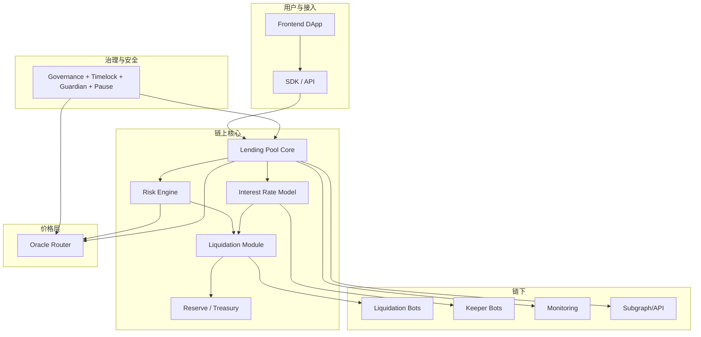

# 05-升级后架构与模块化（行业顶级高级 DeFi 借贷）

> 合并自原《升级后架构图》与《升级后模块化设计》。含：分层架构图（ASCII + Mermaid）、数据流、模块边界与依赖、与当前对比。**升级后**目标形态的唯一架构文档。

---

# Part I：升级后架构图

## 1) 总体分层（ASCII）

```
                ┌──────────────────────┐
                │   Frontend DApp      │
                └──────────┬───────────┘
                           │
                           ▼
                ┌──────────────────────┐
                │     SDK / API        │
                └──────────┬───────────┘
                           │
────────────────────────链上边界────────────────────────
                           │
                           ▼
        ┌─────────────────────────────────────────────┐
        │           Lending Pool Core                 │
        │  supply / withdraw / borrow / repay / flash  │
        └──────────┬───────────────┬───────────────────┘
                   │               │
                   ▼               ▼
        ┌────────────────┐   ┌────────────────────┐
        │  Risk Engine   │   │ Interest Rate     │
        │  HF/LTV/LT     │   │ Utilization→Rate   │
        └────────┬────────┘   └─────────┬──────────┘
                 │                      │
                 ▼                      ▼
        ┌─────────────────────────────────────────────┐
        │           Liquidation Module                 │
        │  closeFactor / bonus / badDebt / auction     │
        └──────────┬───────────────────────────────────┘
                   │
                   ▼
        ┌─────────────────────────────────────────────┐
        │           Reserve / Treasury                 │
        │  interest share / bad debt cover / revenue   │
        └─────────────────────────────────────────────┘

────────────────────────价格层────────────────────────
                           │
                           ▼
        ┌─────────────────────────────────────────────┐
        │              Oracle Router                   │
        │  Chainlink + TWAP + Guard + Fallback         │
        └─────────────────────────────────────────────┘

────────────────────────治理与安全──────────────────────
                           │
                           ▼
        ┌─────────────────────────────────────────────┐
        │  Governance + Timelock + Guardian + Pause    │
        └─────────────────────────────────────────────┘

────────────────────────链下系统────────────────────────
                           │
                           ▼
   ┌──────────────┬──────────────┬──────────────┬──────────────┐
   │ Liquidation  │ Keeper Bots  │ Monitoring   │ Subgraph/API │
   │ Bots (MEV)   │ Rate/Health  │ Alerts       │ Indexing     │
   └──────────────┴──────────────┴──────────────┴──────────────┘
```

## 2) Mermaid 流程图（模块关系）



## 3) 数据流简述

- **存款/取款/借款/还款**：用户 → Frontend → SDK → **Pool**；Pool 调 **RiskEngine**（LTV/LT/HF）、**InterestRateStrategy**（利率）、**ReserveLogic**（记账、index）；多资产时需 **Oracle** 价格。
- **清算**：链下监控 HF → **Liquidation Bots** 调用 **Liquidation**；Liquidation 与 Pool/Reserve 交互，坏账进入 **Treasury**。
- **利率更新**：**Keeper** 或每笔交易触发 **InterestRateStrategy** 更新；池子 utilization 驱动。
- **参数与紧急**：**Governance** 提案 → **Timelock** 执行 → **PoolConfigurator** 改参数；**Guardian** 可 Pause / 紧急下调。

---

# Part II：升级后模块化设计

## 4) 模块总览

| 模块 | 职责 | 主要合约/库 | 依赖 |
|------|------|-------------|------|
| **Pool Core** | 借贷入口、资金进出、记账协调 | Pool, ReserveLogic, UserConfiguration | RiskEngine, InterestRate, Oracle, Liquidation |
| **Reserve & Treasury** | 单池储备记账、协议收入、坏账 | ReserveLogic, Treasury | Pool, Liquidation |
| **Risk Engine** | LTV/LT/HF、maxBorrow/maxWithdraw、隔离/EMode | RiskEngine（**库**，不单独部署） | Oracle, UserConfiguration |
| **Interest Rate** | 利用率→利率、指数累积 | InterestRateStrategy, ReserveLogic | Pool |
| **Liquidation** | 清算触发、部分清算、奖励、坏账处理 | Liquidation | Pool, Oracle, Treasury, RiskEngine |
| **Oracle** | 价格统一出口、多源/熔断/心跳 | OracleRouter, Adapters, Guard | 无（底层） |
| **Governance** | 提案、投票、延迟执行、紧急 | Governor, Timelock, AccessControl, EmergencyModule | PoolConfigurator, Pool, Oracle |
| **Upgrade** | 代理与实现升级 | ProxyAdmin, TransparentProxy / UUPS | 所有核心实现合约 |
| **Tokens** | 存款/借款凭证、激励 | aToken, debtToken, incentives | Pool, ReserveLogic |

## 5) 接口与调用关系

```
                    ┌─────────────┐
                    │   Pool      │ ◄── 用户 / FlashLoan / Liquidation
                    └──────┬──────┘
         ┌─────────────────┼─────────────────┐
         ▼                 ▼                 ▼
  ┌─────────────┐  ┌─────────────┐  ┌─────────────┐
  │ReserveLogic │  │ RiskEngine  │  │ InterestRate│
  └──────┬──────┘  └──────┬──────┘  └──────┬──────┘
         │                │                 │
         │                ▼                 │
         │         ┌─────────────┐          │
         │         │   Oracle    │ ◄─────────┘
         │         └──────┬──────┘
         │                │
         ▼                ▼
  ┌─────────────┐  ┌─────────────┐
  │  Treasury   │  │ Liquidation │
  └─────────────┘  └─────────────┘

  PoolConfigurator ◄── Timelock ◄── Governor
  Pool / Oracle 可 Pause ◄── Guardian / EmergencyModule
```

- **Pool**：唯一对外「存/取/借/还」入口；内部调 ReserveLogic、RiskEngine、InterestRateStrategy。
- **PoolConfigurator**：仅 Timelock 调用；改资产列表、LTV/LT、利率策略等。
- **RiskEngine**：只读；输出 HF、maxBorrow、maxWithdraw、是否可清算。
- **Liquidation**：读 Oracle 与仓位，写 Pool/Reserve 与 Treasury；可被任何人/机器人调用。
- **Oracle**：只读；被 Pool、RiskEngine、Liquidation 调用。

## 6) 模块化原则

- **单一职责**：每合约/库只做一类事（Pool=入口，ReserveLogic=记账，RiskEngine=风控）。
- **可替换**：利率策略可插拔；预言机可换 Adapter；代理可换实现。
- **最小权限**：PoolConfigurator 仅 Timelock；Pause 仅 Guardian/Pauser。
- **无循环依赖**：Oracle → RiskEngine → Pool → ReserveLogic/Liquidation → Treasury；Governance 只调 Configurator 与 Pause。

## 7) 与当前架构对比

| 层级/维度 | 当前（SimpleLending Demo） | 升级后 |
|-----------|----------------------------|--------|
| 池子 | 单合约 SimpleLending | Pool + ReserveLogic + Configurator |
| 利率 | 内嵌简单公式 | 独立 InterestRateStrategy |
| 风控 | 仅 LTV 75% | RiskEngine（HF/LTV/LT/多资产） |
| 清算 | 无 | Liquidation + Treasury |
| 价格 | 无 | Oracle Router + Guard |
| 治理 | Owner + Pause | Governor + Timelock + Guardian |
| 升级 | 无 | 代理 + 升级流程 |
| 链下 | 无 | 清算机器人 + Keeper + 监控 + 索引 |

详见《10-升级方案》阶段划分与《07-升级后智能合约清单》合约列表。
