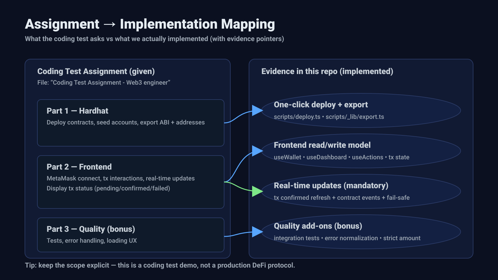
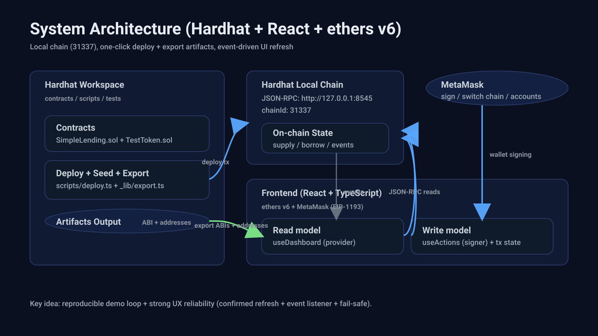
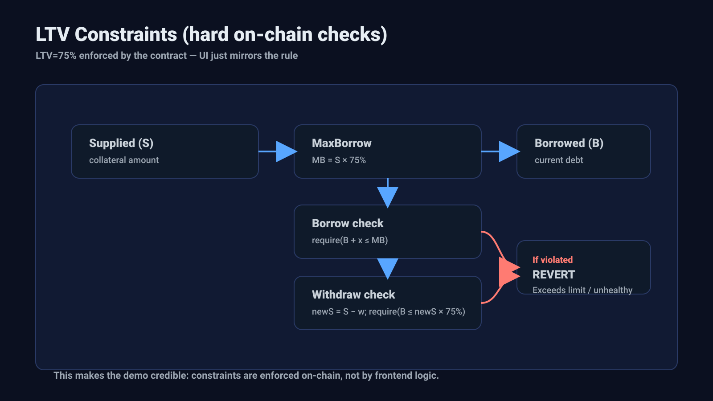
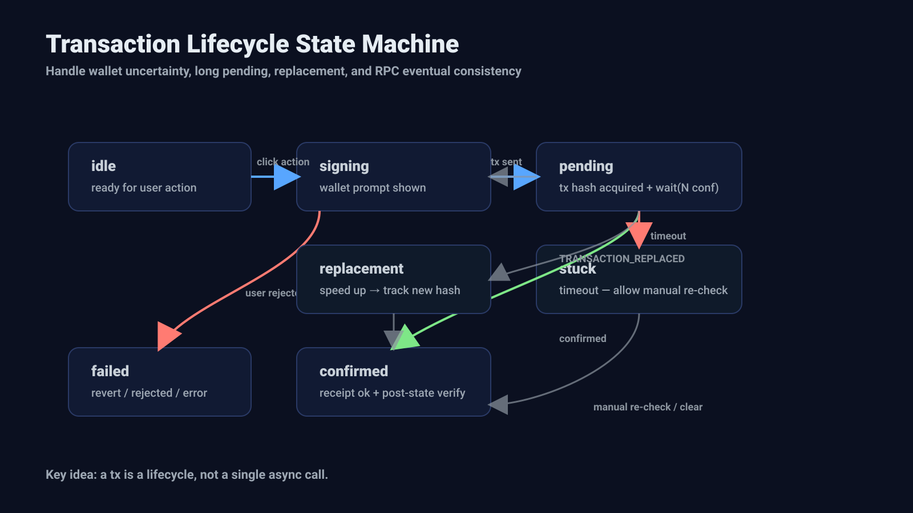
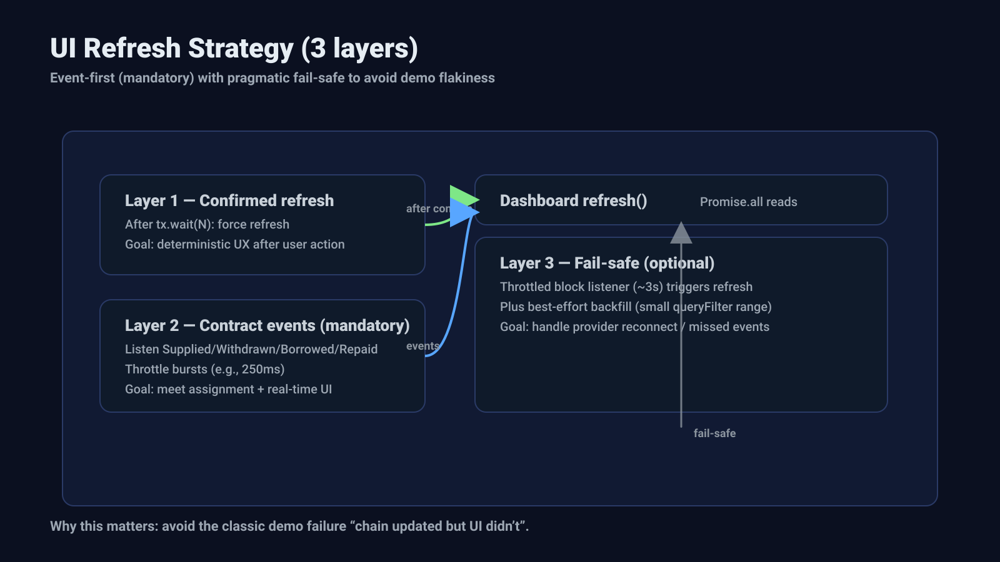
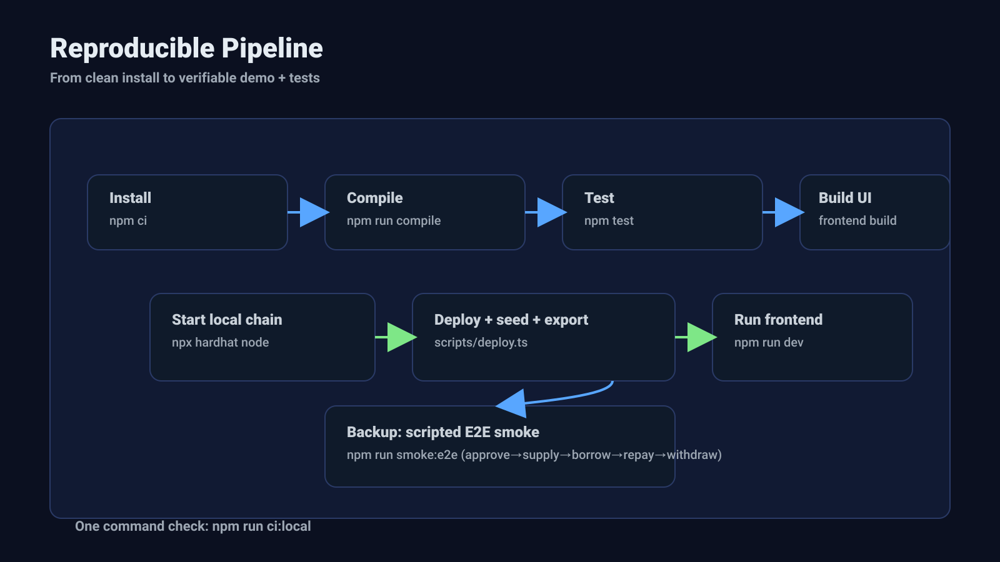

# SimpleLending
## Reproducible Lending MVP (End-to-End)

Reproducible · Verifiable · Security baseline · End-to-end flow

- **Audience**: investors / partners / technical decision-makers / architects
- **Capability**: collateral deposit → borrow → repay → withdraw (end-to-end)
- **Delivery**: contracts + frontend + one-click deploy/export + automated verification

---

## Agenda

OVERVIEW

### Part A
1) Product value & scope
2) Architecture (end-to-end)
3) Key design decisions (tradeoffs)
4) Reliability & UX (Tx lifecycle, refresh strategy)

### Part B
5) Security baseline
6) Testing & reproducibility
7) Demo flow + Q&A

---

## Key terms & interfaces

OVERVIEW

Functions:
- **Supply**: `supply(amount)`
- **Borrow**: `borrow(amount)`
- **Repay**: `repay(amount)`
- **Withdraw**: `withdraw(amount)`

Local PoC defaults:
- **ChainId 31337** = Hardhat local chain (not a port)
- **RPC**: `http://127.0.0.1:8545` (Hardhat node default)
- **Frontend**: `http://localhost:5173` (Vite default)

---

## Executive Summary (Four Audiences)

OVERVIEW

- **Investors**: a demonstrable lending MVP with clear value and explicit boundaries
- **Partners**: exported ABIs + addresses (`frontend/src/contracts/deployments.json` + `frontend/src/abis/*.json`) + standardized events for integration
- **Technical decision-makers**: on-chain hard constraints + verifiable tests + explicit non-goals
- **Architects**: Tx lifecycle + refresh/backfill strategy + normalized errors

One-liner:
> “A reproducible, verifiable lending MVP: end-to-end flow, on-chain hard rules, and production-style delivery.”

---

## Product capabilities & evidence

OVERVIEW

Evidence: <strong>docs/ASSESSMENT_MAPPING.md</strong> · <strong>scripts/deploy.ts</strong> · <strong>frontend/src/hooks/useDashboard.ts</strong>

---

<!-- _class: compact -->

## 60-Second Overview (Value + Credibility)

OVERVIEW

- End-to-end lending MVP with **full-stack integration**
- Contract hard rules: USD8, **LTV=75%**, borrow/withdraw revert on violation
- Reliability: Tx lifecycle + post-confirmation refresh (`onConfirmed()` after `TX_CONFIRMATIONS`) + events + bounded backfill (`EVENT_BACKFILL_MAX_BLOCKS = 2000`)
- Delivery: one-click deploy/seed/export (ABIs + addresses) + integration tests

---

<!-- _class: compact -->

ARCHITECTURE

Architecture

End-to-end system & integration evidence

---

<!-- _class: compact -->

## Architecture (End-to-End)

ARCHITECTURE

Evidence: <strong>scripts/_lib/export.ts</strong> · <strong>frontend/src/contracts/deployments.json</strong> · <strong>frontend/src/abis/*.json</strong>

---

<!-- _class: compact -->

CONTRACT

Contract

Hard rules enforced on-chain

---

<!-- _class: compact dense ultra -->

## Contract: Core Rules

CONTRACT

- Single asset: USD8 is used for both collateral and borrowing
- WETH: frontend balance display only (not used in protocol)
- LTV = 75%
  - `maxBorrow = supplied * 75%`
- Hard constraints:
  - `borrow()` reverts if it exceeds maxBorrow
  - `withdraw()` reverts if it makes position unhealthy

---

<!-- _class: compact -->

## LTV Constraints (Hard Rules)

CONTRACT

Evidence: <strong>contracts/SimpleLending.sol</strong> (LTV_RATIO, borrow(), withdraw(), calculateMaxBorrow(), calculateMaxWithdraw())

---

<!-- _class: compact dense -->

## Frontend: Read/Write Separation

FRONTEND

- Read model (provider): balances, pool stats, position, maxBorrow/maxWithdraw
- Write model (signer): approve-if-needed + Tx lifecycle + post-state checks (verifying/verified/unverified, bounded)

Why it matters:
- Reads are parallelized via `Promise.all` and guarded by `refreshSeq` to prevent stale overwrites
- Writes are inherently uncertain (reject, replace, timeout)

---

RELIABILITY

Reliability

Tx lifecycle + refresh strategy

---

## Reliability: Tx Lifecycle State Machine

RELIABILITY

- `idle → signing → pending → confirmed / failed / stuck`
- Handles real-world cases:
  - user rejection
  - long pending txs
  - replacement (speed up)
  - pending timeout (`TX_PENDING_TIMEOUT_MS`) + RPC eventual consistency

---

## Tx State Machine (Reliability Core)

RELIABILITY

Evidence: <strong>frontend/src/state/tx.ts</strong> · <strong>frontend/src/hooks/useActions.ts</strong> · <strong>frontend/src/state/txStore.ts</strong>

---

## Reliability: Refresh Strategy

RELIABILITY

Three layers (in order):
1) After tx confirmation: force refresh
2) Contract events: Supplied/Withdrawn/Borrowed/Repaid (primary path)
3) Fail-safe fallback: throttled block listener (~3s) + small-range backfill (best-effort)

---

<!-- _class: compact dense ultra safefooter -->

## Refresh strategy (3 layers)

RELIABILITY

**Three-layer refresh mechanism** (by priority):
1) **Force refresh after tx confirmed**: after confirmation (`tx.wait(TX_CONFIRMATIONS)` / `provider.waitForTransaction`), invoke `onConfirmed()` to refresh read-models
2) **Contract event listeners** (primary path): `Supplied` / `Withdrawn` / `Borrowed` / `Repaid`
3) **Fail-safe fallback**: throttled block listener + small-range backfill (`EVENT_BACKFILL_MAX_BLOCKS = 2000`)

Auditable budgets:
- Throttle: `scheduleRefresh` ~250ms; block fail-safe disabled during `signing/pending/stuck` and while dashboard is loading
- Backfill (best-effort): `queryFilter(from..to)`; if any log then refresh; cursor=`to+1`; errors retry later
- Post-state: budget `POST_STATE_MAX_WAIT_MS` (poll 500ms; timeout → `unverified` with note)

Evidence: <strong>frontend/src/hooks/useDashboard.ts</strong> · <strong>frontend/src/config/runtime.ts</strong>

---

SECURITY

Security

Baseline hardening + explicit scope boundary

---

## Security Baseline (In-Scope)

SECURITY

- `ReentrancyGuard`: nonReentrant on state-changing flows
- `Pausable` + `Ownable`: emergency stop
- `SafeERC20`: safer token interactions

Scope boundary:
- No oracle, liquidation, multi-asset (intentionally out of scope)

---

<!-- _class: dense -->

## Security & UX safety hardening

SECURITY

Evidence: <strong>contracts/SimpleLending.sol</strong> · <strong>frontend/src/utils/amount.ts</strong> · <strong>frontend/src/hooks/useWallet.ts</strong>

---

TESTING

Testing

Reproducible verification (happy path + key reverts)

---

## Testing & Reproducibility

TESTING

### Integration test (acceptance-level)
- approve → supply → borrow → repay → withdraw
- Key reverts:
  - borrow over LTV: revertedWith("Exceeds borrowing limit")
  - withdraw unhealthy: revertedWith("Withdrawal would make position unhealthy")

### Automated verification
- Scripted E2E smoke: `npm run smoke:e2e`

Why it matters:
- Reduces integration uncertainty with a repeatable verification path

---

## Reproducible Pipeline (Copy/Paste)

REPRODUCIBILITY

Evidence: <strong>package.json</strong> scripts · <strong>scripts/deploy.ts</strong> · <strong>scripts/smoke-e2e.mjs</strong>

---

## Delivery & Operational Readiness (Enterprise Checklist)

DELIVERY

### Reproducible / Verifiable
- **Reproducible**: one-click scripts + exported artifacts (ABIs + addresses) + pinned deps
- **Verifiable**: integration tests cover the full loop + key safety boundaries

### Operable / scope boundary
- **Operable**: `smoke:e2e` verification fallback reduces live uncertainty
- **Scope boundary**: explicit non-goals to avoid “fake production-ready” claims
- **Full-stack integration (design sketch; out of scope here)**: Next.js/Node BFF (REST) + JWT; Postgres for app state/indexed views; optional Kafka for event ingestion + async retries (best-effort)

---

DEMO

Demo

5-minute flow + verification fallback

---

<!-- _class: compact -->

## Demo Flow (5 Minutes)

DEMO

### Flow
1) Connect wallet (auto switch to 31337)
2) Supply (approve if needed)
3) Borrow (show LTV)
4) Repay (approve if needed)
5) Withdraw (health check)

### What to highlight
- On-chain hard constraints: LTV checks on borrow/withdraw
- Reliability: Tx lifecycle + post-confirmation refresh + event-driven updates
- Evidence pointers: repo paths on slides

---

<!-- _class: dense -->

# Q&A (business + partner + technical)

APPENDIX

### Scope / non-goals
- No oracle, liquidation, interest accrual, multi-asset
- Reason: keep MVP scope crisp while preserving reproducibility and verifiability

### Common follow-ups
- Why `approve` is required (ERC20 allowance)
- Why refresh after confirmation (RPC eventual consistency)
- What if events are missed (fail-safe fallback refresh/backfill)
- How to extend to production (oracle + liquidation + risk parameters)
- Backend integration (design sketch): Next.js/REST/JWT + Postgres; optional Kafka for ingestion/retries (on-chain as source of truth)

---

# Thanks

Happy to dive into product value, integration, security, or architecture.
